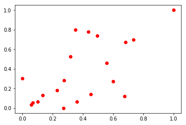
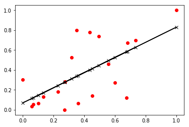

# Camada linear

Um dos principais blocos do PyTorch utilizado na construção de redes neurais é a camada linear, essa camada é utilizada para a construção de um modelo de redes neurais chamado *fully connected*, que são camadas de neurônios onde todos se conectam com todos.


A operação matemática realizada pela camada linear pode ser descrita através da seguinte expressão matemática.

$$Y = Wx + b$$
Onde: 
$W$ são os pesos, $x$ é a entrada, $b$ o bias, e $Y$ é a predição.


```python
%matplotlib inline
import torch
from torch import nn, optim
from torch.autograd import Variable
import numpy as np
import matplotlib.pyplot as plt
from sklearn import datasets
```


```python
diabetes = datasets.load_diabetes()
diabetes_X = diabetes.data[:, np.newaxis, 2]

diabetes_X_train = diabetes_X[20:40]
diabetes_y_train = diabetes.target[20:40]
```

Nessa parte foi feito apenas o slice dos dados no numpy, esses dados serão utilizados no treinamento.


```python
diabetes_X_train -= diabetes_X_train.min()
diabetes_X_train /= diabetes_X_train.max()
diabetes_y_train -= diabetes_y_train.min()
diabetes_y_train /= diabetes_y_train.max()
plt.plot(diabetes_X_train, diabetes_y_train, 'ro', label='Train data')
plt.show()
```





```python
class LinearRegressionModel(torch.nn.Module): 
  
    def __init__(self): 
        super(LinearRegressionModel, self).__init__() 
        self.linear = torch.nn.Linear(1, 1)  # One in and one out 
  
    def forward(self, x): 
        y_pred = self.linear(x) 
        return y_pred 
  
# our model 
model = LinearRegressionModel()
```


```python
x_data = torch.FloatTensor(diabetes_X_train)
y_data = torch.FloatTensor(diabetes_y_train)
y_data = y_data.view(diabetes_X_train.shape)
```


```python
criterion = torch.nn.MSELoss() 
optimizer = torch.optim.SGD(model.parameters(), lr = 0.01) 

loss_vec = []

for epoch in range(5000): 
    inputs = Variable(x_data)
    target = Variable(y_data)
    
    # Forward pass: Compute predicted y by passing  
    # x to the model 
    pred_y = model(inputs) 
  
    # Compute and print loss 
    loss = criterion(pred_y, target) 
  
    # Zero gradients, perform a backward pass,  
    # and update the weights. 
    optimizer.zero_grad() 
    loss.backward() 
    optimizer.step() 
    loss_vec.append(loss.item())
    print('epoch {}, loss {}'.format(epoch, loss.item())) 
```

    epoch 0, loss 0.3633134663105011
    epoch 1, loss 0.3502175509929657
    epoch 2, loss 0.3377206027507782
    epoch 3, loss 0.32579511404037476
    epoch 4, loss 0.3144148886203766
    epoch 5, loss 0.30355486273765564
    epoch 6, loss 0.293191134929657
    epoch 7, loss 0.2833009660243988
    epoch 8, loss 0.2738626003265381
    epoch 9, loss 0.264855295419693
    epoch 10, loss 0.2562592625617981
    epoch 11, loss 0.24805563688278198
    epoch 12, loss 0.2402263730764389
    epoch 13, loss 0.23275433480739594
    epoch 14, loss 0.22562308609485626
    epoch 15, loss 0.21881699562072754
    epoch 16, loss 0.21232111752033234
    epoch 17, loss 0.20612125098705292
    epoch 18, loss 0.2002038061618805
    epoch 19, loss 0.19455578923225403
    epoch 20, loss 0.18916484713554382
    epoch 21, loss 0.18401919305324554
    epoch 22, loss 0.17910756170749664
    epoch 23, loss 0.17441920936107635
    epoch 24, loss 0.1699438989162445
    epoch 25, loss 0.16567184031009674
    epoch 26, loss 0.1615937203168869
    epoch 27, loss 0.15770061314105988
    epoch 28, loss 0.15398405492305756
    epoch 29, loss 0.1504359394311905
    epoch 30, loss 0.14704853296279907
    epoch 31, loss 0.14381445944309235
    epoch 32, loss 0.14072668552398682
    epoch 33, loss 0.13777849078178406
    epoch 34, loss 0.1349634975194931
    epoch 35, loss 0.1322755664587021
    epoch 36, loss 0.1297088861465454
    epoch 37, loss 0.12725786864757538
    epoch 38, loss 0.12491724640130997
    epoch 39, loss 0.12268191576004028
    epoch 40, loss 0.12054707854986191
    epoch 41, loss 0.11850810796022415
    epoch 42, loss 0.11656060069799423
    epoch 43, loss 0.11470039188861847
    epoch 44, loss 0.11292344331741333
    epoch 45, loss 0.11122595518827438
    epoch 46, loss 0.10960428416728973
    epoch 47, loss 0.10805495083332062
    epoch 48, loss 0.1065746322274208
    epoch 49, loss 0.1051601767539978
    epoch 50, loss 0.10380855202674866
    epoch 51, loss 0.10251688957214355
    epoch 52, loss 0.10128244012594223
    epoch 53, loss 0.10010256618261337
    epoch 54, loss 0.0989747866988182
    epoch 55, loss 0.09789670258760452
    epoch 56, loss 0.09686603397130966
    epoch 57, loss 0.09588062018156052
    epoch 58, loss 0.09493837505578995
    epoch 59, loss 0.09403733909130096
    epoch 60, loss 0.09317559748888016
    epoch 61, loss 0.09235137701034546
    epoch 62, loss 0.09156294167041779
    epoch 63, loss 0.09080866724252701
    epoch 64, loss 0.09008698165416718
    epoch 65, loss 0.0893963873386383
    epoch 66, loss 0.08873548358678818
    epoch 67, loss 0.08810288459062576
    epoch 68, loss 0.08749730885028839
    epoch 69, loss 0.08691752701997757
    epoch 70, loss 0.0863623395562172
    epoch 71, loss 0.08583063632249832
    epoch 72, loss 0.0853213369846344
    epoch 73, loss 0.08483342826366425
    epoch 74, loss 0.08436592668294907
    epoch 75, loss 0.08391789346933365
    epoch 76, loss 0.08348844200372696
    epoch 77, loss 0.08307673037052155
    epoch 78, loss 0.08268193155527115
    epoch 79, loss 0.08230329304933548
    epoch 80, loss 0.08194006979465485
    epoch 81, loss 0.08159156143665314
    epoch 82, loss 0.08125709742307663
    epoch 83, loss 0.0809360221028328
    epoch 84, loss 0.08062773942947388
    epoch 85, loss 0.08033166080713272
    epoch 86, loss 0.08004724979400635
    epoch 87, loss 0.07977394759654999
    epoch 88, loss 0.07951125502586365
    epoch 89, loss 0.07925870269536972
    epoch 90, loss 0.07901581376791
    epoch 91, loss 0.07878216356039047
    epoch 92, loss 0.07855731248855591
    epoch 93, loss 0.07834088057279587
    epoch 94, loss 0.07813248038291931
    epoch 95, loss 0.07793173938989639
    epoch 96, loss 0.07773831486701965
    epoch 97, loss 0.07755187898874283
    epoch 98, loss 0.07737211138010025
    epoch 99, loss 0.07719870656728745
    epoch 100, loss 0.07703138887882233
    epoch 101, loss 0.07686986774206161
    epoch 102, loss 0.07671389728784561
    epoch 103, loss 0.07656320929527283
    epoch 104, loss 0.07641758024692535
    epoch 105, loss 0.07627677172422409
    epoch 106, loss 0.07614057511091232
    epoch 107, loss 0.07600877434015274
    epoch 108, loss 0.07588118314743042
    epoch 109, loss 0.07575760036706924
    epoch 110, loss 0.07563785463571548
    epoch 111, loss 0.07552177459001541
    epoch 112, loss 0.0754091888666153
    epoch 113, loss 0.0752999410033226
    epoch 114, loss 0.07519388943910599
    epoch 115, loss 0.07509088516235352
    epoch 116, loss 0.07499079406261444
    epoch 117, loss 0.07489348948001862
    epoch 118, loss 0.07479884475469589
    epoch 119, loss 0.07470674812793732
    epoch 120, loss 0.07461707293987274
    epoch 121, loss 0.074529729783535
    epoch 122, loss 0.07444459944963455
    epoch 123, loss 0.07436159253120422
    epoch 124, loss 0.07428061217069626
    epoch 125, loss 0.07420157641172409
    epoch 126, loss 0.07412438839673996
    epoch 127, loss 0.0740489810705185
    epoch 128, loss 0.07397526502609253
    epoch 129, loss 0.0739031657576561
    epoch 130, loss 0.07383263111114502
    epoch 131, loss 0.07376357167959213
    epoch 132, loss 0.07369593530893326
    epoch 133, loss 0.07362965494394302
    epoch 134, loss 0.07356467843055725
    epoch 135, loss 0.07350094616413116
    epoch 136, loss 0.07343840599060059
    epoch 137, loss 0.07337700575590134
    epoch 138, loss 0.07331670075654984
    epoch 139, loss 0.0732574388384819
    epoch 140, loss 0.07319917529821396
    epoch 141, loss 0.07314188033342361
    epoch 142, loss 0.07308550179004669
    epoch 143, loss 0.0730300024151802
    epoch 144, loss 0.07297535240650177
    epoch 145, loss 0.0729215070605278
    epoch 146, loss 0.07286844402551651
    epoch 147, loss 0.07281611859798431
    epoch 148, loss 0.07276450842618942
    epoch 149, loss 0.07271359115839005
    epoch 150, loss 0.0726633220911026
    epoch 151, loss 0.0726136863231659
    epoch 152, loss 0.07256466150283813
    epoch 153, loss 0.07251621782779694
    epoch 154, loss 0.0724683403968811
    epoch 155, loss 0.07242099195718765
    epoch 156, loss 0.07237416505813599
    epoch 157, loss 0.07232782244682312
    epoch 158, loss 0.07228196412324905
    epoch 159, loss 0.072236567735672
    epoch 160, loss 0.07219161838293076
    epoch 161, loss 0.07214708626270294
    epoch 162, loss 0.07210296392440796
    epoch 163, loss 0.07205923646688461
    epoch 164, loss 0.07201588898897171
    epoch 165, loss 0.07197291404008865
    epoch 166, loss 0.07193028926849365
    epoch 167, loss 0.07188799977302551
    epoch 168, loss 0.07184604555368423
    epoch 169, loss 0.07180440425872803
    epoch 170, loss 0.0717630684375763
    epoch 171, loss 0.07172203063964844
    epoch 172, loss 0.07168128341436386
    epoch 173, loss 0.07164080440998077
    epoch 174, loss 0.07160060107707977
    epoch 175, loss 0.07156065106391907
    epoch 176, loss 0.07152096182107925
    epoch 177, loss 0.07148150354623795
    epoch 178, loss 0.07144228368997574
    epoch 179, loss 0.07140328735113144
    epoch 180, loss 0.07136451452970505
    epoch 181, loss 0.07132595777511597
    epoch 182, loss 0.0712876096367836
    epoch 183, loss 0.07124946266412735
    epoch 184, loss 0.07121151685714722
    epoch 185, loss 0.071173757314682
    epoch 186, loss 0.07113617658615112
    epoch 187, loss 0.07109878212213516
    epoch 188, loss 0.07106157392263412
    epoch 189, loss 0.07102452218532562
    epoch 190, loss 0.07098764926195145
    epoch 191, loss 0.0709509328007698
    epoch 192, loss 0.0709143728017807
    epoch 193, loss 0.07087796926498413
    epoch 194, loss 0.0708417221903801
    epoch 195, loss 0.0708056166768074
    epoch 196, loss 0.07076966017484665
    epoch 197, loss 0.07073383778333664
    epoch 198, loss 0.07069816440343857
    epoch 199, loss 0.07066261768341064
    epoch 200, loss 0.07062720507383347
    epoch 201, loss 0.07059192657470703
    epoch 202, loss 0.07055676728487015
    epoch 203, loss 0.07052174210548401
    epoch 204, loss 0.07048683613538742
    epoch 205, loss 0.07045204937458038
    epoch 206, loss 0.0704173743724823
    epoch 207, loss 0.07038282603025436
    epoch 208, loss 0.07034838199615479
    epoch 209, loss 0.07031405717134476
    epoch 210, loss 0.07027984410524368
    epoch 211, loss 0.07024573534727097
    epoch 212, loss 0.0702117383480072
    epoch 213, loss 0.0701778456568718
    epoch 214, loss 0.07014405727386475
    epoch 215, loss 0.07011035829782486
    epoch 216, loss 0.07007677108049393
    epoch 217, loss 0.07004328072071075
    epoch 218, loss 0.07000989466905594
    epoch 219, loss 0.06997660547494888
    epoch 220, loss 0.06994340568780899
    epoch 221, loss 0.06991030275821686
    epoch 222, loss 0.06987729668617249
    epoch 223, loss 0.06984438002109528
    epoch 224, loss 0.06981155276298523
    epoch 225, loss 0.06977882236242294
    epoch 226, loss 0.06974617391824722
    epoch 227, loss 0.06971362233161926
    epoch 228, loss 0.06968115270137787
    epoch 229, loss 0.06964877247810364
    epoch 230, loss 0.06961648166179657
    epoch 231, loss 0.06958426535129547
    epoch 232, loss 0.06955214589834213
    epoch 233, loss 0.06952010840177536
    epoch 234, loss 0.06948815286159515
    epoch 235, loss 0.06945627927780151
    epoch 236, loss 0.06942448765039444
    epoch 237, loss 0.06939277052879333
    epoch 238, loss 0.0693611428141594
    epoch 239, loss 0.06932959705591202
    epoch 240, loss 0.06929812580347061
    epoch 241, loss 0.06926672905683517
    epoch 242, loss 0.0692354142665863
    epoch 243, loss 0.069204181432724
    epoch 244, loss 0.06917303055524826
    epoch 245, loss 0.0691419467329979
    epoch 246, loss 0.0691109448671341
    epoch 247, loss 0.06908001750707626
    epoch 248, loss 0.0690491646528244
    epoch 249, loss 0.06901838630437851
    epoch 250, loss 0.06898768991231918
    epoch 251, loss 0.06895706057548523
    epoch 252, loss 0.06892650574445724
    epoch 253, loss 0.06889602541923523
    epoch 254, loss 0.06886561959981918
    epoch 255, loss 0.0688352882862091
    epoch 256, loss 0.068805031478405
    epoch 257, loss 0.06877484172582626
    epoch 258, loss 0.0687447264790535
    epoch 259, loss 0.0687146857380867
    epoch 260, loss 0.06868471205234528
    epoch 261, loss 0.06865481287240982
    epoch 262, loss 0.06862498074769974
    epoch 263, loss 0.06859522312879562
    epoch 264, loss 0.06856553256511688
    epoch 265, loss 0.06853591650724411
    epoch 266, loss 0.06850636005401611
    epoch 267, loss 0.06847687810659409
    epoch 268, loss 0.06844747066497803
    epoch 269, loss 0.06841813027858734
    epoch 270, loss 0.06838885694742203
    epoch 271, loss 0.06835965067148209
    epoch 272, loss 0.06833051145076752
    epoch 273, loss 0.06830144673585892
    epoch 274, loss 0.06827244162559509
    epoch 275, loss 0.06824351102113724
    epoch 276, loss 0.06821464002132416
    epoch 277, loss 0.06818584352731705
    epoch 278, loss 0.06815710663795471
    epoch 279, loss 0.06812844425439835
    epoch 280, loss 0.06809984147548676
    epoch 281, loss 0.06807131320238113
    epoch 282, loss 0.06804283708333969
    epoch 283, loss 0.06801443547010422
    epoch 284, loss 0.06798610091209412
    epoch 285, loss 0.06795783340930939
    epoch 286, loss 0.06792962551116943
    epoch 287, loss 0.06790148466825485
    epoch 288, loss 0.06787341088056564
    epoch 289, loss 0.06784539669752121
    epoch 290, loss 0.06781744956970215
    epoch 291, loss 0.06778956949710846
    epoch 292, loss 0.06776174902915955
    epoch 293, loss 0.067733995616436
    epoch 294, loss 0.06770630180835724
    epoch 295, loss 0.06767867505550385
    epoch 296, loss 0.06765111535787582
    epoch 297, loss 0.06762361526489258
    epoch 298, loss 0.06759617477655411
    epoch 299, loss 0.06756880134344101
    epoch 300, loss 0.06754148751497269
    epoch 301, loss 0.06751424074172974
    epoch 302, loss 0.06748705357313156
    epoch 303, loss 0.06745992600917816
    epoch 304, loss 0.06743286550045013
    epoch 305, loss 0.06740586459636688
    epoch 306, loss 0.0673789232969284
    epoch 307, loss 0.0673520490527153
    epoch 308, loss 0.06732523441314697
    epoch 309, loss 0.06729847937822342
    epoch 310, loss 0.06727178394794464
    epoch 311, loss 0.06724514812231064
    epoch 312, loss 0.06721857935190201
    epoch 313, loss 0.06719206273555756
    epoch 314, loss 0.06716562062501907
    epoch 315, loss 0.06713922321796417
    epoch 316, loss 0.06711289286613464
    epoch 317, loss 0.06708662956953049
    epoch 318, loss 0.06706041842699051
    epoch 319, loss 0.0670342668890953
    epoch 320, loss 0.06700817495584488
    epoch 321, loss 0.06698214262723923
    epoch 322, loss 0.06695616990327835
    epoch 323, loss 0.06693025678396225
    epoch 324, loss 0.06690440326929092
    epoch 325, loss 0.06687860935926437
    epoch 326, loss 0.0668528750538826
    epoch 327, loss 0.0668272003531456
    epoch 328, loss 0.06680157780647278
    epoch 329, loss 0.06677602231502533
    epoch 330, loss 0.06675051897764206
    epoch 331, loss 0.06672507524490356
    epoch 332, loss 0.06669969111680984
    epoch 333, loss 0.0666743591427803
    epoch 334, loss 0.06664908677339554
    epoch 335, loss 0.06662388145923615
    epoch 336, loss 0.06659872084856033
    epoch 337, loss 0.0665736272931099
    epoch 338, loss 0.06654858589172363
    epoch 339, loss 0.06652360409498215
    epoch 340, loss 0.06649867445230484
    epoch 341, loss 0.06647380441427231
    epoch 342, loss 0.06644898653030396
    epoch 343, loss 0.06642423570156097
    epoch 344, loss 0.06639953702688217
    epoch 345, loss 0.06637489050626755
    epoch 346, loss 0.0663502961397171
    epoch 347, loss 0.06632576882839203
    epoch 348, loss 0.06630128622055054
    epoch 349, loss 0.06627687066793442
    epoch 350, loss 0.06625250726938248
    epoch 351, loss 0.06622819602489471
    epoch 352, loss 0.06620393693447113
    epoch 353, loss 0.06617973744869232
    epoch 354, loss 0.06615559756755829
    epoch 355, loss 0.06613150984048843
    epoch 356, loss 0.06610747426748276
    epoch 357, loss 0.06608349084854126
    epoch 358, loss 0.06605956703424454
    epoch 359, loss 0.066035695374012
    epoch 360, loss 0.06601187586784363
    epoch 361, loss 0.06598811596632004
    epoch 362, loss 0.06596440821886063
    epoch 363, loss 0.0659407526254654
    epoch 364, loss 0.06591714918613434
    epoch 365, loss 0.06589360535144806
    epoch 366, loss 0.06587011367082596
    epoch 367, loss 0.06584667414426804
    epoch 368, loss 0.0658232793211937
    epoch 369, loss 0.06579995155334473
    epoch 370, loss 0.06577666848897934
    epoch 371, loss 0.06575344502925873
    epoch 372, loss 0.0657302737236023
    epoch 373, loss 0.06570714712142944
    epoch 374, loss 0.06568408012390137
    epoch 375, loss 0.06566106528043747
    epoch 376, loss 0.06563810259103775
    epoch 377, loss 0.06561518460512161
    epoch 378, loss 0.06559232622385025
    epoch 379, loss 0.06556951999664307
    epoch 380, loss 0.06554676592350006
    epoch 381, loss 0.06552405655384064
    epoch 382, loss 0.06550140678882599
    epoch 383, loss 0.06547880172729492
    epoch 384, loss 0.06545625627040863
    epoch 385, loss 0.06543375551700592
    epoch 386, loss 0.06541130691766739
    epoch 387, loss 0.06538891047239304
    epoch 388, loss 0.06536656618118286
    epoch 389, loss 0.06534426659345627
    epoch 390, loss 0.06532202661037445
    epoch 391, loss 0.06529983878135681
    epoch 392, loss 0.06527769565582275
    epoch 393, loss 0.06525560468435287
    epoch 394, loss 0.06523355841636658
    epoch 395, loss 0.06521157175302505
    epoch 396, loss 0.06518962979316711
    epoch 397, loss 0.06516773253679276
    epoch 398, loss 0.06514589488506317
    epoch 399, loss 0.06512410193681717
    epoch 400, loss 0.06510235369205475
    epoch 401, loss 0.0650806650519371
    epoch 402, loss 0.06505902111530304
    epoch 403, loss 0.06503742188215256
    epoch 404, loss 0.06501587480306625
    epoch 405, loss 0.06499437987804413
    epoch 406, loss 0.06497292965650558
    epoch 407, loss 0.06495153158903122
    epoch 408, loss 0.06493017822504044
    epoch 409, loss 0.06490887701511383
    epoch 410, loss 0.0648876279592514
    epoch 411, loss 0.06486642360687256
    epoch 412, loss 0.0648452639579773
    epoch 413, loss 0.06482415646314621
    epoch 414, loss 0.0648030936717987
    epoch 415, loss 0.06478208303451538
    epoch 416, loss 0.06476110965013504
    epoch 417, loss 0.06474019587039948
    epoch 418, loss 0.06471932679414749
    epoch 419, loss 0.06469850242137909
    epoch 420, loss 0.06467773020267487
    epoch 421, loss 0.06465700268745422
    epoch 422, loss 0.06463631987571716
    epoch 423, loss 0.06461568921804428
    epoch 424, loss 0.06459510326385498
    epoch 425, loss 0.06457456201314926
    epoch 426, loss 0.06455406546592712
    epoch 427, loss 0.06453362107276917
    epoch 428, loss 0.06451322138309479
    epoch 429, loss 0.06449286639690399
    epoch 430, loss 0.06447255611419678
    epoch 431, loss 0.06445229053497314
    epoch 432, loss 0.06443207710981369
    epoch 433, loss 0.06441190838813782
    epoch 434, loss 0.06439178436994553
    epoch 435, loss 0.06437170505523682
    epoch 436, loss 0.06435167044401169
    epoch 437, loss 0.06433168798685074
    epoch 438, loss 0.06431174278259277
    epoch 439, loss 0.06429184973239899
    epoch 440, loss 0.06427199393510818
    epoch 441, loss 0.06425219774246216
    epoch 442, loss 0.06423243135213852
    epoch 443, loss 0.06421271711587906
    epoch 444, loss 0.06419304758310318
    epoch 445, loss 0.06417342275381088
    epoch 446, loss 0.06415384262800217
    epoch 447, loss 0.06413430720567703
    epoch 448, loss 0.06411480903625488
    epoch 449, loss 0.06409536302089691
    epoch 450, loss 0.06407596170902252
    epoch 451, loss 0.06405659765005112
    epoch 452, loss 0.06403728574514389
    epoch 453, loss 0.06401801109313965
    epoch 454, loss 0.06399878859519958
    epoch 455, loss 0.0639796033501625
    epoch 456, loss 0.06396046280860901
    epoch 457, loss 0.0639413595199585
    epoch 458, loss 0.06392230838537216
    epoch 459, loss 0.06390330195426941
    epoch 460, loss 0.06388433277606964
    epoch 461, loss 0.06386540830135345
    epoch 462, loss 0.06384652853012085
    epoch 463, loss 0.06382769346237183
    epoch 464, loss 0.06380889564752579
    epoch 465, loss 0.06379014253616333
    epoch 466, loss 0.06377143412828445
    epoch 467, loss 0.06375276297330856
    epoch 468, loss 0.06373414397239685
    epoch 469, loss 0.06371556222438812
    epoch 470, loss 0.06369701772928238
    epoch 471, loss 0.06367852538824081
    epoch 472, loss 0.06366006284952164
    epoch 473, loss 0.06364165246486664
    epoch 474, loss 0.06362327933311462
    epoch 475, loss 0.06360495090484619
    epoch 476, loss 0.06358665972948074
    epoch 477, loss 0.06356841325759888
    epoch 478, loss 0.06355021148920059
    epoch 479, loss 0.06353204697370529
    epoch 480, loss 0.06351392716169357
    epoch 481, loss 0.06349583715200424
    epoch 482, loss 0.06347780674695969
    epoch 483, loss 0.06345979869365692
    epoch 484, loss 0.06344184279441833
    epoch 485, loss 0.06342392414808273
    epoch 486, loss 0.06340605020523071
    epoch 487, loss 0.06338821351528168
    epoch 488, loss 0.06337042152881622
    epoch 489, loss 0.06335265934467316
    epoch 490, loss 0.06333494931459427
    epoch 491, loss 0.06331727653741837
    epoch 492, loss 0.06329964101314545
    epoch 493, loss 0.06328205019235611
    epoch 494, loss 0.06326448917388916
    epoch 495, loss 0.06324697285890579
    epoch 496, loss 0.063229501247406
    epoch 497, loss 0.0632120668888092
    epoch 498, loss 0.06319466978311539
    epoch 499, loss 0.06317731738090515
    epoch 500, loss 0.0631599947810173
    epoch 501, loss 0.06314272433519363
    epoch 502, loss 0.06312548369169235
    epoch 503, loss 0.06310828775167465
    epoch 504, loss 0.06309112906455994
    epoch 505, loss 0.0630740076303482
    epoch 506, loss 0.06305692344903946
    epoch 507, loss 0.0630398839712143
    epoch 508, loss 0.06302288174629211
    epoch 509, loss 0.06300591677427292
    epoch 510, loss 0.06298898905515671
    epoch 511, loss 0.06297210603952408
    epoch 512, loss 0.06295525282621384
    epoch 513, loss 0.06293844431638718
    epoch 514, loss 0.0629216656088829
    epoch 515, loss 0.06290493160486221
    epoch 516, loss 0.0628882348537445
    epoch 517, loss 0.06287157535552979
    epoch 518, loss 0.06285496056079865
    epoch 519, loss 0.06283837556838989
    epoch 520, loss 0.06282182782888412
    epoch 521, loss 0.06280532479286194
    epoch 522, loss 0.06278885155916214
    epoch 523, loss 0.06277242302894592
    epoch 524, loss 0.0627560243010521
    epoch 525, loss 0.06273966282606125
    epoch 526, loss 0.06272334605455399
    epoch 527, loss 0.06270705908536911
    epoch 528, loss 0.06269081681966782
    epoch 529, loss 0.06267460435628891
    epoch 530, loss 0.06265842914581299
    epoch 531, loss 0.06264229863882065
    epoch 532, loss 0.0626261979341507
    epoch 533, loss 0.06261013448238373
    epoch 534, loss 0.06259410828351974
    epoch 535, loss 0.06257811933755875
    epoch 536, loss 0.06256216019392014
    epoch 537, loss 0.0625462532043457
    epoch 538, loss 0.06253036111593246
    epoch 539, loss 0.0625145211815834
    epoch 540, loss 0.06249871104955673
    epoch 541, loss 0.062482934445142746
    epoch 542, loss 0.06246719881892204
    epoch 543, loss 0.062451500445604324
    epoch 544, loss 0.06243583559989929
    epoch 545, loss 0.062420204281806946
    epoch 546, loss 0.062404610216617584
    epoch 547, loss 0.06238905340433121
    epoch 548, loss 0.06237352639436722
    epoch 549, loss 0.06235803663730621
    epoch 550, loss 0.06234258785843849
    epoch 551, loss 0.06232716888189316
    epoch 552, loss 0.06231178343296051
    epoch 553, loss 0.062296438962221146
    epoch 554, loss 0.06228112429380417
    epoch 555, loss 0.062265846878290176
    epoch 556, loss 0.06225060299038887
    epoch 557, loss 0.06223539263010025
    epoch 558, loss 0.062220219522714615
    epoch 559, loss 0.062205079942941666
    epoch 560, loss 0.0621899738907814
    epoch 561, loss 0.062174905091524124
    epoch 562, loss 0.06215986981987953
    epoch 563, loss 0.06214486435055733
    epoch 564, loss 0.06212989240884781
    epoch 565, loss 0.062114961445331573
    epoch 566, loss 0.062100064009428024
    epoch 567, loss 0.06208519637584686
    epoch 568, loss 0.06207036226987839
    epoch 569, loss 0.0620555616915226
    epoch 570, loss 0.062040798366069794
    epoch 571, loss 0.062026068568229675
    epoch 572, loss 0.062011368572711945
    epoch 573, loss 0.0619967021048069
    epoch 574, loss 0.06198207288980484
    epoch 575, loss 0.061967477202415466
    epoch 576, loss 0.06195291131734848
    epoch 577, loss 0.06193837895989418
    epoch 578, loss 0.06192387640476227
    epoch 579, loss 0.06190941110253334
    epoch 580, loss 0.0618949793279171
    epoch 581, loss 0.061880577355623245
    epoch 582, loss 0.061866212636232376
    epoch 583, loss 0.061851877719163895
    epoch 584, loss 0.0618375763297081
    epoch 585, loss 0.06182330474257469
    epoch 586, loss 0.06180907040834427
    epoch 587, loss 0.061794865876436234
    epoch 588, loss 0.061780691146850586
    epoch 589, loss 0.061766549944877625
    epoch 590, loss 0.06175244599580765
    epoch 591, loss 0.06173836812376976
    epoch 592, loss 0.06172432377934456
    epoch 593, loss 0.061710309237241745
    epoch 594, loss 0.06169632822275162
    epoch 595, loss 0.061682380735874176
    epoch 596, loss 0.06166846677660942
    epoch 597, loss 0.061654578894376755
    epoch 598, loss 0.06164072826504707
    epoch 599, loss 0.06162690743803978
    epoch 600, loss 0.061613116413354874
    epoch 601, loss 0.061599355190992355
    epoch 602, loss 0.06158562749624252
    epoch 603, loss 0.06157192960381508
    epoch 604, loss 0.06155826523900032
    epoch 605, loss 0.06154463440179825
    epoch 606, loss 0.06153102591633797
    epoch 607, loss 0.06151745095849037
    epoch 608, loss 0.06150391697883606
    epoch 609, loss 0.06149040535092354
    epoch 610, loss 0.061476923525333405
    epoch 611, loss 0.06146347522735596
    epoch 612, loss 0.0614500567317009
    epoch 613, loss 0.061436671763658524
    epoch 614, loss 0.06142331287264824
    epoch 615, loss 0.061409980058670044
    epoch 616, loss 0.06139668822288513
    epoch 617, loss 0.06138341873884201
    epoch 618, loss 0.06137017905712128
    epoch 619, loss 0.06135697662830353
    epoch 620, loss 0.06134379655122757
    epoch 621, loss 0.0613306500017643
    epoch 622, loss 0.06131753697991371
    epoch 623, loss 0.061304450035095215
    epoch 624, loss 0.061291392892599106
    epoch 625, loss 0.061278361827135086
    epoch 626, loss 0.06126536428928375
    epoch 627, loss 0.061252396553754807
    epoch 628, loss 0.06123946234583855
    epoch 629, loss 0.06122655048966408
    epoch 630, loss 0.061213668435811996
    epoch 631, loss 0.0612008199095726
    epoch 632, loss 0.061187997460365295
    epoch 633, loss 0.06117520108819008
    epoch 634, loss 0.06116244196891785
    epoch 635, loss 0.061149705201387405
    epoch 636, loss 0.06113699823617935
    epoch 637, loss 0.061124324798583984
    epoch 638, loss 0.061111677438020706
    epoch 639, loss 0.061099059879779816
    epoch 640, loss 0.061086468398571014
    epoch 641, loss 0.0610739067196846
    epoch 642, loss 0.061061371117830276
    epoch 643, loss 0.06104886904358864
    epoch 644, loss 0.06103639304637909
    epoch 645, loss 0.06102394685149193
    epoch 646, loss 0.061011526733636856
    epoch 647, loss 0.06099913269281387
    epoch 648, loss 0.06098677217960358
    epoch 649, loss 0.06097443774342537
    epoch 650, loss 0.06096212938427925
    epoch 651, loss 0.06094985082745552
    epoch 652, loss 0.06093759834766388
    epoch 653, loss 0.060925379395484924
    epoch 654, loss 0.06091318279504776
    epoch 655, loss 0.060901012271642685
    epoch 656, loss 0.060888875275850296
    epoch 657, loss 0.0608767606317997
    epoch 658, loss 0.060864679515361786
    epoch 659, loss 0.060852620750665665
    epoch 660, loss 0.06084059178829193
    epoch 661, loss 0.06082858890295029
    epoch 662, loss 0.06081661209464073
    epoch 663, loss 0.060804665088653564
    epoch 664, loss 0.060792744159698486
    epoch 665, loss 0.0607808493077755
    epoch 666, loss 0.060768984258174896
    epoch 667, loss 0.060757145285606384
    epoch 668, loss 0.06074533239006996
    epoch 669, loss 0.06073354557156563
    epoch 670, loss 0.060721784830093384
    epoch 671, loss 0.06071005389094353
    epoch 672, loss 0.06069834902882576
    epoch 673, loss 0.06068667396903038
    epoch 674, loss 0.06067502126097679
    epoch 675, loss 0.06066339462995529
    epoch 676, loss 0.06065179407596588
    epoch 677, loss 0.06064021959900856
    epoch 678, loss 0.06062867119908333
    epoch 679, loss 0.060617152601480484
    epoch 680, loss 0.06060565635561943
    epoch 681, loss 0.060594189912080765
    epoch 682, loss 0.06058274954557419
    epoch 683, loss 0.0605713352560997
    epoch 684, loss 0.060559939593076706
    epoch 685, loss 0.060548581182956696
    epoch 686, loss 0.06053724139928818
    epoch 687, loss 0.06052592769265175
    epoch 688, loss 0.06051464378833771
    epoch 689, loss 0.06050338223576546
    epoch 690, loss 0.060492146760225296
    epoch 691, loss 0.060480933636426926
    epoch 692, loss 0.06046975031495094
    epoch 693, loss 0.06045859307050705
    epoch 694, loss 0.06044745817780495
    epoch 695, loss 0.060436349362134933
    epoch 696, loss 0.06042526662349701
    epoch 697, loss 0.060414206236600876
    epoch 698, loss 0.06040317565202713
    epoch 699, loss 0.060392167419195175
    epoch 700, loss 0.06038118526339531
    epoch 701, loss 0.060370225459337234
    epoch 702, loss 0.06035929545760155
    epoch 703, loss 0.06034838780760765
    epoch 704, loss 0.060337502509355545
    epoch 705, loss 0.06032664328813553
    epoch 706, loss 0.0603158101439476
    epoch 707, loss 0.060304999351501465
    epoch 708, loss 0.060294218361377716
    epoch 709, loss 0.06028345599770546
    epoch 710, loss 0.06027271971106529
    epoch 711, loss 0.060262009501457214
    epoch 712, loss 0.06025132164359093
    epoch 713, loss 0.06024065986275673
    epoch 714, loss 0.06023002415895462
    epoch 715, loss 0.0602194108068943
    epoch 716, loss 0.060208819806575775
    epoch 717, loss 0.06019825115799904
    epoch 718, loss 0.06018771231174469
    epoch 719, loss 0.06017719581723213
    epoch 720, loss 0.060166701674461365
    epoch 721, loss 0.06015623360872269
    epoch 722, loss 0.0601457841694355
    epoch 723, loss 0.060135360807180405
    epoch 724, loss 0.0601249635219574
    epoch 725, loss 0.06011458858847618
    epoch 726, loss 0.060104236006736755
    epoch 727, loss 0.06009390950202942
    epoch 728, loss 0.06008360534906387
    epoch 729, loss 0.06007332354784012
    epoch 730, loss 0.060063064098358154
    epoch 731, loss 0.06005283072590828
    epoch 732, loss 0.060042619705200195
    epoch 733, loss 0.0600324347615242
    epoch 734, loss 0.0600222684442997
    epoch 735, loss 0.060012124478816986
    epoch 736, loss 0.06000201031565666
    epoch 737, loss 0.05999191105365753
    epoch 738, loss 0.05998184159398079
    epoch 739, loss 0.05997179076075554
    epoch 740, loss 0.05996176227927208
    epoch 741, loss 0.05995175987482071
    epoch 742, loss 0.05994177982211113
    epoch 743, loss 0.05993182212114334
    epoch 744, loss 0.05992188677191734
    epoch 745, loss 0.05991197004914284
    epoch 746, loss 0.05990207940340042
    epoch 747, loss 0.059892214834690094
    epoch 748, loss 0.05988236516714096
    epoch 749, loss 0.05987254157662392
    epoch 750, loss 0.05986274033784866
    epoch 751, loss 0.0598529651761055
    epoch 752, loss 0.05984320491552353
    epoch 753, loss 0.05983347073197365
    epoch 754, loss 0.059823762625455856
    epoch 755, loss 0.05981406942009926
    epoch 756, loss 0.05980440229177475
    epoch 757, loss 0.05979476124048233
    epoch 758, loss 0.059785135090351105
    epoch 759, loss 0.05977552756667137
    epoch 760, loss 0.059765949845314026
    epoch 761, loss 0.05975639075040817
    epoch 762, loss 0.05974685773253441
    epoch 763, loss 0.05973733961582184
    epoch 764, loss 0.05972784757614136
    epoch 765, loss 0.05971837043762207
    epoch 766, loss 0.05970892310142517
    epoch 767, loss 0.059699494391679764
    epoch 768, loss 0.05969008430838585
    epoch 769, loss 0.05968070030212402
    epoch 770, loss 0.05967133492231369
    epoch 771, loss 0.05966199189424515
    epoch 772, loss 0.0596526674926281
    epoch 773, loss 0.05964336916804314
    epoch 774, loss 0.05963408946990967
    epoch 775, loss 0.05962482839822769
    epoch 776, loss 0.059615589678287506
    epoch 777, loss 0.05960637703537941
    epoch 778, loss 0.05959717929363251
    epoch 779, loss 0.0595880001783371
    epoch 780, loss 0.059578850865364075
    epoch 781, loss 0.059569716453552246
    epoch 782, loss 0.05956060439348221
    epoch 783, loss 0.05955151095986366
    epoch 784, loss 0.05954243987798691
    epoch 785, loss 0.059533391147851944
    epoch 786, loss 0.05952436104416847
    epoch 787, loss 0.05951534956693649
    epoch 788, loss 0.059506360441446304
    epoch 789, loss 0.059497393667697906
    epoch 790, loss 0.059488445520401
    epoch 791, loss 0.05947951599955559
    epoch 792, loss 0.059470608830451965
    epoch 793, loss 0.059461724013090134
    epoch 794, loss 0.059452857822179794
    epoch 795, loss 0.05944401025772095
    epoch 796, loss 0.05943518504500389
    epoch 797, loss 0.05942637845873833
    epoch 798, loss 0.059417590498924255
    epoch 799, loss 0.059408824890851974
    epoch 800, loss 0.059400077909231186
    epoch 801, loss 0.05939135327935219
    epoch 802, loss 0.059382643550634384
    epoch 803, loss 0.05937395617365837
    epoch 804, loss 0.05936528742313385
    epoch 805, loss 0.05935664474964142
    epoch 806, loss 0.05934801325201988
    epoch 807, loss 0.059339407831430435
    epoch 808, loss 0.05933082103729248
    epoch 809, loss 0.05932224541902542
    epoch 810, loss 0.05931369960308075
    epoch 811, loss 0.05930516868829727
    epoch 812, loss 0.059296660125255585
    epoch 813, loss 0.05928817018866539
    epoch 814, loss 0.05927969142794609
    epoch 815, loss 0.05927123874425888
    epoch 816, loss 0.05926281213760376
    epoch 817, loss 0.059254392981529236
    epoch 818, loss 0.0592459961771965
    epoch 819, loss 0.05923762172460556
    epoch 820, loss 0.05922926217317581
    epoch 821, loss 0.059220921248197556
    epoch 822, loss 0.05921260640025139
    epoch 823, loss 0.059204306453466415
    epoch 824, loss 0.059196025133132935
    epoch 825, loss 0.059187762439250946
    epoch 826, loss 0.05917951464653015
    epoch 827, loss 0.05917128920555115
    epoch 828, loss 0.059163082391023636
    epoch 829, loss 0.059154897928237915
    epoch 830, loss 0.059146732091903687
    epoch 831, loss 0.05913857743144035
    epoch 832, loss 0.05913044884800911
    epoch 833, loss 0.05912233516573906
    epoch 834, loss 0.0591142401099205
    epoch 835, loss 0.05910615995526314
    epoch 836, loss 0.05909810587763786
    epoch 837, loss 0.059090062975883484
    epoch 838, loss 0.059082042425870895
    epoch 839, loss 0.0590740405023098
    epoch 840, loss 0.0590660534799099
    epoch 841, loss 0.059058088809251785
    epoch 842, loss 0.05905013531446457
    epoch 843, loss 0.05904220789670944
    epoch 844, loss 0.05903429538011551
    epoch 845, loss 0.05902640148997307
    epoch 846, loss 0.05901852622628212
    epoch 847, loss 0.059010665863752365
    epoch 848, loss 0.0590028278529644
    epoch 849, loss 0.058994997292757034
    epoch 850, loss 0.058987196534872055
    epoch 851, loss 0.05897940695285797
    epoch 852, loss 0.05897163972258568
    epoch 853, loss 0.05896388739347458
    epoch 854, loss 0.058956146240234375
    epoch 855, loss 0.05894843116402626
    epoch 856, loss 0.05894073098897934
    epoch 857, loss 0.05893305316567421
    epoch 858, loss 0.058925386518239975
    epoch 859, loss 0.05891773849725723
    epoch 860, loss 0.05891010910272598
    epoch 861, loss 0.058902494609355927
    epoch 862, loss 0.05889490246772766
    epoch 863, loss 0.05888732150197029
    epoch 864, loss 0.05887976288795471
    epoch 865, loss 0.05887221917510033
    epoch 866, loss 0.058864690363407135
    epoch 867, loss 0.058857183903455734
    epoch 868, loss 0.05884968861937523
    epoch 869, loss 0.058842215687036514
    epoch 870, loss 0.058834757655858994
    epoch 871, loss 0.058827318251132965
    epoch 872, loss 0.05881989002227783
    epoch 873, loss 0.05881248787045479
    epoch 874, loss 0.05880509689450264
    epoch 875, loss 0.05879771709442139
    epoch 876, loss 0.05879036337137222
    epoch 877, loss 0.05878302454948425
    epoch 878, loss 0.05877569690346718
    epoch 879, loss 0.058768391609191895
    epoch 880, loss 0.058761101216077805
    epoch 881, loss 0.05875382944941521
    epoch 882, loss 0.0587465725839138
    epoch 883, loss 0.05873933061957359
    epoch 884, loss 0.058732107281684875
    epoch 885, loss 0.05872489884495735
    epoch 886, loss 0.05871770530939102
    epoch 887, loss 0.05871053412556648
    epoch 888, loss 0.05870337039232254
    epoch 889, loss 0.05869622901082039
    epoch 890, loss 0.05868910253047943
    epoch 891, loss 0.058681994676589966
    epoch 892, loss 0.058674901723861694
    epoch 893, loss 0.05866782367229462
    epoch 894, loss 0.05866076424717903
    epoch 895, loss 0.05865371599793434
    epoch 896, loss 0.058646686375141144
    epoch 897, loss 0.05863967165350914
    epoch 898, loss 0.05863267555832863
    epoch 899, loss 0.05862569436430931
    epoch 900, loss 0.05861872434616089
    epoch 901, loss 0.05861177295446396
    epoch 902, loss 0.05860484391450882
    epoch 903, loss 0.058597926050424576
    epoch 904, loss 0.058591023087501526
    epoch 905, loss 0.05858413130044937
    epoch 906, loss 0.058577265590429306
    epoch 907, loss 0.058570411056280136
    epoch 908, loss 0.05856356397271156
    epoch 909, loss 0.05855673924088478
    epoch 910, loss 0.05854992941021919
    epoch 911, loss 0.058543138206005096
    epoch 912, loss 0.058536361902952194
    epoch 913, loss 0.058529600501060486
    epoch 914, loss 0.05852285027503967
    epoch 915, loss 0.05851611867547035
    epoch 916, loss 0.058509401977062225
    epoch 917, loss 0.05850270390510559
    epoch 918, loss 0.05849601700901985
    epoch 919, loss 0.05848934128880501
    epoch 920, loss 0.058482687920331955
    epoch 921, loss 0.0584760457277298
    epoch 922, loss 0.05846942216157913
    epoch 923, loss 0.05846281349658966
    epoch 924, loss 0.058456216007471085
    epoch 925, loss 0.0584496334195137
    epoch 926, loss 0.05844307318329811
    epoch 927, loss 0.058436520397663116
    epoch 928, loss 0.058429986238479614
    epoch 929, loss 0.058423466980457306
    epoch 930, loss 0.05841695889830589
    epoch 931, loss 0.058410465717315674
    epoch 932, loss 0.05840399116277695
    epoch 933, loss 0.058397531509399414
    epoch 934, loss 0.058391083031892776
    epoch 935, loss 0.05838464945554733
    epoch 936, loss 0.05837823078036308
    epoch 937, loss 0.05837182700634003
    epoch 938, loss 0.058365438133478165
    epoch 939, loss 0.058359067887067795
    epoch 940, loss 0.05835270881652832
    epoch 941, loss 0.05834636464715004
    epoch 942, loss 0.058340031653642654
    epoch 943, loss 0.05833371728658676
    epoch 944, loss 0.058327414095401764
    epoch 945, loss 0.05832112580537796
    epoch 946, loss 0.05831485241651535
    epoch 947, loss 0.058308593928813934
    epoch 948, loss 0.05830235034227371
    epoch 949, loss 0.05829611420631409
    epoch 950, loss 0.05828990414738655
    epoch 951, loss 0.05828369781374931
    epoch 952, loss 0.05827751383185387
    epoch 953, loss 0.05827133730053902
    epoch 954, loss 0.05826517567038536
    epoch 955, loss 0.0582590326666832
    epoch 956, loss 0.05825290456414223
    epoch 957, loss 0.058246783912181854
    epoch 958, loss 0.058240681886672974
    epoch 959, loss 0.05823458731174469
    epoch 960, loss 0.0582285076379776
    epoch 961, loss 0.0582224503159523
    epoch 962, loss 0.0582164004445076
    epoch 963, loss 0.05821036174893379
    epoch 964, loss 0.058204345405101776
    epoch 965, loss 0.05819833651185036
    epoch 966, loss 0.05819234251976013
    epoch 967, loss 0.0581863634288311
    epoch 968, loss 0.058180395513772964
    epoch 969, loss 0.05817444249987602
    epoch 970, loss 0.058168504387140274
    epoch 971, loss 0.05816257745027542
    epoch 972, loss 0.058156661689281464
    epoch 973, loss 0.058150764554739
    epoch 974, loss 0.05814487859606743
    epoch 975, loss 0.05813900753855705
    epoch 976, loss 0.058133143931627274
    epoch 977, loss 0.058127302676439285
    epoch 978, loss 0.05812147259712219
    epoch 979, loss 0.058115649968385696
    epoch 980, loss 0.05810984596610069
    epoch 981, loss 0.058104049414396286
    epoch 982, loss 0.05809827148914337
    epoch 983, loss 0.05809250473976135
    epoch 984, loss 0.05808675289154053
    epoch 985, loss 0.0580810122191906
    epoch 986, loss 0.05807528644800186
    epoch 987, loss 0.05806956812739372
    epoch 988, loss 0.058063868433237076
    epoch 989, loss 0.05805818364024162
    epoch 990, loss 0.05805250629782677
    epoch 991, loss 0.058046843856573105
    epoch 992, loss 0.05804119631648064
    epoch 993, loss 0.058035559952259064
    epoch 994, loss 0.058029934763908386
    epoch 995, loss 0.0580243244767189
    epoch 996, loss 0.058018721640110016
    epoch 997, loss 0.05801314115524292
    epoch 998, loss 0.05800756439566612
    epoch 999, loss 0.05800200253725052
    epoch 1000, loss 0.05799645557999611
    epoch 1001, loss 0.05799092352390289
    epoch 1002, loss 0.057985398918390274
    epoch 1003, loss 0.05797988921403885
    epoch 1004, loss 0.05797439441084862
    epoch 1005, loss 0.05796891078352928
    epoch 1006, loss 0.05796343833208084
    epoch 1007, loss 0.057957977056503296
    epoch 1008, loss 0.057952530682086945
    epoch 1009, loss 0.05794709548354149
    epoch 1010, loss 0.05794167518615723
    epoch 1011, loss 0.05793626233935356
    epoch 1012, loss 0.05793086066842079
    epoch 1013, loss 0.057925477623939514
    epoch 1014, loss 0.057920102030038834
    epoch 1015, loss 0.057914745062589645
    epoch 1016, loss 0.057909391820430756
    epoch 1017, loss 0.05790405720472336
    epoch 1018, loss 0.05789873003959656
    epoch 1019, loss 0.05789342150092125
    epoch 1020, loss 0.05788812041282654
    epoch 1021, loss 0.05788283422589302
    epoch 1022, loss 0.0578775554895401
    epoch 1023, loss 0.057872287929058075
    epoch 1024, loss 0.057867035269737244
    epoch 1025, loss 0.057861801236867905
    epoch 1026, loss 0.057856567203998566
    epoch 1027, loss 0.05785135552287102
    epoch 1028, loss 0.05784614756703377
    epoch 1029, loss 0.05784095078706741
    epoch 1030, loss 0.05783577635884285
    epoch 1031, loss 0.057830605655908585
    epoch 1032, loss 0.057825446128845215
    epoch 1033, loss 0.05782030150294304
    epoch 1034, loss 0.05781516432762146
    epoch 1035, loss 0.057810042053461075
    epoch 1036, loss 0.057804930955171585
    epoch 1037, loss 0.05779983103275299
    epoch 1038, loss 0.05779474228620529
    epoch 1039, loss 0.05778966844081879
    epoch 1040, loss 0.05778459832072258
    epoch 1041, loss 0.057779550552368164
    epoch 1042, loss 0.05777450650930405
    epoch 1043, loss 0.05776947736740112
    epoch 1044, loss 0.057764455676078796
    epoch 1045, loss 0.057759448885917664
    epoch 1046, loss 0.057754456996917725
    epoch 1047, loss 0.05774947255849838
    epoch 1048, loss 0.05774449557065964
    epoch 1049, loss 0.057739537209272385
    epoch 1050, loss 0.05773458629846573
    epoch 1051, loss 0.05772964656352997
    epoch 1052, loss 0.0577247180044651
    epoch 1053, loss 0.05771980062127113
    epoch 1054, loss 0.05771489441394806
    epoch 1055, loss 0.05770999938249588
    epoch 1056, loss 0.0577051118016243
    epoch 1057, loss 0.05770024657249451
    epoch 1058, loss 0.057695381343364716
    epoch 1059, loss 0.05769053101539612
    epoch 1060, loss 0.057685695588588715
    epoch 1061, loss 0.05768086761236191
    epoch 1062, loss 0.057676050812006
    epoch 1063, loss 0.05767124146223068
    epoch 1064, loss 0.05766644701361656
    epoch 1065, loss 0.05766166374087334
    epoch 1066, loss 0.05765688419342041
    epoch 1067, loss 0.057652123272418976
    epoch 1068, loss 0.05764737352728844
    epoch 1069, loss 0.05764263495802879
    epoch 1070, loss 0.05763790383934975
    epoch 1071, loss 0.057633183896541595
    epoch 1072, loss 0.05762847140431404
    epoch 1073, loss 0.05762377753853798
    epoch 1074, loss 0.057619087398052216
    epoch 1075, loss 0.057614412158727646
    epoch 1076, loss 0.05760974436998367
    epoch 1077, loss 0.057605091482400894
    epoch 1078, loss 0.05760044604539871
    epoch 1079, loss 0.057595815509557724
    epoch 1080, loss 0.057591188699007034
    epoch 1081, loss 0.05758657306432724
    epoch 1082, loss 0.05758196860551834
    epoch 1083, loss 0.057577379047870636
    epoch 1084, loss 0.05757279694080353
    epoch 1085, loss 0.057568226009607315
    epoch 1086, loss 0.0575636625289917
    epoch 1087, loss 0.05755911394953728
    epoch 1088, loss 0.05755457282066345
    epoch 1089, loss 0.057550039142370224
    epoch 1090, loss 0.05754552409052849
    epoch 1091, loss 0.05754101276397705
    epoch 1092, loss 0.05753651261329651
    epoch 1093, loss 0.05753202736377716
    epoch 1094, loss 0.05752754583954811
    epoch 1095, loss 0.05752307549118996
    epoch 1096, loss 0.0575186163187027
    epoch 1097, loss 0.057514168322086334
    epoch 1098, loss 0.057509731501340866
    epoch 1099, loss 0.05750530585646629
    epoch 1100, loss 0.05750088393688202
    epoch 1101, loss 0.05749648064374924
    epoch 1102, loss 0.057492077350616455
    epoch 1103, loss 0.057487692683935165
    epoch 1104, loss 0.05748331546783447
    epoch 1105, loss 0.057478949427604675
    epoch 1106, loss 0.057474590837955475
    epoch 1107, loss 0.05747023969888687
    epoch 1108, loss 0.05746589973568916
    epoch 1109, loss 0.05746157094836235
    epoch 1110, loss 0.057457249611616135
    epoch 1111, loss 0.05745294690132141
    epoch 1112, loss 0.05744864419102669
    epoch 1113, loss 0.057444360107183456
    epoch 1114, loss 0.057440076023340225
    epoch 1115, loss 0.05743580684065819
    epoch 1116, loss 0.057431548833847046
    epoch 1117, loss 0.0574272982776165
    epoch 1118, loss 0.05742305889725685
    epoch 1119, loss 0.0574188269674778
    epoch 1120, loss 0.05741460621356964
    epoch 1121, loss 0.05741039291024208
    epoch 1122, loss 0.057406190782785416
    epoch 1123, loss 0.057401999831199646
    epoch 1124, loss 0.05739781633019447
    epoch 1125, loss 0.0573936402797699
    epoch 1126, loss 0.057389479130506516
    epoch 1127, loss 0.05738532170653343
    epoch 1128, loss 0.05738117918372154
    epoch 1129, loss 0.05737704038619995
    epoch 1130, loss 0.057372916489839554
    epoch 1131, loss 0.057368796318769455
    epoch 1132, loss 0.05736468732357025
    epoch 1133, loss 0.05736059322953224
    epoch 1134, loss 0.05735650286078453
    epoch 1135, loss 0.057352423667907715
    epoch 1136, loss 0.057348355650901794
    epoch 1137, loss 0.05734429135918617
    epoch 1138, loss 0.057340238243341446
    epoch 1139, loss 0.057336196303367615
    epoch 1140, loss 0.05733216181397438
    epoch 1141, loss 0.05732813850045204
    epoch 1142, loss 0.0573241226375103
    epoch 1143, loss 0.05732011795043945
    epoch 1144, loss 0.057316120713949203
    epoch 1145, loss 0.05731213092803955
    epoch 1146, loss 0.05730815604329109
    epoch 1147, loss 0.05730418860912323
    epoch 1148, loss 0.05730022117495537
    epoch 1149, loss 0.057296272367239
    epoch 1150, loss 0.057292331010103226
    epoch 1151, loss 0.05728839710354805
    epoch 1152, loss 0.05728447064757347
    epoch 1153, loss 0.05728055164217949
    epoch 1154, loss 0.0572766475379467
    epoch 1155, loss 0.05727275088429451
    epoch 1156, loss 0.05726885795593262
    epoch 1157, loss 0.05726498365402222
    epoch 1158, loss 0.057261109352111816
    epoch 1159, loss 0.05725724622607231
    epoch 1160, loss 0.0572533905506134
    epoch 1161, loss 0.05724954977631569
    epoch 1162, loss 0.05724571272730827
    epoch 1163, loss 0.057241883128881454
    epoch 1164, loss 0.05723806470632553
    epoch 1165, loss 0.057234253734350204
    epoch 1166, loss 0.057230450212955475
    epoch 1167, loss 0.05722666159272194
    epoch 1168, loss 0.0572228729724884
    epoch 1169, loss 0.05721909925341606
    epoch 1170, loss 0.057215332984924316
    epoch 1171, loss 0.05721157044172287
    epoch 1172, loss 0.05720782279968262
    epoch 1173, loss 0.05720407888293266
    epoch 1174, loss 0.0572003498673439
    epoch 1175, loss 0.05719662085175514
    epoch 1176, loss 0.057192906737327576
    epoch 1177, loss 0.05718919634819031
    epoch 1178, loss 0.05718550086021423
    epoch 1179, loss 0.05718180909752846
    epoch 1180, loss 0.05717812478542328
    epoch 1181, loss 0.057174455374479294
    epoch 1182, loss 0.05717078596353531
    epoch 1183, loss 0.05716713145375252
    epoch 1184, loss 0.057163484394550323
    epoch 1185, loss 0.05715984106063843
    epoch 1186, loss 0.05715620890259743
    epoch 1187, loss 0.05715258792042732
    epoch 1188, loss 0.057148970663547516
    epoch 1189, loss 0.057145360857248306
    epoch 1190, loss 0.05714176222681999
    epoch 1191, loss 0.057138167321681976
    epoch 1192, loss 0.057134587317705154
    epoch 1193, loss 0.05713101103901863
    epoch 1194, loss 0.057127438485622406
    epoch 1195, loss 0.05712388455867767
    epoch 1196, loss 0.05712033808231354
    epoch 1197, loss 0.0571167916059494
    epoch 1198, loss 0.05711326003074646
    epoch 1199, loss 0.057109732180833817
    epoch 1200, loss 0.05710621550679207
    epoch 1201, loss 0.05710269883275032
    epoch 1202, loss 0.057099200785160065
    epoch 1203, loss 0.05709570273756981
    epoch 1204, loss 0.05709221959114075
    epoch 1205, loss 0.057088736444711685
    epoch 1206, loss 0.05708526819944382
    epoch 1207, loss 0.057081807404756546
    epoch 1208, loss 0.05707835406064987
    epoch 1209, loss 0.057074904441833496
    epoch 1210, loss 0.05707146227359772
    epoch 1211, loss 0.05706803500652313
    epoch 1212, loss 0.057064611464738846
    epoch 1213, loss 0.05706119164824486
    epoch 1214, loss 0.057057783007621765
    epoch 1215, loss 0.05705438554286957
    epoch 1216, loss 0.05705099180340767
    epoch 1217, loss 0.057047609239816666
    epoch 1218, loss 0.05704423040151596
    epoch 1219, loss 0.05704086273908615
    epoch 1220, loss 0.05703749880194664
    epoch 1221, loss 0.057034146040678024
    epoch 1222, loss 0.05703079700469971
    epoch 1223, loss 0.057027459144592285
    epoch 1224, loss 0.05702412873506546
    epoch 1225, loss 0.05702080577611923
    epoch 1226, loss 0.0570174865424633
    epoch 1227, loss 0.05701418220996857
    epoch 1228, loss 0.05701087787747383
    epoch 1229, loss 0.05700758099555969
    epoch 1230, loss 0.05700429528951645
    epoch 1231, loss 0.0570010207593441
    epoch 1232, loss 0.05699774995446205
    epoch 1233, loss 0.0569944828748703
    epoch 1234, loss 0.056991226971149445
    epoch 1235, loss 0.05698797479271889
    epoch 1236, loss 0.056984737515449524
    epoch 1237, loss 0.05698150023818016
    epoch 1238, loss 0.05697827413678169
    epoch 1239, loss 0.05697505548596382
    epoch 1240, loss 0.05697184428572655
    epoch 1241, loss 0.05696863681077957
    epoch 1242, loss 0.05696544051170349
    epoch 1243, loss 0.056962255388498306
    epoch 1244, loss 0.05695906654000282
    epoch 1245, loss 0.056955888867378235
    epoch 1246, loss 0.05695272237062454
    epoch 1247, loss 0.05694956332445145
    epoch 1248, loss 0.05694640800356865
    epoch 1249, loss 0.05694326013326645
    epoch 1250, loss 0.056940123438835144
    epoch 1251, loss 0.05693698674440384
    epoch 1252, loss 0.05693385750055313
    epoch 1253, loss 0.05693074315786362
    epoch 1254, loss 0.0569276288151741
    epoch 1255, loss 0.056924525648355484
    epoch 1256, loss 0.05692142993211746
    epoch 1257, loss 0.05691834166646004
    epoch 1258, loss 0.05691525340080261
    epoch 1259, loss 0.05691218003630638
    epoch 1260, loss 0.05690911039710045
    epoch 1261, loss 0.05690604820847511
    epoch 1262, loss 0.056902989745140076
    epoch 1263, loss 0.056899942457675934
    epoch 1264, loss 0.05689690262079239
    epoch 1265, loss 0.05689386650919914
    epoch 1266, loss 0.05689084157347679
    epoch 1267, loss 0.05688782036304474
    epoch 1268, loss 0.05688480660319328
    epoch 1269, loss 0.056881800293922424
    epoch 1270, loss 0.05687880143523216
    epoch 1271, loss 0.0568758063018322
    epoch 1272, loss 0.05687281861901283
    epoch 1273, loss 0.05686983838677406
    epoch 1274, loss 0.05686686560511589
    epoch 1275, loss 0.056863900274038315
    epoch 1276, loss 0.05686093866825104
    epoch 1277, loss 0.05685798451304436
    epoch 1278, loss 0.05685504153370857
    epoch 1279, loss 0.056852102279663086
    epoch 1280, loss 0.056849170476198196
    epoch 1281, loss 0.056846242398023605
    epoch 1282, loss 0.05684332177042961
    epoch 1283, loss 0.05684041231870651
    epoch 1284, loss 0.056837499141693115
    epoch 1285, loss 0.05683460086584091
    epoch 1286, loss 0.05683170631527901
    epoch 1287, loss 0.056828822940588
    epoch 1288, loss 0.05682593956589699
    epoch 1289, loss 0.056823067367076874
    epoch 1290, loss 0.05682019889354706
    epoch 1291, loss 0.05681733787059784
    epoch 1292, loss 0.056814488023519516
    epoch 1293, loss 0.05681163817644119
    epoch 1294, loss 0.056808799505233765
    epoch 1295, loss 0.05680596083402634
    epoch 1296, loss 0.056803133338689804
    epoch 1297, loss 0.05680031329393387
    epoch 1298, loss 0.05679750069975853
    epoch 1299, loss 0.05679468810558319
    epoch 1300, loss 0.05679188668727875
    epoch 1301, loss 0.0567890889942646
    epoch 1302, loss 0.05678630247712135
    epoch 1303, loss 0.0567835196852684
    epoch 1304, loss 0.05678074061870575
    epoch 1305, loss 0.05677797272801399
    epoch 1306, loss 0.056775208562612534
    epoch 1307, loss 0.05677245184779167
    epoch 1308, loss 0.05676970258355141
    epoch 1309, loss 0.05676695331931114
    epoch 1310, loss 0.05676421523094177
    epoch 1311, loss 0.056761484593153
    epoch 1312, loss 0.05675875395536423
    epoch 1313, loss 0.05675603449344635
    epoch 1314, loss 0.05675331875681877
    epoch 1315, loss 0.05675061419606209
    epoch 1316, loss 0.0567479133605957
    epoch 1317, loss 0.05674521252512932
    epoch 1318, loss 0.05674252659082413
    epoch 1319, loss 0.056739844381809235
    epoch 1320, loss 0.05673716589808464
    epoch 1321, loss 0.056734491139650345
    epoch 1322, loss 0.05673183128237724
    epoch 1323, loss 0.05672917142510414
    epoch 1324, loss 0.05672651529312134
    epoch 1325, loss 0.05672387033700943
    epoch 1326, loss 0.05672122910618782
    epoch 1327, loss 0.05671859532594681
    epoch 1328, loss 0.056715965270996094
    epoch 1329, loss 0.05671333894133568
    epoch 1330, loss 0.05671072378754616
    epoch 1331, loss 0.056708116084337234
    epoch 1332, loss 0.05670550838112831
    epoch 1333, loss 0.056702908128499985
    epoch 1334, loss 0.056700315326452255
    epoch 1335, loss 0.056697726249694824
    epoch 1336, loss 0.05669514089822769
    epoch 1337, loss 0.05669257044792175
    epoch 1338, loss 0.056689999997615814
    epoch 1339, loss 0.05668743699789047
    epoch 1340, loss 0.05668487772345543
    epoch 1341, loss 0.05668232589960098
    epoch 1342, loss 0.056679777801036835
    epoch 1343, loss 0.056677237153053284
    epoch 1344, loss 0.05667470395565033
    epoch 1345, loss 0.056672174483537674
    epoch 1346, loss 0.056669652462005615
    epoch 1347, loss 0.056667134165763855
    epoch 1348, loss 0.05666461959481239
    epoch 1349, loss 0.05666211247444153
    epoch 1350, loss 0.05665961280465126
    epoch 1351, loss 0.05665711686015129
    epoch 1352, loss 0.05665463209152222
    epoch 1353, loss 0.05665214732289314
    epoch 1354, loss 0.05664966627955437
    epoch 1355, loss 0.05664719641208649
    epoch 1356, loss 0.05664472654461861
    epoch 1357, loss 0.05664226785302162
    epoch 1358, loss 0.05663980916142464
    epoch 1359, loss 0.05663736164569855
    epoch 1360, loss 0.056634917855262756
    epoch 1361, loss 0.05663248151540756
    epoch 1362, loss 0.05663004517555237
    epoch 1363, loss 0.05662762001156807
    epoch 1364, loss 0.05662519857287407
    epoch 1365, loss 0.05662278085947037
    epoch 1366, loss 0.056620366871356964
    epoch 1367, loss 0.05661796033382416
    epoch 1368, loss 0.05661556497216225
    epoch 1369, loss 0.056613169610500336
    epoch 1370, loss 0.05661077797412872
    epoch 1371, loss 0.05660839378833771
    epoch 1372, loss 0.05660601332783699
    epoch 1373, loss 0.05660364031791687
    epoch 1374, loss 0.05660127475857735
    epoch 1375, loss 0.05659891292452812
    epoch 1376, loss 0.0565965510904789
    epoch 1377, loss 0.056594204157590866
    epoch 1378, loss 0.056591857224702835
    epoch 1379, loss 0.0565895177423954
    epoch 1380, loss 0.056587181985378265
    epoch 1381, loss 0.05658485367894173
    epoch 1382, loss 0.05658252537250519
    epoch 1383, loss 0.056580208241939545
    epoch 1384, loss 0.0565778911113739
    epoch 1385, loss 0.056575581431388855
    epoch 1386, loss 0.056573282927274704
    epoch 1387, loss 0.056570980697870255
    epoch 1388, loss 0.0565686859190464
    epoch 1389, loss 0.056566398590803146
    epoch 1390, loss 0.05656411871314049
    epoch 1391, loss 0.05656183883547783
    epoch 1392, loss 0.05655956640839577
    epoch 1393, loss 0.0565573014318943
    epoch 1394, loss 0.05655503273010254
    epoch 1395, loss 0.05655277892947197
    epoch 1396, loss 0.0565505288541317
    epoch 1397, loss 0.056548282504081726
    epoch 1398, loss 0.05654603987932205
    epoch 1399, loss 0.056543800979852676
    epoch 1400, loss 0.0565415695309639
    epoch 1401, loss 0.05653934180736542
    epoch 1402, loss 0.056537121534347534
    epoch 1403, loss 0.05653490498661995
    epoch 1404, loss 0.05653269588947296
    epoch 1405, loss 0.056530486792325974
    epoch 1406, loss 0.05652828514575958
    epoch 1407, loss 0.05652609094977379
    epoch 1408, loss 0.056523896753787994
    epoch 1409, loss 0.0565217100083828
    epoch 1410, loss 0.0565195307135582
    epoch 1411, loss 0.056517355144023895
    epoch 1412, loss 0.05651518329977989
    epoch 1413, loss 0.056513018906116486
    epoch 1414, loss 0.05651085451245308
    epoch 1415, loss 0.05650869756937027
    epoch 1416, loss 0.05650654807686806
    epoch 1417, loss 0.056504398584365845
    epoch 1418, loss 0.05650226026773453
    epoch 1419, loss 0.05650012195110321
    epoch 1420, loss 0.05649798735976219
    epoch 1421, loss 0.05649586021900177
    epoch 1422, loss 0.056493740528821945
    epoch 1423, loss 0.05649162083864212
    epoch 1424, loss 0.05648950859904289
    epoch 1425, loss 0.05648740008473396
    epoch 1426, loss 0.05648529529571533
    epoch 1427, loss 0.056483194231987
    epoch 1428, loss 0.05648110434412956
    epoch 1429, loss 0.056479014456272125
    epoch 1430, loss 0.056476932018995285
    epoch 1431, loss 0.056474849581718445
    epoch 1432, loss 0.0564727745950222
    epoch 1433, loss 0.056470707058906555
    epoch 1434, loss 0.05646863952279091
    epoch 1435, loss 0.05646657943725586
    epoch 1436, loss 0.05646452680230141
    epoch 1437, loss 0.056462470442056656
    epoch 1438, loss 0.0564604252576828
    epoch 1439, loss 0.056458380073308945
    epoch 1440, loss 0.05645634979009628
    epoch 1441, loss 0.056454312056303024
    epoch 1442, loss 0.05645228549838066
    epoch 1443, loss 0.0564502589404583
    epoch 1444, loss 0.05644824355840683
    epoch 1445, loss 0.05644622817635536
    epoch 1446, loss 0.05644422024488449
    epoch 1447, loss 0.05644221603870392
    epoch 1448, loss 0.056440215557813644
    epoch 1449, loss 0.05643821880221367
    epoch 1450, loss 0.05643622577190399
    epoch 1451, loss 0.05643423646688461
    epoch 1452, loss 0.05643225833773613
    epoch 1453, loss 0.05643027648329735
    epoch 1454, loss 0.05642830580472946
    epoch 1455, loss 0.056426338851451874
    epoch 1456, loss 0.056424371898174286
    epoch 1457, loss 0.056422412395477295
    epoch 1458, loss 0.056420452892780304
    epoch 1459, loss 0.05641850456595421
    epoch 1460, loss 0.05641655623912811
    epoch 1461, loss 0.056414615362882614
    epoch 1462, loss 0.056412678211927414
    epoch 1463, loss 0.05641074478626251
    epoch 1464, loss 0.05640881508588791
    epoch 1465, loss 0.0564068928360939
    epoch 1466, loss 0.056404974311590195
    epoch 1467, loss 0.05640305578708649
    epoch 1468, loss 0.056401148438453674
    epoch 1469, loss 0.05639923736453056
    epoch 1470, loss 0.05639733746647835
    epoch 1471, loss 0.056395433843135834
    epoch 1472, loss 0.056393541395664215
    epoch 1473, loss 0.056391652673482895
    epoch 1474, loss 0.05638976767659187
    epoch 1475, loss 0.05638788640499115
    epoch 1476, loss 0.05638600513339043
    epoch 1477, loss 0.0563841350376606
    epoch 1478, loss 0.05638226494193077
    epoch 1479, loss 0.05638040602207184
    epoch 1480, loss 0.05637853965163231
    epoch 1481, loss 0.05637668818235397
    epoch 1482, loss 0.05637483298778534
    epoch 1483, loss 0.0563729852437973
    epoch 1484, loss 0.05637114495038986
    epoch 1485, loss 0.05636930465698242
    epoch 1486, loss 0.05636746808886528
    epoch 1487, loss 0.056365638971328735
    epoch 1488, loss 0.05636380985379219
    epoch 1489, loss 0.05636198818683624
    epoch 1490, loss 0.05636017397046089
    epoch 1491, loss 0.05635835975408554
    epoch 1492, loss 0.05635654926300049
    epoch 1493, loss 0.056354742497205734
    epoch 1494, loss 0.05635293945670128
    epoch 1495, loss 0.05635114386677742
    epoch 1496, loss 0.05634935200214386
    epoch 1497, loss 0.0563475601375103
    epoch 1498, loss 0.05634577199816704
    epoch 1499, loss 0.05634399503469467
    epoch 1500, loss 0.056342218071222305
    epoch 1501, loss 0.05634044483304024
    epoch 1502, loss 0.05633867159485817
    epoch 1503, loss 0.056336909532547
    epoch 1504, loss 0.056335147470235825
    epoch 1505, loss 0.05633338540792465
    epoch 1506, loss 0.05633163824677467
    epoch 1507, loss 0.056329887360334396
    epoch 1508, loss 0.056328143924474716
    epoch 1509, loss 0.056326400488615036
    epoch 1510, loss 0.056324660778045654
    epoch 1511, loss 0.05632292851805687
    epoch 1512, loss 0.05632120370864868
    epoch 1513, loss 0.05631948262453079
    epoch 1514, loss 0.056317754089832306
    epoch 1515, loss 0.056316033005714417
    epoch 1516, loss 0.05631432309746742
    epoch 1517, loss 0.05631261318922043
    epoch 1518, loss 0.056310903280973434
    epoch 1519, loss 0.056309208273887634
    epoch 1520, loss 0.056307509541511536
    epoch 1521, loss 0.056305814534425735
    epoch 1522, loss 0.056304123252630234
    epoch 1523, loss 0.05630243569612503
    epoch 1524, loss 0.056300751864910126
    epoch 1525, loss 0.05629907548427582
    epoch 1526, loss 0.05629739910364151
    epoch 1527, loss 0.0562957301735878
    epoch 1528, loss 0.05629406124353409
    epoch 1529, loss 0.056292396038770676
    epoch 1530, loss 0.05629073455929756
    epoch 1531, loss 0.056289080530405045
    epoch 1532, loss 0.05628742650151253
    epoch 1533, loss 0.05628577992320061
    epoch 1534, loss 0.056284137070178986
    epoch 1535, loss 0.056282494217157364
    epoch 1536, loss 0.05628085508942604
    epoch 1537, loss 0.05627922713756561
    epoch 1538, loss 0.05627759173512459
    epoch 1539, loss 0.05627596750855446
    epoch 1540, loss 0.05627434700727463
    epoch 1541, loss 0.0562727227807045
    epoch 1542, loss 0.056271109730005264
    epoch 1543, loss 0.05626950040459633
    epoch 1544, loss 0.056267887353897095
    epoch 1545, loss 0.056266285479068756
    epoch 1546, loss 0.056264687329530716
    epoch 1547, loss 0.056263089179992676
    epoch 1548, loss 0.056261494755744934
    epoch 1549, loss 0.05625990778207779
    epoch 1550, loss 0.056258320808410645
    epoch 1551, loss 0.0562567375600338
    epoch 1552, loss 0.05625515803694725
    epoch 1553, loss 0.056253582239151
    epoch 1554, loss 0.05625201389193535
    epoch 1555, loss 0.056250445544719696
    epoch 1556, loss 0.05624888092279434
    epoch 1557, loss 0.056247320026159286
    epoch 1558, loss 0.05624576285481453
    epoch 1559, loss 0.05624420940876007
    epoch 1560, loss 0.05624265968799591
    epoch 1561, loss 0.05624110996723175
    epoch 1562, loss 0.05623956769704819
    epoch 1563, loss 0.05623802915215492
    epoch 1564, loss 0.05623649060726166
    epoch 1565, loss 0.05623495951294899
    epoch 1566, loss 0.05623342841863632
    epoch 1567, loss 0.05623190477490425
    epoch 1568, loss 0.05623038113117218
    epoch 1569, loss 0.05622886121273041
    epoch 1570, loss 0.05622734874486923
    epoch 1571, loss 0.05622583255171776
    epoch 1572, loss 0.05622432380914688
    epoch 1573, loss 0.0562228187918663
    epoch 1574, loss 0.05622132122516632
    epoch 1575, loss 0.05621981993317604
    epoch 1576, loss 0.05621832609176636
    epoch 1577, loss 0.05621683597564697
    epoch 1578, loss 0.05621534585952759
    epoch 1579, loss 0.0562138594686985
    epoch 1580, loss 0.056212376803159714
    epoch 1581, loss 0.05621090531349182
    epoch 1582, loss 0.05620943009853363
    epoch 1583, loss 0.05620795488357544
    epoch 1584, loss 0.056206487119197845
    epoch 1585, loss 0.05620502308011055
    epoch 1586, loss 0.05620356276631355
    epoch 1587, loss 0.056202106177806854
    epoch 1588, loss 0.05620064586400986
    epoch 1589, loss 0.056199196726083755
    epoch 1590, loss 0.05619775131344795
    epoch 1591, loss 0.05619630590081215
    epoch 1592, loss 0.056194864213466644
    epoch 1593, loss 0.05619342625141144
    epoch 1594, loss 0.05619199201464653
    epoch 1595, loss 0.05619055777788162
    epoch 1596, loss 0.05618913471698761
    epoch 1597, loss 0.056187704205513
    epoch 1598, loss 0.056186284869909286
    epoch 1599, loss 0.05618486553430557
    epoch 1600, loss 0.05618344992399216
    epoch 1601, loss 0.05618203803896904
    epoch 1602, loss 0.05618062987923622
    epoch 1603, loss 0.0561792254447937
    epoch 1604, loss 0.05617782101035118
    epoch 1605, loss 0.05617642030119896
    epoch 1606, loss 0.056175027042627335
    epoch 1607, loss 0.05617363378405571
    epoch 1608, loss 0.056172244250774384
    epoch 1609, loss 0.05617085471749306
    epoch 1610, loss 0.05616947263479233
    epoch 1611, loss 0.0561680942773819
    epoch 1612, loss 0.056166715919971466
    epoch 1613, loss 0.056165341287851334
    epoch 1614, loss 0.0561639703810215
    epoch 1615, loss 0.056162603199481964
    epoch 1616, loss 0.05616123974323273
    epoch 1617, loss 0.05615987628698349
    epoch 1618, loss 0.05615851655602455
    epoch 1619, loss 0.05615716055035591
    epoch 1620, loss 0.05615580826997757
    epoch 1621, loss 0.056154459714889526
    epoch 1622, loss 0.05615311488509178
    epoch 1623, loss 0.05615177005529404
    epoch 1624, loss 0.05615042895078659
    epoch 1625, loss 0.05614909157156944
    epoch 1626, loss 0.05614775791764259
    epoch 1627, loss 0.05614642798900604
    epoch 1628, loss 0.05614510178565979
    epoch 1629, loss 0.05614377558231354
    epoch 1630, loss 0.05614245682954788
    epoch 1631, loss 0.05614113435149193
    epoch 1632, loss 0.05613981559872627
    epoch 1633, loss 0.05613850802183151
    epoch 1634, loss 0.056137192994356155
    epoch 1635, loss 0.056135889142751694
    epoch 1636, loss 0.05613458529114723
    epoch 1637, loss 0.05613328516483307
    epoch 1638, loss 0.056131985038518906
    epoch 1639, loss 0.05613069236278534
    epoch 1640, loss 0.056129395961761475
    epoch 1641, loss 0.056128110736608505
    epoch 1642, loss 0.05612682178616524
    epoch 1643, loss 0.05612553656101227
    epoch 1644, loss 0.056124258786439896
    epoch 1645, loss 0.05612298101186752
    epoch 1646, loss 0.05612170696258545
    epoch 1647, loss 0.056120432913303375
    epoch 1648, loss 0.0561191663146019
    epoch 1649, loss 0.05611789599061012
    epoch 1650, loss 0.056116633117198944
    epoch 1651, loss 0.05611537769436836
    epoch 1652, loss 0.05611411854624748
    epoch 1653, loss 0.0561128631234169
    epoch 1654, loss 0.05611161142587662
    epoch 1655, loss 0.05611036345362663
    epoch 1656, loss 0.05610911548137665
    epoch 1657, loss 0.05610787123441696
    epoch 1658, loss 0.056106630712747574
    epoch 1659, loss 0.05610539764165878
    epoch 1660, loss 0.056104160845279694
    epoch 1661, loss 0.0561029277741909
    epoch 1662, loss 0.05610170215368271
    epoch 1663, loss 0.056100476533174515
    epoch 1664, loss 0.05609924718737602
    epoch 1665, loss 0.056098029017448425
    epoch 1666, loss 0.05609681084752083
    epoch 1667, loss 0.05609560012817383
    epoch 1668, loss 0.05609438195824623
    epoch 1669, loss 0.05609317868947983
    epoch 1670, loss 0.05609196797013283
    epoch 1671, loss 0.056090764701366425
    epoch 1672, loss 0.05608956515789032
    epoch 1673, loss 0.05608836188912392
    epoch 1674, loss 0.05608716607093811
    epoch 1675, loss 0.056085970252752304
    epoch 1676, loss 0.056084781885147095
    epoch 1677, loss 0.056083593517541885
    epoch 1678, loss 0.05608241260051727
    epoch 1679, loss 0.05608123168349266
    epoch 1680, loss 0.05608004704117775
    epoch 1681, loss 0.056078869849443436
    epoch 1682, loss 0.05607769638299942
    epoch 1683, loss 0.0560765266418457
    epoch 1684, loss 0.056075356900691986
    epoch 1685, loss 0.05607419088482857
    epoch 1686, loss 0.05607302486896515
    epoch 1687, loss 0.05607186630368233
    epoch 1688, loss 0.05607070401310921
    epoch 1689, loss 0.05606955289840698
    epoch 1690, loss 0.05606839805841446
    epoch 1691, loss 0.056067246943712234
    epoch 1692, loss 0.05606609955430031
    epoch 1693, loss 0.05606495216488838
    epoch 1694, loss 0.05606381222605705
    epoch 1695, loss 0.05606267228722572
    epoch 1696, loss 0.05606153607368469
    epoch 1697, loss 0.05606039613485336
    epoch 1698, loss 0.05605926364660263
    epoch 1699, loss 0.056058138608932495
    epoch 1700, loss 0.05605700612068176
    epoch 1701, loss 0.056055884808301926
    epoch 1702, loss 0.05605476349592209
    epoch 1703, loss 0.05605364218354225
    epoch 1704, loss 0.05605252459645271
    epoch 1705, loss 0.05605141073465347
    epoch 1706, loss 0.05605030059814453
    epoch 1707, loss 0.05604918673634529
    epoch 1708, loss 0.05604808032512665
    epoch 1709, loss 0.0560469776391983
    epoch 1710, loss 0.05604587495326996
    epoch 1711, loss 0.05604477599263191
    epoch 1712, loss 0.056043680757284164
    epoch 1713, loss 0.05604258552193642
    epoch 1714, loss 0.05604149401187897
    epoch 1715, loss 0.056040406227111816
    epoch 1716, loss 0.056039318442344666
    epoch 1717, loss 0.05603823438286781
    epoch 1718, loss 0.05603715404868126
    epoch 1719, loss 0.056036073714494705
    epoch 1720, loss 0.05603499710559845
    epoch 1721, loss 0.056033920496702194
    epoch 1722, loss 0.056032851338386536
    epoch 1723, loss 0.05603177845478058
    epoch 1724, loss 0.05603071302175522
    epoch 1725, loss 0.05602964386343956
    epoch 1726, loss 0.0560285858809948
    epoch 1727, loss 0.056027527898550034
    epoch 1728, loss 0.05602646619081497
    epoch 1729, loss 0.05602540820837021
    epoch 1730, loss 0.05602435767650604
    epoch 1731, loss 0.056023310869932175
    epoch 1732, loss 0.05602226033806801
    epoch 1733, loss 0.05602121353149414
    epoch 1734, loss 0.05602017045021057
    epoch 1735, loss 0.056019127368927
    epoch 1736, loss 0.05601809173822403
    epoch 1737, loss 0.05601705238223076
    epoch 1738, loss 0.056016020476818085
    epoch 1739, loss 0.05601499229669571
    epoch 1740, loss 0.056013964116573334
    epoch 1741, loss 0.05601293593645096
    epoch 1742, loss 0.05601190775632858
    epoch 1743, loss 0.056010887026786804
    epoch 1744, loss 0.056009870022535324
    epoch 1745, loss 0.056008849292993546
    epoch 1746, loss 0.056007836014032364
    epoch 1747, loss 0.05600682273507118
    epoch 1748, loss 0.0560058131814003
    epoch 1749, loss 0.056004803627729416
    epoch 1750, loss 0.05600379779934883
    epoch 1751, loss 0.056002795696258545
    epoch 1752, loss 0.05600178986787796
    epoch 1753, loss 0.05600079521536827
    epoch 1754, loss 0.055999793112277985
    epoch 1755, loss 0.055998802185058594
    epoch 1756, loss 0.0559978112578392
    epoch 1757, loss 0.055996816605329514
    epoch 1758, loss 0.05599582940340042
    epoch 1759, loss 0.05599484592676163
    epoch 1760, loss 0.05599386245012283
    epoch 1761, loss 0.05599288269877434
    epoch 1762, loss 0.055991899222135544
    epoch 1763, loss 0.055990930646657944
    epoch 1764, loss 0.05598995462059975
    epoch 1765, loss 0.05598898231983185
    epoch 1766, loss 0.05598801001906395
    epoch 1767, loss 0.05598704144358635
    epoch 1768, loss 0.05598607286810875
    epoch 1769, loss 0.055985111743211746
    epoch 1770, loss 0.05598415434360504
    epoch 1771, loss 0.05598319321870804
    epoch 1772, loss 0.05598223954439163
    epoch 1773, loss 0.05598128214478493
    epoch 1774, loss 0.05598033219575882
    epoch 1775, loss 0.05597938224673271
    epoch 1776, loss 0.055978432297706604
    epoch 1777, loss 0.055977486073970795
    epoch 1778, loss 0.055976543575525284
    epoch 1779, loss 0.05597560107707977
    epoch 1780, loss 0.05597465857863426
    epoch 1781, loss 0.05597372353076935
    epoch 1782, loss 0.055972788482904434
    epoch 1783, loss 0.05597185716032982
    epoch 1784, loss 0.0559709258377552
    epoch 1785, loss 0.05596999451518059
    epoch 1786, loss 0.05596906691789627
    epoch 1787, loss 0.055968139320611954
    epoch 1788, loss 0.055967219173908234
    epoch 1789, loss 0.055966299027204514
    epoch 1790, loss 0.05596538260579109
    epoch 1791, loss 0.05596446618437767
    epoch 1792, loss 0.05596354976296425
    epoch 1793, loss 0.05596264451742172
    epoch 1794, loss 0.0559617318212986
    epoch 1795, loss 0.055960819125175476
    epoch 1796, loss 0.05595991387963295
    epoch 1797, loss 0.05595901235938072
    epoch 1798, loss 0.055958110839128494
    epoch 1799, loss 0.055957209318876266
    epoch 1800, loss 0.055956315249204636
    epoch 1801, loss 0.05595541372895241
    epoch 1802, loss 0.055954523384571075
    epoch 1803, loss 0.055953629314899445
    epoch 1804, loss 0.05595273897051811
    epoch 1805, loss 0.05595185235142708
    epoch 1806, loss 0.05595096945762634
    epoch 1807, loss 0.05595008656382561
    epoch 1808, loss 0.05594919994473457
    epoch 1809, loss 0.05594832822680473
    epoch 1810, loss 0.055947445333004
    epoch 1811, loss 0.05594656988978386
    epoch 1812, loss 0.05594569444656372
    epoch 1813, loss 0.05594482272863388
    epoch 1814, loss 0.05594395846128464
    epoch 1815, loss 0.0559430867433548
    epoch 1816, loss 0.055942222476005554
    epoch 1817, loss 0.05594136193394661
    epoch 1818, loss 0.055940497666597366
    epoch 1819, loss 0.05593964084982872
    epoch 1820, loss 0.055938784033060074
    epoch 1821, loss 0.05593792349100113
    epoch 1822, loss 0.05593707039952278
    epoch 1823, loss 0.05593622103333473
    epoch 1824, loss 0.05593537166714668
    epoch 1825, loss 0.055934518575668335
    epoch 1826, loss 0.05593367666006088
    epoch 1827, loss 0.05593283101916313
    epoch 1828, loss 0.05593198910355568
    epoch 1829, loss 0.055931150913238525
    epoch 1830, loss 0.055930305272340775
    epoch 1831, loss 0.05592947080731392
    epoch 1832, loss 0.055928636342287064
    epoch 1833, loss 0.05592780187726021
    epoch 1834, loss 0.05592697486281395
    epoch 1835, loss 0.05592614412307739
    epoch 1836, loss 0.05592532083392143
    epoch 1837, loss 0.055924490094184875
    epoch 1838, loss 0.055923670530319214
    epoch 1839, loss 0.055922847241163254
    epoch 1840, loss 0.05592203140258789
    epoch 1841, loss 0.05592121556401253
    epoch 1842, loss 0.05592039227485657
    epoch 1843, loss 0.0559195801615715
    epoch 1844, loss 0.05591876804828644
    epoch 1845, loss 0.05591795966029167
    epoch 1846, loss 0.055917154997587204
    epoch 1847, loss 0.05591634660959244
    epoch 1848, loss 0.05591553822159767
    epoch 1849, loss 0.0559147372841835
    epoch 1850, loss 0.055913932621479034
    epoch 1851, loss 0.055913135409355164
    epoch 1852, loss 0.05591234192252159
    epoch 1853, loss 0.05591154471039772
    epoch 1854, loss 0.05591075122356415
    epoch 1855, loss 0.055909957736730576
    epoch 1856, loss 0.0559091679751873
    epoch 1857, loss 0.05590837821364403
    epoch 1858, loss 0.055907588452100754
    epoch 1859, loss 0.05590680614113808
    epoch 1860, loss 0.0559060238301754
    epoch 1861, loss 0.05590524524450302
    epoch 1862, loss 0.055904459208250046
    epoch 1863, loss 0.055903688073158264
    epoch 1864, loss 0.05590290576219559
    epoch 1865, loss 0.055902134627103806
    epoch 1866, loss 0.055901363492012024
    epoch 1867, loss 0.055900588631629944
    epoch 1868, loss 0.05589982122182846
    epoch 1869, loss 0.055899057537317276
    epoch 1870, loss 0.05589829012751579
    epoch 1871, loss 0.05589752644300461
    epoch 1872, loss 0.05589676648378372
    epoch 1873, loss 0.055896006524562836
    epoch 1874, loss 0.05589524656534195
    epoch 1875, loss 0.05589449033141136
    epoch 1876, loss 0.055893734097480774
    epoch 1877, loss 0.055892977863550186
    epoch 1878, loss 0.055892229080200195
    epoch 1879, loss 0.055891480296850204
    epoch 1880, loss 0.055890727788209915
    epoch 1881, loss 0.05588998645544052
    epoch 1882, loss 0.05588924139738083
    epoch 1883, loss 0.05588849261403084
    epoch 1884, loss 0.05588775500655174
    epoch 1885, loss 0.05588701367378235
    epoch 1886, loss 0.055886272341012955
    epoch 1887, loss 0.055885542184114456
    epoch 1888, loss 0.05588480830192566
    epoch 1889, loss 0.05588407441973686
    epoch 1890, loss 0.055883340537548065
    epoch 1891, loss 0.05588261038064957
    epoch 1892, loss 0.05588188394904137
    epoch 1893, loss 0.055881157517433167
    epoch 1894, loss 0.055880431085824966
    epoch 1895, loss 0.055879708379507065
    epoch 1896, loss 0.05587898939847946
    epoch 1897, loss 0.05587827041745186
    epoch 1898, loss 0.055877551436424255
    epoch 1899, loss 0.05587683245539665
    epoch 1900, loss 0.05587611719965935
    epoch 1901, loss 0.05587540566921234
    epoch 1902, loss 0.05587469041347504
    epoch 1903, loss 0.05587397888302803
    epoch 1904, loss 0.05587327480316162
    epoch 1905, loss 0.05587256699800491
    epoch 1906, loss 0.055871862918138504
    epoch 1907, loss 0.055871158838272095
    epoch 1908, loss 0.055870454758405685
    epoch 1909, loss 0.055869754403829575
    epoch 1910, loss 0.055869054049253464
    epoch 1911, loss 0.05586836114525795
    epoch 1912, loss 0.05586766451597214
    epoch 1913, loss 0.055866971611976624
    epoch 1914, loss 0.05586627870798111
    epoch 1915, loss 0.055865589529275894
    epoch 1916, loss 0.05586489662528038
    epoch 1917, loss 0.05586421117186546
    epoch 1918, loss 0.055863525718450546
    epoch 1919, loss 0.05586284026503563
    epoch 1920, loss 0.05586215481162071
    epoch 1921, loss 0.055861473083496094
    epoch 1922, loss 0.055860791355371475
    epoch 1923, loss 0.055860117077827454
    epoch 1924, loss 0.055859439074993134
    epoch 1925, loss 0.05585876479744911
    epoch 1926, loss 0.05585809051990509
    epoch 1927, loss 0.05585741624236107
    epoch 1928, loss 0.055856745690107346
    epoch 1929, loss 0.05585607513785362
    epoch 1930, loss 0.0558554083108902
    epoch 1931, loss 0.05585474520921707
    epoch 1932, loss 0.05585407838225365
    epoch 1933, loss 0.05585341155529022
    epoch 1934, loss 0.055852752178907394
    epoch 1935, loss 0.05585209280252457
    epoch 1936, loss 0.05585143342614174
    epoch 1937, loss 0.05585077777504921
    epoch 1938, loss 0.05585012584924698
    epoch 1939, loss 0.05584946647286415
    epoch 1940, loss 0.05584881827235222
    epoch 1941, loss 0.05584816262125969
    epoch 1942, loss 0.05584751442074776
    epoch 1943, loss 0.055846866220235825
    epoch 1944, loss 0.05584622174501419
    epoch 1945, loss 0.05584557354450226
    epoch 1946, loss 0.055844929069280624
    epoch 1947, loss 0.05584428459405899
    epoch 1948, loss 0.055843647569417953
    epoch 1949, loss 0.055843010544776917
    epoch 1950, loss 0.05584236606955528
    epoch 1951, loss 0.055841732770204544
    epoch 1952, loss 0.05584109574556351
    epoch 1953, loss 0.05584046244621277
    epoch 1954, loss 0.05583983287215233
    epoch 1955, loss 0.05583919957280159
    epoch 1956, loss 0.05583857372403145
    epoch 1957, loss 0.05583794414997101
    epoch 1958, loss 0.05583731830120087
    epoch 1959, loss 0.055836696177721024
    epoch 1960, loss 0.055836066603660583
    epoch 1961, loss 0.05583544448018074
    epoch 1962, loss 0.0558348223567009
    epoch 1963, loss 0.05583420768380165
    epoch 1964, loss 0.055833589285612106
    epoch 1965, loss 0.05583297088742256
    epoch 1966, loss 0.055832356214523315
    epoch 1967, loss 0.05583174154162407
    epoch 1968, loss 0.05583113059401512
    epoch 1969, loss 0.055830519646406174
    epoch 1970, loss 0.055829908698797226
    epoch 1971, loss 0.05582929775118828
    epoch 1972, loss 0.05582869425415993
    epoch 1973, loss 0.05582809075713158
    epoch 1974, loss 0.05582748353481293
    epoch 1975, loss 0.055826880037784576
    epoch 1976, loss 0.055826280266046524
    epoch 1977, loss 0.05582568049430847
    epoch 1978, loss 0.05582508072257042
    epoch 1979, loss 0.055824484676122665
    epoch 1980, loss 0.05582388862967491
    epoch 1981, loss 0.055823296308517456
    epoch 1982, loss 0.0558227002620697
    epoch 1983, loss 0.055822111666202545
    epoch 1984, loss 0.05582152307033539
    epoch 1985, loss 0.05582093074917793
    epoch 1986, loss 0.055820345878601074
    epoch 1987, loss 0.05581975355744362
    epoch 1988, loss 0.05581916868686676
    epoch 1989, loss 0.0558185875415802
    epoch 1990, loss 0.05581800639629364
    epoch 1991, loss 0.05581742525100708
    epoch 1992, loss 0.05581684038043022
    epoch 1993, loss 0.05581626668572426
    epoch 1994, loss 0.0558156855404377
    epoch 1995, loss 0.055815115571022034
    epoch 1996, loss 0.05581453815102577
    epoch 1997, loss 0.05581396445631981
    epoch 1998, loss 0.055813390761613846
    epoch 1999, loss 0.05581282079219818
    epoch 2000, loss 0.055812250822782516
    epoch 2001, loss 0.05581168457865715
    epoch 2002, loss 0.055811118334531784
    epoch 2003, loss 0.05581055209040642
    epoch 2004, loss 0.05580998957157135
    epoch 2005, loss 0.055809423327445984
    epoch 2006, loss 0.055808864533901215
    epoch 2007, loss 0.05580830201506615
    epoch 2008, loss 0.05580773949623108
    epoch 2009, loss 0.05580718815326691
    epoch 2010, loss 0.05580662935972214
    epoch 2011, loss 0.05580607056617737
    epoch 2012, loss 0.055805519223213196
    epoch 2013, loss 0.05580496788024902
    epoch 2014, loss 0.05580441281199455
    epoch 2015, loss 0.05580386519432068
    epoch 2016, loss 0.055803313851356506
    epoch 2017, loss 0.05580276623368263
    epoch 2018, loss 0.05580222234129906
    epoch 2019, loss 0.05580167472362518
    epoch 2020, loss 0.05580113083124161
    epoch 2021, loss 0.05580059066414833
    epoch 2022, loss 0.055800046771764755
    epoch 2023, loss 0.05579951032996178
    epoch 2024, loss 0.0557989738881588
    epoch 2025, loss 0.05579843372106552
    epoch 2026, loss 0.055797893553972244
    epoch 2027, loss 0.055797357112169266
    epoch 2028, loss 0.055796824395656586
    epoch 2029, loss 0.055796291679143906
    epoch 2030, loss 0.055795758962631226
    epoch 2031, loss 0.055795226246118546
    epoch 2032, loss 0.055794697254896164
    epoch 2033, loss 0.05579417198896408
    epoch 2034, loss 0.0557936429977417
    epoch 2035, loss 0.055793117731809616
    epoch 2036, loss 0.05579259619116783
    epoch 2037, loss 0.05579207092523575
    epoch 2038, loss 0.055791549384593964
    epoch 2039, loss 0.05579102784395218
    epoch 2040, loss 0.05579051002860069
    epoch 2041, loss 0.05578998848795891
    epoch 2042, loss 0.05578947067260742
    epoch 2043, loss 0.055788956582546234
    epoch 2044, loss 0.05578843876719475
    epoch 2045, loss 0.05578792467713356
    epoch 2046, loss 0.05578741431236267
    epoch 2047, loss 0.05578690394759178
    epoch 2048, loss 0.05578639358282089
    epoch 2049, loss 0.05578588321805
    epoch 2050, loss 0.055785372853279114
    epoch 2051, loss 0.05578486993908882
    epoch 2052, loss 0.05578436329960823
    epoch 2053, loss 0.05578385666012764
    epoch 2054, loss 0.05578335374593735
    epoch 2055, loss 0.055782850831747055
    epoch 2056, loss 0.05578235164284706
    epoch 2057, loss 0.05578184872865677
    epoch 2058, loss 0.055781349539756775
    epoch 2059, loss 0.05578085035085678
    epoch 2060, loss 0.055780354887247086
    epoch 2061, loss 0.05577986314892769
    epoch 2062, loss 0.055779363960027695
    epoch 2063, loss 0.055778875946998596
    epoch 2064, loss 0.0557783804833889
    epoch 2065, loss 0.055777888745069504
    epoch 2066, loss 0.05577739700675011
    epoch 2067, loss 0.05577690899372101
    epoch 2068, loss 0.05577642470598221
    epoch 2069, loss 0.05577593669295311
    epoch 2070, loss 0.05577544867992401
    epoch 2071, loss 0.05577496811747551
    epoch 2072, loss 0.05577448382973671
    epoch 2073, loss 0.05577399954199791
    epoch 2074, loss 0.05577351897954941
    epoch 2075, loss 0.055773038417100906
    epoch 2076, loss 0.0557725615799427
    epoch 2077, loss 0.0557720810174942
    epoch 2078, loss 0.055771604180336
    epoch 2079, loss 0.055771131068468094
    epoch 2080, loss 0.05577065795660019
    epoch 2081, loss 0.055770184844732285
    epoch 2082, loss 0.05576971173286438
    epoch 2083, loss 0.055769238620996475
    epoch 2084, loss 0.05576877295970917
    epoch 2085, loss 0.05576829984784126
    epoch 2086, loss 0.05576783046126366
    epoch 2087, loss 0.05576736479997635
    epoch 2088, loss 0.05576689913868904
    epoch 2089, loss 0.055766429752111435
    epoch 2090, loss 0.055765971541404724
    epoch 2091, loss 0.055765509605407715
    epoch 2092, loss 0.05576504394412041
    epoch 2093, loss 0.055764585733413696
    epoch 2094, loss 0.05576412379741669
    epoch 2095, loss 0.055763669312000275
    epoch 2096, loss 0.055763207376003265
    epoch 2097, loss 0.05576275289058685
    epoch 2098, loss 0.05576229467988014
    epoch 2099, loss 0.05576184019446373
    epoch 2100, loss 0.055761389434337616
    epoch 2101, loss 0.055760934948921204
    epoch 2102, loss 0.05576048418879509
    epoch 2103, loss 0.055760033428668976
    epoch 2104, loss 0.05575958639383316
    epoch 2105, loss 0.055759139358997345
    epoch 2106, loss 0.05575869232416153
    epoch 2107, loss 0.055758245289325714
    epoch 2108, loss 0.0557577982544899
    epoch 2109, loss 0.05575735494494438
    epoch 2110, loss 0.055756911635398865
    epoch 2111, loss 0.05575646832585335
    epoch 2112, loss 0.05575602501630783
    epoch 2113, loss 0.05575558543205261
    epoch 2114, loss 0.055755145847797394
    epoch 2115, loss 0.055754709988832474
    epoch 2116, loss 0.055754274129867554
    epoch 2117, loss 0.055753834545612335
    epoch 2118, loss 0.055753398686647415
    epoch 2119, loss 0.055752966552972794
    epoch 2120, loss 0.05575253441929817
    epoch 2121, loss 0.05575209856033325
    epoch 2122, loss 0.05575166642665863
    epoch 2123, loss 0.05575123801827431
    epoch 2124, loss 0.055750809609889984
    epoch 2125, loss 0.05575037747621536
    epoch 2126, loss 0.055749956518411636
    epoch 2127, loss 0.05574952811002731
    epoch 2128, loss 0.05574909970164299
    epoch 2129, loss 0.055748678743839264
    epoch 2130, loss 0.05574825406074524
    epoch 2131, loss 0.05574783310294151
    epoch 2132, loss 0.05574741214513779
    epoch 2133, loss 0.05574698746204376
    epoch 2134, loss 0.055746570229530334
    epoch 2135, loss 0.05574614927172661
    epoch 2136, loss 0.05574573203921318
    epoch 2137, loss 0.05574531480669975
    epoch 2138, loss 0.055744901299476624
    epoch 2139, loss 0.055744487792253494
    epoch 2140, loss 0.055744070559740067
    epoch 2141, loss 0.05574365705251694
    epoch 2142, loss 0.055743247270584106
    epoch 2143, loss 0.055742837488651276
    epoch 2144, loss 0.055742427706718445
    epoch 2145, loss 0.055742017924785614
    epoch 2146, loss 0.05574160814285278
    epoch 2147, loss 0.05574119836091995
    epoch 2148, loss 0.05574079602956772
    epoch 2149, loss 0.05574038624763489
    epoch 2150, loss 0.055739983916282654
    epoch 2151, loss 0.05573957785964012
    epoch 2152, loss 0.055739179253578186
    epoch 2153, loss 0.055738773196935654
    epoch 2154, loss 0.05573837459087372
    epoch 2155, loss 0.05573797598481178
    epoch 2156, loss 0.05573757365345955
    epoch 2157, loss 0.055737175047397614
    epoch 2158, loss 0.05573678016662598
    epoch 2159, loss 0.05573638528585434
    epoch 2160, loss 0.055735986679792404
    epoch 2161, loss 0.05573559179902077
    epoch 2162, loss 0.05573520064353943
    epoch 2163, loss 0.05573480576276779
    epoch 2164, loss 0.05573441460728645
    epoch 2165, loss 0.055734023451805115
    epoch 2166, loss 0.055733636021614075
    epoch 2167, loss 0.05573324114084244
    epoch 2168, loss 0.0557328537106514
    epoch 2169, loss 0.055732470005750656
    epoch 2170, loss 0.05573207885026932
    epoch 2171, loss 0.055731695145368576
    epoch 2172, loss 0.05573131516575813
    epoch 2173, loss 0.05573092773556709
    epoch 2174, loss 0.05573054403066635
    epoch 2175, loss 0.05573016032576561
    epoch 2176, loss 0.05572977662086487
    epoch 2177, loss 0.055729400366544724
    epoch 2178, loss 0.05572901666164398
    epoch 2179, loss 0.05572864040732384
    epoch 2180, loss 0.05572826415300369
    epoch 2181, loss 0.05572788417339325
    epoch 2182, loss 0.0557275116443634
    epoch 2183, loss 0.05572713539004326
    epoch 2184, loss 0.055726759135723114
    epoch 2185, loss 0.05572638660669327
    epoch 2186, loss 0.05572601035237312
    epoch 2187, loss 0.055725641548633575
    epoch 2188, loss 0.05572527274489403
    epoch 2189, loss 0.05572490021586418
    epoch 2190, loss 0.055724531412124634
    epoch 2191, loss 0.05572415888309479
    epoch 2192, loss 0.05572379380464554
    epoch 2193, loss 0.05572342872619629
    epoch 2194, loss 0.05572306364774704
    epoch 2195, loss 0.05572269484400749
    epoch 2196, loss 0.05572233349084854
    epoch 2197, loss 0.05572196841239929
    epoch 2198, loss 0.05572160333395004
    epoch 2199, loss 0.05572124198079109
    epoch 2200, loss 0.05572088062763214
    epoch 2201, loss 0.05572052299976349
    epoch 2202, loss 0.05572016164660454
    epoch 2203, loss 0.055719804018735886
    epoch 2204, loss 0.05571944639086723
    epoch 2205, loss 0.05571908876299858
    epoch 2206, loss 0.05571873113512993
    epoch 2207, loss 0.055718373507261276
    epoch 2208, loss 0.05571802332997322
    epoch 2209, loss 0.05571766942739487
    epoch 2210, loss 0.05571731552481651
    epoch 2211, loss 0.05571696534752846
    epoch 2212, loss 0.0557166151702404
    epoch 2213, loss 0.05571625754237175
    epoch 2214, loss 0.05571591109037399
    epoch 2215, loss 0.05571556091308594
    epoch 2216, loss 0.05571521446108818
    epoch 2217, loss 0.055714868009090424
    epoch 2218, loss 0.05571452155709267
    epoch 2219, loss 0.05571417510509491
    epoch 2220, loss 0.05571382865309715
    epoch 2221, loss 0.055713485926389694
    epoch 2222, loss 0.05571313947439194
    epoch 2223, loss 0.05571279674768448
    epoch 2224, loss 0.05571245774626732
    epoch 2225, loss 0.05571211501955986
    epoch 2226, loss 0.0557117760181427
    epoch 2227, loss 0.05571143701672554
    epoch 2228, loss 0.05571109801530838
    epoch 2229, loss 0.05571076273918152
    epoch 2230, loss 0.05571042001247406
    epoch 2231, loss 0.0557100810110569
    epoch 2232, loss 0.05570974573493004
    epoch 2233, loss 0.055709414184093475
    epoch 2234, loss 0.055709078907966614
    epoch 2235, loss 0.05570874735713005
    epoch 2236, loss 0.05570841208100319
    epoch 2237, loss 0.055708080530166626
    epoch 2238, loss 0.05570775270462036
    epoch 2239, loss 0.0557074211537838
    epoch 2240, loss 0.055707089602947235
    epoch 2241, loss 0.05570676550269127
    epoch 2242, loss 0.055706433951854706
    epoch 2243, loss 0.05570610612630844
    epoch 2244, loss 0.055705778300762177
    epoch 2245, loss 0.05570545420050621
    epoch 2246, loss 0.055705130100250244
    epoch 2247, loss 0.05570480599999428
    epoch 2248, loss 0.05570447817444801
    epoch 2249, loss 0.055704157799482346
    epoch 2250, loss 0.05570383369922638
    epoch 2251, loss 0.05570351332426071
    epoch 2252, loss 0.055703192949295044
    epoch 2253, loss 0.055702876299619675
    epoch 2254, loss 0.05570255592465401
    epoch 2255, loss 0.05570223554968834
    epoch 2256, loss 0.05570191890001297
    epoch 2257, loss 0.0557015985250473
    epoch 2258, loss 0.05570128560066223
    epoch 2259, loss 0.055700965225696564
    epoch 2260, loss 0.05570065230131149
    epoch 2261, loss 0.05570033937692642
    epoch 2262, loss 0.05570002645254135
    epoch 2263, loss 0.05569971352815628
    epoch 2264, loss 0.05569940060377121
    epoch 2265, loss 0.05569908767938614
    epoch 2266, loss 0.05569877848029137
    epoch 2267, loss 0.055698469281196594
    epoch 2268, loss 0.05569816008210182
    epoch 2269, loss 0.05569785088300705
    epoch 2270, loss 0.055697545409202576
    epoch 2271, loss 0.0556972362101078
    epoch 2272, loss 0.05569693073630333
    epoch 2273, loss 0.055696625262498856
    epoch 2274, loss 0.05569631978869438
    epoch 2275, loss 0.05569601431488991
    epoch 2276, loss 0.055695708841085434
    epoch 2277, loss 0.05569540336728096
    epoch 2278, loss 0.05569510534405708
    epoch 2279, loss 0.05569479987025261
    epoch 2280, loss 0.05569450184702873
    epoch 2281, loss 0.055694203823804855
    epoch 2282, loss 0.05569390207529068
    epoch 2283, loss 0.0556936040520668
    epoch 2284, loss 0.05569330230355263
    epoch 2285, loss 0.05569300428032875
    epoch 2286, loss 0.05569270998239517
    epoch 2287, loss 0.055692415684461594
    epoch 2288, loss 0.05569211766123772
    epoch 2289, loss 0.05569182336330414
    epoch 2290, loss 0.05569152906537056
    epoch 2291, loss 0.05569123476743698
    epoch 2292, loss 0.0556909404695034
    epoch 2293, loss 0.05569064989686012
    epoch 2294, loss 0.05569035932421684
    epoch 2295, loss 0.05569006875157356
    epoch 2296, loss 0.05568977817893028
    epoch 2297, loss 0.055689487606287
    epoch 2298, loss 0.05568920075893402
    epoch 2299, loss 0.05568891018629074
    epoch 2300, loss 0.05568862333893776
    epoch 2301, loss 0.05568833649158478
    epoch 2302, loss 0.055688049644231796
    epoch 2303, loss 0.055687759071588516
    epoch 2304, loss 0.05568747967481613
    epoch 2305, loss 0.05568719282746315
    epoch 2306, loss 0.05568690970540047
    epoch 2307, loss 0.055686626583337784
    epoch 2308, loss 0.0556863434612751
    epoch 2309, loss 0.055686064064502716
    epoch 2310, loss 0.05568578094244003
    epoch 2311, loss 0.05568550527095795
    epoch 2312, loss 0.05568522587418556
    epoch 2313, loss 0.05568494275212288
    epoch 2314, loss 0.05568466708064079
    epoch 2315, loss 0.05568438395857811
    epoch 2316, loss 0.055684108287096024
    epoch 2317, loss 0.05568383261561394
    epoch 2318, loss 0.05568355321884155
    epoch 2319, loss 0.055683281272649765
    epoch 2320, loss 0.05568300932645798
    epoch 2321, loss 0.05568273365497589
    epoch 2322, loss 0.055682457983493805
    epoch 2323, loss 0.05568218603730202
    epoch 2324, loss 0.05568191036581993
    epoch 2325, loss 0.05568164214491844
    epoch 2326, loss 0.055681370198726654
    epoch 2327, loss 0.055681101977825165
    epoch 2328, loss 0.05568083003163338
    epoch 2329, loss 0.05568055808544159
    epoch 2330, loss 0.0556802935898304
    epoch 2331, loss 0.05568002536892891
    epoch 2332, loss 0.05567975714802742
    epoch 2333, loss 0.05567948892712593
    epoch 2334, loss 0.05567922443151474
    epoch 2335, loss 0.05567895621061325
    epoch 2336, loss 0.05567869544029236
    epoch 2337, loss 0.05567843094468117
    epoch 2338, loss 0.05567816644906998
    epoch 2339, loss 0.055677901953458786
    epoch 2340, loss 0.055677641183137894
    epoch 2341, loss 0.0556773766875267
    epoch 2342, loss 0.05567711591720581
    epoch 2343, loss 0.05567685514688492
    epoch 2344, loss 0.055676594376564026
    epoch 2345, loss 0.05567633733153343
    epoch 2346, loss 0.05567607656121254
    epoch 2347, loss 0.055675819516181946
    epoch 2348, loss 0.05567555874586105
    epoch 2349, loss 0.05567530170083046
    epoch 2350, loss 0.055675048381090164
    epoch 2351, loss 0.05567478761076927
    epoch 2352, loss 0.055674534291028976
    epoch 2353, loss 0.05567428097128868
    epoch 2354, loss 0.055674027651548386
    epoch 2355, loss 0.05567377060651779
    epoch 2356, loss 0.055673517286777496
    epoch 2357, loss 0.0556732639670372
    epoch 2358, loss 0.055673014372587204
    epoch 2359, loss 0.05567276477813721
    epoch 2360, loss 0.05567251145839691
    epoch 2361, loss 0.055672261863946915
    epoch 2362, loss 0.05567201226949692
    epoch 2363, loss 0.05567175894975662
    epoch 2364, loss 0.055671513080596924
    epoch 2365, loss 0.055671267211437225
    epoch 2366, loss 0.05567101761698723
    epoch 2367, loss 0.05567077547311783
    epoch 2368, loss 0.05567052215337753
    epoch 2369, loss 0.05567028000950813
    epoch 2370, loss 0.05567003786563873
    epoch 2371, loss 0.055669788271188736
    epoch 2372, loss 0.055669546127319336
    epoch 2373, loss 0.05566930025815964
    epoch 2374, loss 0.05566905811429024
    epoch 2375, loss 0.05566881597042084
    epoch 2376, loss 0.05566857382655144
    epoch 2377, loss 0.055668335407972336
    epoch 2378, loss 0.05566808953881264
    epoch 2379, loss 0.055667851120233536
    epoch 2380, loss 0.055667608976364136
    epoch 2381, loss 0.05566737428307533
    epoch 2382, loss 0.05566713586449623
    epoch 2383, loss 0.05566689372062683
    epoch 2384, loss 0.05566665902733803
    epoch 2385, loss 0.055666420608758926
    epoch 2386, loss 0.05566618591547012
    epoch 2387, loss 0.05566595122218132
    epoch 2388, loss 0.05566571280360222
    epoch 2389, loss 0.055665478110313416
    epoch 2390, loss 0.05566524714231491
    epoch 2391, loss 0.05566500872373581
    epoch 2392, loss 0.055664777755737305
    epoch 2393, loss 0.0556645430624485
    epoch 2394, loss 0.05566431209445
    epoch 2395, loss 0.05566408112645149
    epoch 2396, loss 0.05566385015845299
    epoch 2397, loss 0.05566361919045448
    epoch 2398, loss 0.05566338822245598
    epoch 2399, loss 0.05566316097974777
    epoch 2400, loss 0.05566293001174927
    epoch 2401, loss 0.05566270276904106
    epoch 2402, loss 0.05566247180104256
    epoch 2403, loss 0.05566224455833435
    epoch 2404, loss 0.05566202104091644
    epoch 2405, loss 0.05566179007291794
    epoch 2406, loss 0.05566156655550003
    epoch 2407, loss 0.05566134303808212
    epoch 2408, loss 0.05566111579537392
    epoch 2409, loss 0.05566089600324631
    epoch 2410, loss 0.0556606687605381
    epoch 2411, loss 0.055660445243120193
    epoch 2412, loss 0.055660221725702286
    epoch 2413, loss 0.05565999820828438
    epoch 2414, loss 0.05565977469086647
    epoch 2415, loss 0.05565955489873886
    epoch 2416, loss 0.05565933510661125
    epoch 2417, loss 0.05565911903977394
    epoch 2418, loss 0.05565889552235603
    epoch 2419, loss 0.055658675730228424
    epoch 2420, loss 0.05565845966339111
    epoch 2421, loss 0.055658236145973206
    epoch 2422, loss 0.05565802380442619
    epoch 2423, loss 0.055657804012298584
    epoch 2424, loss 0.05565758794546127
    epoch 2425, loss 0.055657368153333664
    epoch 2426, loss 0.05565715208649635
    epoch 2427, loss 0.05565693974494934
    epoch 2428, loss 0.05565672367811203
    epoch 2429, loss 0.05565651133656502
    epoch 2430, loss 0.055656298995018005
    epoch 2431, loss 0.055656079202890396
    epoch 2432, loss 0.05565587058663368
    epoch 2433, loss 0.05565565824508667
    epoch 2434, loss 0.05565544590353966
    epoch 2435, loss 0.055655237287282944
    epoch 2436, loss 0.05565502122044563
    epoch 2437, loss 0.05565481260418892
    epoch 2438, loss 0.055654603987932205
    epoch 2439, loss 0.05565439164638519
    epoch 2440, loss 0.05565418303012848
    epoch 2441, loss 0.055653974413871765
    epoch 2442, loss 0.05565376952290535
    epoch 2443, loss 0.05565355718135834
    epoch 2444, loss 0.05565335229039192
    epoch 2445, loss 0.05565314367413521
    epoch 2446, loss 0.05565293878316879
    epoch 2447, loss 0.05565273016691208
    epoch 2448, loss 0.05565252527594566
    epoch 2449, loss 0.055652324110269547
    epoch 2450, loss 0.05565211921930313
    epoch 2451, loss 0.05565191060304642
    epoch 2452, loss 0.0556517094373703
    epoch 2453, loss 0.05565150827169418
    epoch 2454, loss 0.055651307106018066
    epoch 2455, loss 0.05565110221505165
    epoch 2456, loss 0.055650901049375534
    epoch 2457, loss 0.05565069988369942
    epoch 2458, loss 0.0556504987180233
    epoch 2459, loss 0.05565029755234718
    epoch 2460, loss 0.055650100111961365
    epoch 2461, loss 0.055649902671575546
    epoch 2462, loss 0.05564970150589943
    epoch 2463, loss 0.05564950034022331
    epoch 2464, loss 0.05564930662512779
    epoch 2465, loss 0.055649105459451675
    epoch 2466, loss 0.05564890801906586
    epoch 2467, loss 0.05564871057868004
    epoch 2468, loss 0.05564851313829422
    epoch 2469, loss 0.0556483194231987
    epoch 2470, loss 0.05564812570810318
    epoch 2471, loss 0.05564793199300766
    epoch 2472, loss 0.05564773827791214
    epoch 2473, loss 0.05564754083752632
    epoch 2474, loss 0.0556473471224308
    epoch 2475, loss 0.05564715340733528
    epoch 2476, loss 0.05564695969223976
    epoch 2477, loss 0.05564677342772484
    epoch 2478, loss 0.05564658343791962
    epoch 2479, loss 0.0556463897228241
    epoch 2480, loss 0.05564619600772858
    epoch 2481, loss 0.055646009743213654
    epoch 2482, loss 0.055645816028118134
    epoch 2483, loss 0.05564562603831291
    epoch 2484, loss 0.05564543977379799
    epoch 2485, loss 0.05564524978399277
    epoch 2486, loss 0.055645059794187546
    epoch 2487, loss 0.05564487352967262
    epoch 2488, loss 0.0556446872651577
    epoch 2489, loss 0.05564449727535248
    epoch 2490, loss 0.055644307285547256
    epoch 2491, loss 0.05564412474632263
    epoch 2492, loss 0.05564393848180771
    epoch 2493, loss 0.055643752217292786
    epoch 2494, loss 0.05564356967806816
    epoch 2495, loss 0.05564338341355324
    epoch 2496, loss 0.05564320087432861
    epoch 2497, loss 0.05564301833510399
    epoch 2498, loss 0.055642835795879364
    epoch 2499, loss 0.05564265325665474
    epoch 2500, loss 0.055642466992139816
    epoch 2501, loss 0.05564229190349579
    epoch 2502, loss 0.055642105638980865
    epoch 2503, loss 0.05564192309975624
    epoch 2504, loss 0.055641740560531616
    epoch 2505, loss 0.05564156547188759
    epoch 2506, loss 0.05564138665795326
    epoch 2507, loss 0.05564120039343834
    epoch 2508, loss 0.05564102530479431
    epoch 2509, loss 0.055640846490859985
    epoch 2510, loss 0.05564066395163536
    epoch 2511, loss 0.05564049258828163
    epoch 2512, loss 0.05564031004905701
    epoch 2513, loss 0.05564013123512268
    epoch 2514, loss 0.05563995614647865
    epoch 2515, loss 0.055639781057834625
    epoch 2516, loss 0.0556396059691906
    epoch 2517, loss 0.05563943088054657
    epoch 2518, loss 0.05563925579190254
    epoch 2519, loss 0.055639080703258514
    epoch 2520, loss 0.055638909339904785
    epoch 2521, loss 0.05563873425126076
    epoch 2522, loss 0.05563855916261673
    epoch 2523, loss 0.0556383840739727
    epoch 2524, loss 0.05563821271061897
    epoch 2525, loss 0.055638041347265244
    epoch 2526, loss 0.055637869983911514
    epoch 2527, loss 0.055637698620557785
    epoch 2528, loss 0.055637527257204056
    epoch 2529, loss 0.05563735216856003
    epoch 2530, loss 0.0556371845304966
    epoch 2531, loss 0.055637016892433167
    epoch 2532, loss 0.05563684180378914
    epoch 2533, loss 0.055636677891016006
    epoch 2534, loss 0.05563650652766228
    epoch 2535, loss 0.055636338889598846
    epoch 2536, loss 0.055636171251535416
    epoch 2537, loss 0.055635999888181686
    epoch 2538, loss 0.055635835975408554
    epoch 2539, loss 0.05563566833734512
    epoch 2540, loss 0.05563550069928169
    epoch 2541, loss 0.05563533678650856
    epoch 2542, loss 0.05563516914844513
    epoch 2543, loss 0.0556350015103817
    epoch 2544, loss 0.055634841322898865
    epoch 2545, loss 0.055634673684835434
    epoch 2546, loss 0.0556345134973526
    epoch 2547, loss 0.05563434585928917
    epoch 2548, loss 0.05563418194651604
    epoch 2549, loss 0.055634018033742905
    epoch 2550, loss 0.05563385784626007
    epoch 2551, loss 0.05563369393348694
    epoch 2552, loss 0.055633533746004105
    epoch 2553, loss 0.05563337355852127
    epoch 2554, loss 0.05563320964574814
    epoch 2555, loss 0.0556330531835556
    epoch 2556, loss 0.05563288554549217
    epoch 2557, loss 0.05563272908329964
    epoch 2558, loss 0.0556325688958168
    epoch 2559, loss 0.05563240870833397
    epoch 2560, loss 0.055632248520851135
    epoch 2561, loss 0.0556320920586586
    epoch 2562, loss 0.055631935596466064
    epoch 2563, loss 0.05563177540898323
    epoch 2564, loss 0.0556316152215004
    epoch 2565, loss 0.05563145875930786
    epoch 2566, loss 0.055631302297115326
    epoch 2567, loss 0.05563114583492279
    epoch 2568, loss 0.055630989372730255
    epoch 2569, loss 0.05563083291053772
    epoch 2570, loss 0.05563068017363548
    epoch 2571, loss 0.055630527436733246
    epoch 2572, loss 0.05563036724925041
    epoch 2573, loss 0.055630214512348175
    epoch 2574, loss 0.05563006177544594
    epoch 2575, loss 0.0556299053132534
    epoch 2576, loss 0.055629752576351166
    epoch 2577, loss 0.05562959983944893
    epoch 2578, loss 0.05562944710254669
    epoch 2579, loss 0.055629294365644455
    epoch 2580, loss 0.055629145354032516
    epoch 2581, loss 0.05562898889183998
    epoch 2582, loss 0.05562883988022804
    epoch 2583, loss 0.055628687143325806
    epoch 2584, loss 0.05562853813171387
    epoch 2585, loss 0.05562838539481163
    epoch 2586, loss 0.05562824010848999
    epoch 2587, loss 0.05562808737158775
    epoch 2588, loss 0.055627938359975815
    epoch 2589, loss 0.055627793073654175
    epoch 2590, loss 0.055627644062042236
    epoch 2591, loss 0.0556274950504303
    epoch 2592, loss 0.05562734231352806
    epoch 2593, loss 0.05562719702720642
    epoch 2594, loss 0.05562704801559448
    epoch 2595, loss 0.05562690272927284
    epoch 2596, loss 0.0556267611682415
    epoch 2597, loss 0.055626608431339264
    epoch 2598, loss 0.05562646687030792
    epoch 2599, loss 0.055626317858695984
    epoch 2600, loss 0.05562617629766464
    epoch 2601, loss 0.055626027286052704
    epoch 2602, loss 0.055625881999731064
    epoch 2603, loss 0.05562574043869972
    epoch 2604, loss 0.05562559515237808
    epoch 2605, loss 0.05562545359134674
    epoch 2606, loss 0.0556253083050251
    epoch 2607, loss 0.05562517046928406
    epoch 2608, loss 0.05562502145767212
    epoch 2609, loss 0.05562487989664078
    epoch 2610, loss 0.055624738335609436
    epoch 2611, loss 0.055624596774578094
    epoch 2612, loss 0.05562445521354675
    epoch 2613, loss 0.05562431365251541
    epoch 2614, loss 0.05562417209148407
    epoch 2615, loss 0.05562403425574303
    epoch 2616, loss 0.055623892694711685
    epoch 2617, loss 0.05562375485897064
    epoch 2618, loss 0.0556236132979393
    epoch 2619, loss 0.05562347546219826
    epoch 2620, loss 0.055623337626457214
    epoch 2621, loss 0.05562319979071617
    epoch 2622, loss 0.05562306195497513
    epoch 2623, loss 0.05562292039394379
    epoch 2624, loss 0.05562278628349304
    epoch 2625, loss 0.055622648447752
    epoch 2626, loss 0.055622510612010956
    epoch 2627, loss 0.05562237277626991
    epoch 2628, loss 0.05562223866581917
    epoch 2629, loss 0.055622100830078125
    epoch 2630, loss 0.05562197044491768
    epoch 2631, loss 0.05562182888388634
    epoch 2632, loss 0.055621691048145294
    epoch 2633, loss 0.05562156066298485
    epoch 2634, loss 0.0556214265525341
    epoch 2635, loss 0.05562129244208336
    epoch 2636, loss 0.055621154606342316
    epoch 2637, loss 0.05562102422118187
    epoch 2638, loss 0.055620890110731125
    epoch 2639, loss 0.05562075600028038
    epoch 2640, loss 0.055620625615119934
    epoch 2641, loss 0.05562049522995949
    epoch 2642, loss 0.05562036111950874
    epoch 2643, loss 0.0556202307343483
    epoch 2644, loss 0.05562009662389755
    epoch 2645, loss 0.055619966238737106
    epoch 2646, loss 0.05561983585357666
    epoch 2647, loss 0.05561970919370651
    epoch 2648, loss 0.05561957508325577
    epoch 2649, loss 0.05561944842338562
    epoch 2650, loss 0.055619318038225174
    epoch 2651, loss 0.05561918765306473
    epoch 2652, loss 0.05561905354261398
    epoch 2653, loss 0.055618930608034134
    epoch 2654, loss 0.05561880022287369
    epoch 2655, loss 0.05561867356300354
    epoch 2656, loss 0.055618543177843094
    epoch 2657, loss 0.055618420243263245
    epoch 2658, loss 0.0556182861328125
    epoch 2659, loss 0.05561816319823265
    epoch 2660, loss 0.055618032813072205
    epoch 2661, loss 0.055617909878492355
    epoch 2662, loss 0.05561778321862221
    epoch 2663, loss 0.05561765655875206
    epoch 2664, loss 0.05561752989888191
    epoch 2665, loss 0.05561740696430206
    epoch 2666, loss 0.055617280304431915
    epoch 2667, loss 0.055617157369852066
    epoch 2668, loss 0.05561703443527222
    epoch 2669, loss 0.05561690777540207
    epoch 2670, loss 0.05561678484082222
    epoch 2671, loss 0.05561665818095207
    epoch 2672, loss 0.05561653897166252
    epoch 2673, loss 0.05561641603708267
    epoch 2674, loss 0.055616289377212524
    epoch 2675, loss 0.055616170167922974
    epoch 2676, loss 0.05561605095863342
    epoch 2677, loss 0.055615924298763275
    epoch 2678, loss 0.055615801364183426
    epoch 2679, loss 0.055615682154893875
    epoch 2680, loss 0.055615562945604324
    epoch 2681, loss 0.055615440011024475
    epoch 2682, loss 0.055615317076444626
    epoch 2683, loss 0.055615197867155075
    epoch 2684, loss 0.05561508238315582
    epoch 2685, loss 0.055614959448575974
    epoch 2686, loss 0.05561484023928642
    epoch 2687, loss 0.05561472102999687
    epoch 2688, loss 0.05561460182070732
    epoch 2689, loss 0.05561448633670807
    epoch 2690, loss 0.05561436712741852
    epoch 2691, loss 0.05561424419283867
    epoch 2692, loss 0.055614132434129715
    epoch 2693, loss 0.05561401695013046
    epoch 2694, loss 0.05561389401555061
    epoch 2695, loss 0.05561377480626106
    epoch 2696, loss 0.05561366304755211
    epoch 2697, loss 0.055613547563552856
    epoch 2698, loss 0.055613428354263306
    epoch 2699, loss 0.05561331287026405
    epoch 2700, loss 0.0556131973862648
    epoch 2701, loss 0.05561308190226555
    epoch 2702, loss 0.055612962692976
    epoch 2703, loss 0.055612850934267044
    epoch 2704, loss 0.05561273545026779
    epoch 2705, loss 0.05561261996626854
    epoch 2706, loss 0.055612508207559586
    epoch 2707, loss 0.05561239644885063
    epoch 2708, loss 0.05561228096485138
    epoch 2709, loss 0.055612169206142426
    epoch 2710, loss 0.05561205372214317
    epoch 2711, loss 0.05561194196343422
    epoch 2712, loss 0.055611830204725266
    epoch 2713, loss 0.05561171472072601
    epoch 2714, loss 0.05561160296201706
    epoch 2715, loss 0.055611491203308105
    epoch 2716, loss 0.05561138316988945
    epoch 2717, loss 0.055611271411180496
    epoch 2718, loss 0.055611155927181244
    epoch 2719, loss 0.05561104416847229
    epoch 2720, loss 0.055610936135053635
    epoch 2721, loss 0.05561082810163498
    epoch 2722, loss 0.05561071261763573
    epoch 2723, loss 0.05561060458421707
    epoch 2724, loss 0.055610496550798416
    epoch 2725, loss 0.05561038851737976
    epoch 2726, loss 0.05561027675867081
    epoch 2727, loss 0.05561016872525215
    epoch 2728, loss 0.055610060691833496
    epoch 2729, loss 0.05560995265841484
    epoch 2730, loss 0.055609844624996185
    epoch 2731, loss 0.05560973659157753
    epoch 2732, loss 0.055609628558158875
    epoch 2733, loss 0.05560952052474022
    epoch 2734, loss 0.05560941621661186
    epoch 2735, loss 0.05560930818319321
    epoch 2736, loss 0.05560920014977455
    epoch 2737, loss 0.055609095841646194
    epoch 2738, loss 0.05560898780822754
    epoch 2739, loss 0.055608879774808884
    epoch 2740, loss 0.05560877546668053
    epoch 2741, loss 0.05560867488384247
    epoch 2742, loss 0.05560857057571411
    epoch 2743, loss 0.055608462542295456
    epoch 2744, loss 0.0556083582341671
    epoch 2745, loss 0.05560825392603874
    epoch 2746, loss 0.055608149617910385
    epoch 2747, loss 0.05560804530978203
    epoch 2748, loss 0.05560794100165367
    epoch 2749, loss 0.055607836693525314
    epoch 2750, loss 0.055607736110687256
    epoch 2751, loss 0.0556076318025589
    epoch 2752, loss 0.05560752749443054
    epoch 2753, loss 0.05560743063688278
    epoch 2754, loss 0.05560732260346413
    epoch 2755, loss 0.05560722202062607
    epoch 2756, loss 0.05560712143778801
    epoch 2757, loss 0.05560702085494995
    epoch 2758, loss 0.055606916546821594
    epoch 2759, loss 0.055606815963983536
    epoch 2760, loss 0.055606719106435776
    epoch 2761, loss 0.05560661479830742
    epoch 2762, loss 0.05560651421546936
    epoch 2763, loss 0.055606409907341
    epoch 2764, loss 0.05560631677508354
    epoch 2765, loss 0.055606212466955185
    epoch 2766, loss 0.055606115609407425
    epoch 2767, loss 0.055606015026569366
    epoch 2768, loss 0.055605918169021606
    epoch 2769, loss 0.05560581758618355
    epoch 2770, loss 0.05560571700334549
    epoch 2771, loss 0.05560562014579773
    epoch 2772, loss 0.05560552328824997
    epoch 2773, loss 0.05560541898012161
    epoch 2774, loss 0.05560532584786415
    epoch 2775, loss 0.05560522899031639
    epoch 2776, loss 0.05560513213276863
    epoch 2777, loss 0.05560503527522087
    epoch 2778, loss 0.05560494214296341
    epoch 2779, loss 0.05560483783483505
    epoch 2780, loss 0.05560474097728729
    epoch 2781, loss 0.05560464411973953
    epoch 2782, loss 0.05560455098748207
    epoch 2783, loss 0.05560445785522461
    epoch 2784, loss 0.05560436099767685
    epoch 2785, loss 0.05560426414012909
    epoch 2786, loss 0.05560416728258133
    epoch 2787, loss 0.05560407415032387
    epoch 2788, loss 0.05560397729277611
    epoch 2789, loss 0.055603887885808945
    epoch 2790, loss 0.055603791028261185
    epoch 2791, loss 0.05560369789600372
    epoch 2792, loss 0.05560360476374626
    epoch 2793, loss 0.0556035079061985
    epoch 2794, loss 0.05560341849923134
    epoch 2795, loss 0.05560332164168358
    epoch 2796, loss 0.055603232234716415
    epoch 2797, loss 0.055603135377168655
    epoch 2798, loss 0.055603042244911194
    epoch 2799, loss 0.05560295283794403
    epoch 2800, loss 0.05560285970568657
    epoch 2801, loss 0.055602770298719406
    epoch 2802, loss 0.055602677166461945
    epoch 2803, loss 0.05560258403420448
    epoch 2804, loss 0.05560249462723732
    epoch 2805, loss 0.05560240522027016
    epoch 2806, loss 0.055602312088012695
    epoch 2807, loss 0.05560222268104553
    epoch 2808, loss 0.05560212954878807
    epoch 2809, loss 0.05560204014182091
    epoch 2810, loss 0.055601950734853745
    epoch 2811, loss 0.05560186132788658
    epoch 2812, loss 0.05560177192091942
    epoch 2813, loss 0.055601686239242554
    epoch 2814, loss 0.05560159310698509
    epoch 2815, loss 0.05560150742530823
    epoch 2816, loss 0.055601414293050766
    epoch 2817, loss 0.0556013248860836
    epoch 2818, loss 0.05560123547911644
    epoch 2819, loss 0.055601149797439575
    epoch 2820, loss 0.05560106411576271
    epoch 2821, loss 0.05560097098350525
    epoch 2822, loss 0.05560088902711868
    epoch 2823, loss 0.05560079962015152
    epoch 2824, loss 0.05560071021318436
    epoch 2825, loss 0.05560062453150749
    epoch 2826, loss 0.05560053512454033
    epoch 2827, loss 0.05560045316815376
    epoch 2828, loss 0.0556003637611866
    epoch 2829, loss 0.055600278079509735
    epoch 2830, loss 0.05560019239783287
    epoch 2831, loss 0.055600106716156006
    epoch 2832, loss 0.05560002103447914
    epoch 2833, loss 0.055599939078092575
    epoch 2834, loss 0.055599845945835114
    epoch 2835, loss 0.05559976398944855
    epoch 2836, loss 0.05559967830777168
    epoch 2837, loss 0.05559959262609482
    epoch 2838, loss 0.05559951066970825
    epoch 2839, loss 0.055599428713321686
    epoch 2840, loss 0.05559934303164482
    epoch 2841, loss 0.05559925734996796
    epoch 2842, loss 0.05559917911887169
    epoch 2843, loss 0.055599089711904526
    epoch 2844, loss 0.05559901148080826
    epoch 2845, loss 0.05559892579913139
    epoch 2846, loss 0.05559884011745453
    epoch 2847, loss 0.05559875816106796
    epoch 2848, loss 0.055598676204681396
    epoch 2849, loss 0.05559859424829483
    epoch 2850, loss 0.055598512291908264
    epoch 2851, loss 0.0555984303355217
    epoch 2852, loss 0.05559834837913513
    epoch 2853, loss 0.055598266422748566
    epoch 2854, loss 0.055598184466362
    epoch 2855, loss 0.05559810250997543
    epoch 2856, loss 0.05559802055358887
    epoch 2857, loss 0.0555979423224926
    epoch 2858, loss 0.05559786409139633
    epoch 2859, loss 0.055597782135009766
    epoch 2860, loss 0.0555977001786232
    epoch 2861, loss 0.05559761822223663
    epoch 2862, loss 0.055597539991140366
    epoch 2863, loss 0.0555974617600441
    epoch 2864, loss 0.05559737607836723
    epoch 2865, loss 0.055597301572561264
    epoch 2866, loss 0.0555972196161747
    epoch 2867, loss 0.05559713765978813
    epoch 2868, loss 0.05559706687927246
    epoch 2869, loss 0.055596984922885895
    epoch 2870, loss 0.05559690669178963
    epoch 2871, loss 0.05559682846069336
    epoch 2872, loss 0.05559675022959709
    epoch 2873, loss 0.055596671998500824
    epoch 2874, loss 0.055596593767404556
    epoch 2875, loss 0.05559651553630829
    epoch 2876, loss 0.05559643730521202
    epoch 2877, loss 0.05559635907411575
    epoch 2878, loss 0.055596284568309784
    epoch 2879, loss 0.055596206337213516
    epoch 2880, loss 0.05559612810611725
    epoch 2881, loss 0.05559605360031128
    epoch 2882, loss 0.05559597909450531
    epoch 2883, loss 0.05559590086340904
    epoch 2884, loss 0.055595822632312775
    epoch 2885, loss 0.055595748126506805
    epoch 2886, loss 0.055595673620700836
    epoch 2887, loss 0.05559559911489487
    epoch 2888, loss 0.0555955208837986
    epoch 2889, loss 0.05559544637799263
    epoch 2890, loss 0.05559537187218666
    epoch 2891, loss 0.05559529736638069
    epoch 2892, loss 0.055595219135284424
    epoch 2893, loss 0.05559514835476875
    epoch 2894, loss 0.055595073848962784
    epoch 2895, loss 0.055594995617866516
    epoch 2896, loss 0.055594928562641144
    epoch 2897, loss 0.05559484660625458
    epoch 2898, loss 0.05559477210044861
    epoch 2899, loss 0.05559470131993294
    epoch 2900, loss 0.05559463053941727
    epoch 2901, loss 0.0555945560336113
    epoch 2902, loss 0.05559448525309563
    epoch 2903, loss 0.05559440702199936
    epoch 2904, loss 0.05559433996677399
    epoch 2905, loss 0.05559426546096802
    epoch 2906, loss 0.05559419095516205
    epoch 2907, loss 0.05559412017464638
    epoch 2908, loss 0.05559404939413071
    epoch 2909, loss 0.055593978613615036
    epoch 2910, loss 0.05559390410780907
    epoch 2911, loss 0.055593833327293396
    epoch 2912, loss 0.05559375882148743
    epoch 2913, loss 0.055593691766262054
    epoch 2914, loss 0.055593620985746384
    epoch 2915, loss 0.05559355393052101
    epoch 2916, loss 0.05559347942471504
    epoch 2917, loss 0.05559340864419937
    epoch 2918, loss 0.0555933341383934
    epoch 2919, loss 0.05559326708316803
    epoch 2920, loss 0.05559320002794266
    epoch 2921, loss 0.05559312552213669
    epoch 2922, loss 0.055593058466911316
    epoch 2923, loss 0.055592991411685944
    epoch 2924, loss 0.05559292063117027
    epoch 2925, loss 0.0555928498506546
    epoch 2926, loss 0.05559277907013893
    epoch 2927, loss 0.05559270828962326
    epoch 2928, loss 0.05559264495968819
    epoch 2929, loss 0.055592574179172516
    epoch 2930, loss 0.055592503398656845
    epoch 2931, loss 0.05559244006872177
    epoch 2932, loss 0.0555923655629158
    epoch 2933, loss 0.05559230223298073
    epoch 2934, loss 0.05559223145246506
    epoch 2935, loss 0.055592164397239685
    epoch 2936, loss 0.05559210106730461
    epoch 2937, loss 0.05559203028678894
    epoch 2938, loss 0.05559196323156357
    epoch 2939, loss 0.0555918924510479
    epoch 2940, loss 0.055591825395822525
    epoch 2941, loss 0.05559175834059715
    epoch 2942, loss 0.05559169128537178
    epoch 2943, loss 0.05559162423014641
    epoch 2944, loss 0.055591560900211334
    epoch 2945, loss 0.05559149384498596
    epoch 2946, loss 0.05559143051505089
    epoch 2947, loss 0.055591363459825516
    epoch 2948, loss 0.05559129640460014
    epoch 2949, loss 0.05559123307466507
    epoch 2950, loss 0.0555911660194397
    epoch 2951, loss 0.05559110268950462
    epoch 2952, loss 0.05559103563427925
    epoch 2953, loss 0.05559096857905388
    epoch 2954, loss 0.055590905249118805
    epoch 2955, loss 0.05559083819389343
    epoch 2956, loss 0.05559077486395836
    epoch 2957, loss 0.055590711534023285
    epoch 2958, loss 0.05559064447879791
    epoch 2959, loss 0.05559058487415314
    epoch 2960, loss 0.055590517818927765
    epoch 2961, loss 0.05559045448899269
    epoch 2962, loss 0.05559039115905762
    epoch 2963, loss 0.05559032782912254
    epoch 2964, loss 0.05559026449918747
    epoch 2965, loss 0.055590204894542694
    epoch 2966, loss 0.05559013411402702
    epoch 2967, loss 0.05559007450938225
    epoch 2968, loss 0.055590011179447174
    epoch 2969, loss 0.0555899478495121
    epoch 2970, loss 0.055589888244867325
    epoch 2971, loss 0.05558982864022255
    epoch 2972, loss 0.05558976158499718
    epoch 2973, loss 0.0555897019803524
    epoch 2974, loss 0.05558963492512703
    epoch 2975, loss 0.055589575320482254
    epoch 2976, loss 0.05558951571583748
    epoch 2977, loss 0.055589452385902405
    epoch 2978, loss 0.05558939278125763
    epoch 2979, loss 0.055589329451322556
    epoch 2980, loss 0.05558926984667778
    epoch 2981, loss 0.055589206516742706
    epoch 2982, loss 0.05558914691209793
    epoch 2983, loss 0.055589087307453156
    epoch 2984, loss 0.05558902397751808
    epoch 2985, loss 0.055588964372873306
    epoch 2986, loss 0.05558890476822853
    epoch 2987, loss 0.055588845163583755
    epoch 2988, loss 0.05558878555893898
    epoch 2989, loss 0.055588722229003906
    epoch 2990, loss 0.05558866634964943
    epoch 2991, loss 0.055588603019714355
    epoch 2992, loss 0.05558854341506958
    epoch 2993, loss 0.0555884875357151
    epoch 2994, loss 0.05558842420578003
    epoch 2995, loss 0.05558836832642555
    epoch 2996, loss 0.055588312447071075
    epoch 2997, loss 0.0555882528424263
    epoch 2998, loss 0.055588193237781525
    epoch 2999, loss 0.05558813735842705
    epoch 3000, loss 0.055588074028491974
    epoch 3001, loss 0.0555880181491375
    epoch 3002, loss 0.05558795854449272
    epoch 3003, loss 0.055587902665138245
    epoch 3004, loss 0.05558784306049347
    epoch 3005, loss 0.055587783455848694
    epoch 3006, loss 0.05558772385120392
    epoch 3007, loss 0.05558767169713974
    epoch 3008, loss 0.055587612092494965
    epoch 3009, loss 0.05558755621314049
    epoch 3010, loss 0.05558750033378601
    epoch 3011, loss 0.055587440729141235
    epoch 3012, loss 0.05558738484978676
    epoch 3013, loss 0.05558732897043228
    epoch 3014, loss 0.055587269365787506
    epoch 3015, loss 0.05558720976114273
    epoch 3016, loss 0.05558715760707855
    epoch 3017, loss 0.055587101727724075
    epoch 3018, loss 0.0555870458483696
    epoch 3019, loss 0.05558698624372482
    epoch 3020, loss 0.055586934089660645
    epoch 3021, loss 0.05558687448501587
    epoch 3022, loss 0.05558682233095169
    epoch 3023, loss 0.05558677017688751
    epoch 3024, loss 0.05558671057224274
    epoch 3025, loss 0.05558665469288826
    epoch 3026, loss 0.05558659881353378
    epoch 3027, loss 0.055586542934179306
    epoch 3028, loss 0.05558649078011513
    epoch 3029, loss 0.05558643490076065
    epoch 3030, loss 0.055586379021406174
    epoch 3031, loss 0.055586326867341995
    epoch 3032, loss 0.05558627471327782
    epoch 3033, loss 0.05558621883392334
    epoch 3034, loss 0.05558616667985916
    epoch 3035, loss 0.055586110800504684
    epoch 3036, loss 0.055586058646440506
    epoch 3037, loss 0.05558600276708603
    epoch 3038, loss 0.05558595061302185
    epoch 3039, loss 0.05558589845895767
    epoch 3040, loss 0.055585842579603195
    epoch 3041, loss 0.05558579042553902
    epoch 3042, loss 0.05558573827147484
    epoch 3043, loss 0.05558568611741066
    epoch 3044, loss 0.05558563023805618
    epoch 3045, loss 0.0555855818092823
    epoch 3046, loss 0.05558552220463753
    epoch 3047, loss 0.05558547377586365
    epoch 3048, loss 0.05558542534708977
    epoch 3049, loss 0.05558536946773529
    epoch 3050, loss 0.05558531731367111
    epoch 3051, loss 0.055585265159606934
    epoch 3052, loss 0.05558520928025246
    epoch 3053, loss 0.05558516085147858
    epoch 3054, loss 0.0555851086974144
    epoch 3055, loss 0.05558505654335022
    epoch 3056, loss 0.05558500811457634
    epoch 3057, loss 0.05558495596051216
    epoch 3058, loss 0.055584900081157684
    epoch 3059, loss 0.055584847927093506
    epoch 3060, loss 0.055584803223609924
    epoch 3061, loss 0.055584751069545746
    epoch 3062, loss 0.05558469891548157
    epoch 3063, loss 0.05558465048670769
    epoch 3064, loss 0.05558459460735321
    epoch 3065, loss 0.05558454617857933
    epoch 3066, loss 0.05558449774980545
    epoch 3067, loss 0.05558444932103157
    epoch 3068, loss 0.05558439716696739
    epoch 3069, loss 0.05558434873819351
    epoch 3070, loss 0.055584296584129333
    epoch 3071, loss 0.055584248155355453
    epoch 3072, loss 0.055584199726581573
    epoch 3073, loss 0.055584147572517395
    epoch 3074, loss 0.05558409541845322
    epoch 3075, loss 0.055584054440259933
    epoch 3076, loss 0.055584002286195755
    epoch 3077, loss 0.055583953857421875
    epoch 3078, loss 0.0555839017033577
    epoch 3079, loss 0.055583853274583817
    epoch 3080, loss 0.055583804845809937
    epoch 3081, loss 0.055583756417036057
    epoch 3082, loss 0.055583711713552475
    epoch 3083, loss 0.055583663284778595
    epoch 3084, loss 0.055583611130714417
    epoch 3085, loss 0.055583562701940536
    epoch 3086, loss 0.055583517998456955
    epoch 3087, loss 0.055583465844392776
    epoch 3088, loss 0.055583417415618896
    epoch 3089, loss 0.055583372712135315
    epoch 3090, loss 0.055583324283361435
    epoch 3091, loss 0.055583275854587555
    epoch 3092, loss 0.055583227425813675
    epoch 3093, loss 0.05558318272233009
    epoch 3094, loss 0.05558313429355621
    epoch 3095, loss 0.05558309331536293
    epoch 3096, loss 0.05558304488658905
    epoch 3097, loss 0.05558299645781517
    epoch 3098, loss 0.05558294802904129
    epoch 3099, loss 0.05558290332555771
    epoch 3100, loss 0.05558285489678383
    epoch 3101, loss 0.05558280646800995
    epoch 3102, loss 0.05558275803923607
    epoch 3103, loss 0.055582720786333084
    epoch 3104, loss 0.055582668632268906
    epoch 3105, loss 0.05558262765407562
    epoch 3106, loss 0.05558257922530174
    epoch 3107, loss 0.05558253079652786
    epoch 3108, loss 0.05558248609304428
    epoch 3109, loss 0.0555824376642704
    epoch 3110, loss 0.05558239296078682
    epoch 3111, loss 0.055582351982593536
    epoch 3112, loss 0.055582307279109955
    epoch 3113, loss 0.055582258850336075
    epoch 3114, loss 0.05558221787214279
    epoch 3115, loss 0.05558216944336891
    epoch 3116, loss 0.05558212473988533
    epoch 3117, loss 0.05558208003640175
    epoch 3118, loss 0.05558203533291817
    epoch 3119, loss 0.055581990629434586
    epoch 3120, loss 0.055581945925951004
    epoch 3121, loss 0.055581897497177124
    epoch 3122, loss 0.05558185651898384
    epoch 3123, loss 0.05558181181550026
    epoch 3124, loss 0.05558176711201668
    epoch 3125, loss 0.055581726133823395
    epoch 3126, loss 0.05558168143033981
    epoch 3127, loss 0.05558163672685623
    epoch 3128, loss 0.05558159202337265
    epoch 3129, loss 0.055581554770469666
    epoch 3130, loss 0.055581506341695786
    epoch 3131, loss 0.055581461638212204
    epoch 3132, loss 0.05558142066001892
    epoch 3133, loss 0.05558137595653534
    epoch 3134, loss 0.05558133125305176
    epoch 3135, loss 0.055581290274858475
    epoch 3136, loss 0.05558124929666519
    epoch 3137, loss 0.05558120459318161
    epoch 3138, loss 0.05558115988969803
    epoch 3139, loss 0.055581118911504745
    epoch 3140, loss 0.055581074208021164
    epoch 3141, loss 0.05558103695511818
    epoch 3142, loss 0.0555809922516346
    epoch 3143, loss 0.055580951273441315
    epoch 3144, loss 0.05558091029524803
    epoch 3145, loss 0.05558086559176445
    epoch 3146, loss 0.05558082461357117
    epoch 3147, loss 0.055580783635377884
    epoch 3148, loss 0.0555807389318943
    epoch 3149, loss 0.05558070167899132
    epoch 3150, loss 0.055580656975507736
    epoch 3151, loss 0.05558061599731445
    epoch 3152, loss 0.05558057129383087
    epoch 3153, loss 0.05558053404092789
    epoch 3154, loss 0.055580493062734604
    epoch 3155, loss 0.05558045208454132
    epoch 3156, loss 0.05558041110634804
    epoch 3157, loss 0.055580370128154755
    epoch 3158, loss 0.05558032914996147
    epoch 3159, loss 0.05558028817176819
    epoch 3160, loss 0.055580247193574905
    epoch 3161, loss 0.05558020621538162
    epoch 3162, loss 0.05558016151189804
    epoch 3163, loss 0.055580124258995056
    epoch 3164, loss 0.05558008700609207
    epoch 3165, loss 0.05558004602789879
    epoch 3166, loss 0.055580005049705505
    epoch 3167, loss 0.05557996407151222
    epoch 3168, loss 0.05557992681860924
    epoch 3169, loss 0.055579885840415955
    epoch 3170, loss 0.05557984858751297
    epoch 3171, loss 0.05557980760931969
    epoch 3172, loss 0.0555797703564167
    epoch 3173, loss 0.05557972937822342
    epoch 3174, loss 0.055579688400030136
    epoch 3175, loss 0.05557964742183685
    epoch 3176, loss 0.05557961016893387
    epoch 3177, loss 0.055579572916030884
    epoch 3178, loss 0.0555795319378376
    epoch 3179, loss 0.055579494684934616
    epoch 3180, loss 0.05557945743203163
    epoch 3181, loss 0.05557941272854805
    epoch 3182, loss 0.055579375475645065
    epoch 3183, loss 0.05557933822274208
    epoch 3184, loss 0.055579300969839096
    epoch 3185, loss 0.05557925999164581
    epoch 3186, loss 0.05557922646403313
    epoch 3187, loss 0.05557918921113014
    epoch 3188, loss 0.05557914823293686
    epoch 3189, loss 0.055579107254743576
    epoch 3190, loss 0.05557907000184059
    epoch 3191, loss 0.05557903274893761
    epoch 3192, loss 0.05557899549603462
    epoch 3193, loss 0.05557895824313164
    epoch 3194, loss 0.055578917264938354
    epoch 3195, loss 0.05557888001203537
    epoch 3196, loss 0.055578846484422684
    epoch 3197, loss 0.0555788055062294
    epoch 3198, loss 0.055578768253326416
    epoch 3199, loss 0.05557873100042343
    epoch 3200, loss 0.055578697472810745
    epoch 3201, loss 0.05557866021990776
    epoch 3202, loss 0.055578622967004776
    epoch 3203, loss 0.05557858571410179
    epoch 3204, loss 0.05557854846119881
    epoch 3205, loss 0.05557851120829582
    epoch 3206, loss 0.055578477680683136
    epoch 3207, loss 0.05557844042778015
    epoch 3208, loss 0.05557840317487717
    epoch 3209, loss 0.05557836592197418
    epoch 3210, loss 0.055578332394361496
    epoch 3211, loss 0.05557829141616821
    epoch 3212, loss 0.05557825788855553
    epoch 3213, loss 0.05557822436094284
    epoch 3214, loss 0.055578187108039856
    epoch 3215, loss 0.05557815358042717
    epoch 3216, loss 0.055578116327524185
    epoch 3217, loss 0.0555780790746212
    epoch 3218, loss 0.055578045547008514
    epoch 3219, loss 0.05557801201939583
    epoch 3220, loss 0.055577971041202545
    epoch 3221, loss 0.05557794123888016
    epoch 3222, loss 0.05557790398597717
    epoch 3223, loss 0.05557786673307419
    epoch 3224, loss 0.0555778332054615
    epoch 3225, loss 0.055577799677848816
    epoch 3226, loss 0.05557776242494583
    epoch 3227, loss 0.055577728897333145
    epoch 3228, loss 0.05557769536972046
    epoch 3229, loss 0.055577658116817474
    epoch 3230, loss 0.05557762086391449
    epoch 3231, loss 0.0555775910615921
    epoch 3232, loss 0.05557755380868912
    epoch 3233, loss 0.05557752028107643
    epoch 3234, loss 0.055577486753463745
    epoch 3235, loss 0.05557745322585106
    epoch 3236, loss 0.055577415972948074
    epoch 3237, loss 0.05557738617062569
    epoch 3238, loss 0.0555773489177227
    epoch 3239, loss 0.055577315390110016
    epoch 3240, loss 0.05557728186249733
    epoch 3241, loss 0.055577248334884644
    epoch 3242, loss 0.05557721480727196
    epoch 3243, loss 0.05557718127965927
    epoch 3244, loss 0.055577147752046585
    epoch 3245, loss 0.0555771104991436
    epoch 3246, loss 0.05557708069682121
    epoch 3247, loss 0.05557704344391823
    epoch 3248, loss 0.05557701364159584
    epoch 3249, loss 0.055576980113983154
    epoch 3250, loss 0.05557694658637047
    epoch 3251, loss 0.05557691305875778
    epoch 3252, loss 0.055576883256435394
    epoch 3253, loss 0.05557685345411301
    epoch 3254, loss 0.05557681620121002
    epoch 3255, loss 0.055576786398887634
    epoch 3256, loss 0.05557675287127495
    epoch 3257, loss 0.05557671934366226
    epoch 3258, loss 0.055576685816049576
    epoch 3259, loss 0.05557665228843689
    epoch 3260, loss 0.0555766224861145
    epoch 3261, loss 0.05557658523321152
    epoch 3262, loss 0.05557655915617943
    epoch 3263, loss 0.05557652562856674
    epoch 3264, loss 0.055576492100954056
    epoch 3265, loss 0.05557645857334137
    epoch 3266, loss 0.05557642877101898
    epoch 3267, loss 0.055576398968696594
    epoch 3268, loss 0.05557636544108391
    epoch 3269, loss 0.05557633191347122
    epoch 3270, loss 0.055576298385858536
    epoch 3271, loss 0.05557627230882645
    epoch 3272, loss 0.05557623878121376
    epoch 3273, loss 0.05557620897889137
    epoch 3274, loss 0.055576175451278687
    epoch 3275, loss 0.0555761456489563
    epoch 3276, loss 0.05557611584663391
    epoch 3277, loss 0.05557608604431152
    epoch 3278, loss 0.05557605251669884
    epoch 3279, loss 0.05557601898908615
    epoch 3280, loss 0.055575985461473465
    epoch 3281, loss 0.055575959384441376
    epoch 3282, loss 0.05557592958211899
    epoch 3283, loss 0.0555758960545063
    epoch 3284, loss 0.055575866252183914
    epoch 3285, loss 0.055575836449861526
    epoch 3286, loss 0.05557580664753914
    epoch 3287, loss 0.05557577311992645
    epoch 3288, loss 0.05557574704289436
    epoch 3289, loss 0.05557571351528168
    epoch 3290, loss 0.05557568743824959
    epoch 3291, loss 0.0555756539106369
    epoch 3292, loss 0.055575624108314514
    epoch 3293, loss 0.05557559058070183
    epoch 3294, loss 0.05557556450366974
    epoch 3295, loss 0.05557553470134735
    epoch 3296, loss 0.055575501173734665
    epoch 3297, loss 0.05557547137141228
    epoch 3298, loss 0.05557544529438019
    epoch 3299, loss 0.0555754154920578
    epoch 3300, loss 0.05557538941502571
    epoch 3301, loss 0.055575355887413025
    epoch 3302, loss 0.05557532608509064
    epoch 3303, loss 0.05557530000805855
    epoch 3304, loss 0.05557526648044586
    epoch 3305, loss 0.05557524040341377
    epoch 3306, loss 0.055575210601091385
    epoch 3307, loss 0.055575180798769
    epoch 3308, loss 0.05557515472173691
    epoch 3309, loss 0.05557512119412422
    epoch 3310, loss 0.05557509884238243
    epoch 3311, loss 0.055575065314769745
    epoch 3312, loss 0.05557503551244736
    epoch 3313, loss 0.05557500943541527
    epoch 3314, loss 0.05557497963309288
    epoch 3315, loss 0.05557494983077049
    epoch 3316, loss 0.0555749237537384
    epoch 3317, loss 0.055574893951416016
    epoch 3318, loss 0.05557486414909363
    epoch 3319, loss 0.05557483807206154
    epoch 3320, loss 0.05557480826973915
    epoch 3321, loss 0.05557477846741676
    epoch 3322, loss 0.055574752390384674
    epoch 3323, loss 0.055574726313352585
    epoch 3324, loss 0.055574700236320496
    epoch 3325, loss 0.05557467043399811
    epoch 3326, loss 0.05557464063167572
    epoch 3327, loss 0.05557461455464363
    epoch 3328, loss 0.05557458847761154
    epoch 3329, loss 0.055574558675289154
    epoch 3330, loss 0.055574532598257065
    epoch 3331, loss 0.05557450279593468
    epoch 3332, loss 0.05557447671890259
    epoch 3333, loss 0.0555744469165802
    epoch 3334, loss 0.05557442083954811
    epoch 3335, loss 0.05557439476251602
    epoch 3336, loss 0.055574364960193634
    epoch 3337, loss 0.055574338883161545
    epoch 3338, loss 0.055574316531419754
    epoch 3339, loss 0.05557428300380707
    epoch 3340, loss 0.05557426065206528
    epoch 3341, loss 0.05557423084974289
    epoch 3342, loss 0.0555742084980011
    epoch 3343, loss 0.05557417869567871
    epoch 3344, loss 0.05557415261864662
    epoch 3345, loss 0.05557412654161453
    epoch 3346, loss 0.055574096739292145
    epoch 3347, loss 0.05557406693696976
    epoch 3348, loss 0.055574048310518265
    epoch 3349, loss 0.05557401850819588
    epoch 3350, loss 0.05557399243116379
    epoch 3351, loss 0.0555739663541317
    epoch 3352, loss 0.05557393655180931
    epoch 3353, loss 0.05557391420006752
    epoch 3354, loss 0.05557388439774513
    epoch 3355, loss 0.05557386204600334
    epoch 3356, loss 0.05557383596897125
    epoch 3357, loss 0.055573806166648865
    epoch 3358, loss 0.055573783814907074
    epoch 3359, loss 0.055573754012584686
    epoch 3360, loss 0.055573731660842896
    epoch 3361, loss 0.055573709309101105
    epoch 3362, loss 0.05557367950677872
    epoch 3363, loss 0.05557365342974663
    epoch 3364, loss 0.05557363107800484
    epoch 3365, loss 0.05557360127568245
    epoch 3366, loss 0.05557357892394066
    epoch 3367, loss 0.05557355284690857
    epoch 3368, loss 0.05557352676987648
    epoch 3369, loss 0.05557350069284439
    epoch 3370, loss 0.0555734783411026
    epoch 3371, loss 0.05557345226407051
    epoch 3372, loss 0.05557342991232872
    epoch 3373, loss 0.05557340383529663
    epoch 3374, loss 0.05557337775826454
    epoch 3375, loss 0.05557335168123245
    epoch 3376, loss 0.05557332932949066
    epoch 3377, loss 0.05557330325245857
    epoch 3378, loss 0.05557328090071678
    epoch 3379, loss 0.055573251098394394
    epoch 3380, loss 0.0555732324719429
    epoch 3381, loss 0.05557320639491081
    epoch 3382, loss 0.05557318031787872
    epoch 3383, loss 0.05557315796613693
    epoch 3384, loss 0.05557313188910484
    epoch 3385, loss 0.05557310953736305
    epoch 3386, loss 0.05557308346033096
    epoch 3387, loss 0.05557306110858917
    epoch 3388, loss 0.05557303503155708
    epoch 3389, loss 0.05557301267981529
    epoch 3390, loss 0.0555729866027832
    epoch 3391, loss 0.055572960525751114
    epoch 3392, loss 0.05557293817400932
    epoch 3393, loss 0.055572912096977234
    epoch 3394, loss 0.05557289347052574
    epoch 3395, loss 0.05557286739349365
    epoch 3396, loss 0.05557284131646156
    epoch 3397, loss 0.05557282269001007
    epoch 3398, loss 0.05557279661297798
    epoch 3399, loss 0.05557277053594589
    epoch 3400, loss 0.0555727481842041
    epoch 3401, loss 0.05557272210717201
    epoch 3402, loss 0.05557269975543022
    epoch 3403, loss 0.05557268112897873
    epoch 3404, loss 0.05557265505194664
    epoch 3405, loss 0.05557263270020485
    epoch 3406, loss 0.05557261034846306
    epoch 3407, loss 0.05557258427143097
    epoch 3408, loss 0.05557256191968918
    epoch 3409, loss 0.05557253956794739
    epoch 3410, loss 0.0555725172162056
    epoch 3411, loss 0.055572494864463806
    epoch 3412, loss 0.055572472512722015
    epoch 3413, loss 0.055572446435689926
    epoch 3414, loss 0.055572424083948135
    epoch 3415, loss 0.05557240545749664
    epoch 3416, loss 0.05557238310575485
    epoch 3417, loss 0.05557235702872276
    epoch 3418, loss 0.05557233467698097
    epoch 3419, loss 0.05557231232523918
    epoch 3420, loss 0.05557228997349739
    epoch 3421, loss 0.0555722676217556
    epoch 3422, loss 0.05557224527001381
    epoch 3423, loss 0.05557222291827202
    epoch 3424, loss 0.05557220056653023
    epoch 3425, loss 0.05557217821478844
    epoch 3426, loss 0.055572159588336945
    epoch 3427, loss 0.055572133511304855
    epoch 3428, loss 0.05557211488485336
    epoch 3429, loss 0.055572088807821274
    epoch 3430, loss 0.05557206645607948
    epoch 3431, loss 0.05557204782962799
    epoch 3432, loss 0.0555720254778862
    epoch 3433, loss 0.05557199940085411
    epoch 3434, loss 0.05557198077440262
    epoch 3435, loss 0.05557195842266083
    epoch 3436, loss 0.05557193607091904
    epoch 3437, loss 0.055571917444467545
    epoch 3438, loss 0.055571891367435455
    epoch 3439, loss 0.05557187274098396
    epoch 3440, loss 0.05557185411453247
    epoch 3441, loss 0.05557182803750038
    epoch 3442, loss 0.05557180941104889
    epoch 3443, loss 0.0555717870593071
    epoch 3444, loss 0.05557176470756531
    epoch 3445, loss 0.05557174235582352
    epoch 3446, loss 0.055571723729372025
    epoch 3447, loss 0.055571701377630234
    epoch 3448, loss 0.05557167902588844
    epoch 3449, loss 0.05557166039943695
    epoch 3450, loss 0.05557163804769516
    epoch 3451, loss 0.05557161942124367
    epoch 3452, loss 0.05557159706950188
    epoch 3453, loss 0.055571578443050385
    epoch 3454, loss 0.055571552366018295
    epoch 3455, loss 0.0555715337395668
    epoch 3456, loss 0.05557151511311531
    epoch 3457, loss 0.05557149276137352
    epoch 3458, loss 0.05557147413492203
    epoch 3459, loss 0.05557145178318024
    epoch 3460, loss 0.055571433156728745
    epoch 3461, loss 0.055571410804986954
    epoch 3462, loss 0.05557139217853546
    epoch 3463, loss 0.05557137355208397
    epoch 3464, loss 0.05557135120034218
    epoch 3465, loss 0.055571332573890686
    epoch 3466, loss 0.055571310222148895
    epoch 3467, loss 0.055571287870407104
    epoch 3468, loss 0.05557126924395561
    epoch 3469, loss 0.05557125061750412
    epoch 3470, loss 0.05557122826576233
    epoch 3471, loss 0.05557120963931084
    epoch 3472, loss 0.055571191012859344
    epoch 3473, loss 0.055571168661117554
    epoch 3474, loss 0.05557115003466606
    epoch 3475, loss 0.05557112768292427
    epoch 3476, loss 0.05557111278176308
    epoch 3477, loss 0.055571090430021286
    epoch 3478, loss 0.055571071803569794
    epoch 3479, loss 0.0555710531771183
    epoch 3480, loss 0.05557102710008621
    epoch 3481, loss 0.05557101219892502
    epoch 3482, loss 0.055570993572473526
    epoch 3483, loss 0.055570974946022034
    epoch 3484, loss 0.05557095259428024
    epoch 3485, loss 0.05557093396782875
    epoch 3486, loss 0.05557091534137726
    epoch 3487, loss 0.055570896714925766
    epoch 3488, loss 0.055570878088474274
    epoch 3489, loss 0.05557085573673248
    epoch 3490, loss 0.05557083711028099
    epoch 3491, loss 0.0555708184838295
    epoch 3492, loss 0.055570799857378006
    epoch 3493, loss 0.055570781230926514
    epoch 3494, loss 0.05557076260447502
    epoch 3495, loss 0.05557074397802353
    epoch 3496, loss 0.05557072535157204
    epoch 3497, loss 0.055570706725120544
    epoch 3498, loss 0.05557068809866905
    epoch 3499, loss 0.05557066947221756
    epoch 3500, loss 0.05557065084576607
    epoch 3501, loss 0.05557062849402428
    epoch 3502, loss 0.05557061359286308
    epoch 3503, loss 0.05557059496641159
    epoch 3504, loss 0.0555705726146698
    epoch 3505, loss 0.05557055398821831
    epoch 3506, loss 0.055570539087057114
    epoch 3507, loss 0.05557052046060562
    epoch 3508, loss 0.05557050183415413
    epoch 3509, loss 0.05557048320770264
    epoch 3510, loss 0.055570460855960846
    epoch 3511, loss 0.05557044595479965
    epoch 3512, loss 0.05557042732834816
    epoch 3513, loss 0.05557040870189667
    epoch 3514, loss 0.055570390075445175
    epoch 3515, loss 0.05557037144899368
    epoch 3516, loss 0.05557035654783249
    epoch 3517, loss 0.0555703341960907
    epoch 3518, loss 0.0555703230202198
    epoch 3519, loss 0.05557030066847801
    epoch 3520, loss 0.05557028204202652
    epoch 3521, loss 0.055570267140865326
    epoch 3522, loss 0.055570248514413834
    epoch 3523, loss 0.05557022616267204
    epoch 3524, loss 0.05557021498680115
    epoch 3525, loss 0.055570196360349655
    epoch 3526, loss 0.05557017773389816
    epoch 3527, loss 0.05557015910744667
    epoch 3528, loss 0.05557014048099518
    epoch 3529, loss 0.055570125579833984
    epoch 3530, loss 0.05557010695338249
    epoch 3531, loss 0.055570088326931
    epoch 3532, loss 0.05557006970047951
    epoch 3533, loss 0.055570054799318314
    epoch 3534, loss 0.05557003617286682
    epoch 3535, loss 0.05557002127170563
    epoch 3536, loss 0.055570002645254135
    epoch 3537, loss 0.05556998401880264
    epoch 3538, loss 0.05556996911764145
    epoch 3539, loss 0.05556995049118996
    epoch 3540, loss 0.05556993559002876
    epoch 3541, loss 0.05556991696357727
    epoch 3542, loss 0.05556989833712578
    epoch 3543, loss 0.055569883435964584
    epoch 3544, loss 0.05556986480951309
    epoch 3545, loss 0.0555698499083519
    epoch 3546, loss 0.055569831281900406
    epoch 3547, loss 0.05556981638073921
    epoch 3548, loss 0.05556980147957802
    epoch 3549, loss 0.05556977912783623
    epoch 3550, loss 0.05556976795196533
    epoch 3551, loss 0.05556974560022354
    epoch 3552, loss 0.05556973069906235
    epoch 3553, loss 0.055569712072610855
    epoch 3554, loss 0.05556970089673996
    epoch 3555, loss 0.05556968227028847
    epoch 3556, loss 0.055569663643836975
    epoch 3557, loss 0.05556965246796608
    epoch 3558, loss 0.05556963384151459
    epoch 3559, loss 0.055569615215063095
    epoch 3560, loss 0.0555696003139019
    epoch 3561, loss 0.05556958541274071
    epoch 3562, loss 0.055569566786289215
    epoch 3563, loss 0.05556955188512802
    epoch 3564, loss 0.05556953325867653
    epoch 3565, loss 0.055569518357515335
    epoch 3566, loss 0.05556950718164444
    epoch 3567, loss 0.05556948855519295
    epoch 3568, loss 0.055569469928741455
    epoch 3569, loss 0.05556945502758026
    epoch 3570, loss 0.05556943640112877
    epoch 3571, loss 0.055569421499967575
    epoch 3572, loss 0.05556940659880638
    epoch 3573, loss 0.05556939169764519
    epoch 3574, loss 0.055569373071193695
    epoch 3575, loss 0.0555693581700325
    epoch 3576, loss 0.05556934326887131
    epoch 3577, loss 0.055569328367710114
    epoch 3578, loss 0.05556931719183922
    epoch 3579, loss 0.05556929484009743
    epoch 3580, loss 0.055569279938936234
    epoch 3581, loss 0.05556926503777504
    epoch 3582, loss 0.055569250136613846
    epoch 3583, loss 0.05556923523545265
    epoch 3584, loss 0.05556922033429146
    epoch 3585, loss 0.055569205433130264
    epoch 3586, loss 0.05556918680667877
    epoch 3587, loss 0.05556917190551758
    epoch 3588, loss 0.055569157004356384
    epoch 3589, loss 0.05556914210319519
    epoch 3590, loss 0.055569127202034
    epoch 3591, loss 0.0555691123008728
    epoch 3592, loss 0.05556909739971161
    epoch 3593, loss 0.055569082498550415
    epoch 3594, loss 0.05556906759738922
    epoch 3595, loss 0.05556904897093773
    epoch 3596, loss 0.055569034069776535
    epoch 3597, loss 0.05556902289390564
    epoch 3598, loss 0.05556900426745415
    epoch 3599, loss 0.055568989366292953
    epoch 3600, loss 0.05556897819042206
    epoch 3601, loss 0.055568963289260864
    epoch 3602, loss 0.055568940937519073
    epoch 3603, loss 0.05556892976164818
    epoch 3604, loss 0.05556891858577728
    epoch 3605, loss 0.05556890368461609
    epoch 3606, loss 0.055568888783454895
    epoch 3607, loss 0.0555688701570034
    epoch 3608, loss 0.05556885898113251
    epoch 3609, loss 0.055568844079971313
    epoch 3610, loss 0.05556883290410042
    epoch 3611, loss 0.055568818002939224
    epoch 3612, loss 0.05556879937648773
    epoch 3613, loss 0.05556878447532654
    epoch 3614, loss 0.055568769574165344
    epoch 3615, loss 0.05556875839829445
    epoch 3616, loss 0.055568743497133255
    epoch 3617, loss 0.05556872859597206
    epoch 3618, loss 0.05556871369481087
    epoch 3619, loss 0.05556870251893997
    epoch 3620, loss 0.05556868389248848
    epoch 3621, loss 0.055568672716617584
    epoch 3622, loss 0.05556865781545639
    epoch 3623, loss 0.0555686391890049
    epoch 3624, loss 0.055568628013134
    epoch 3625, loss 0.05556861683726311
    epoch 3626, loss 0.05556860193610191
    epoch 3627, loss 0.05556858330965042
    epoch 3628, loss 0.055568575859069824
    epoch 3629, loss 0.05556855723261833
    epoch 3630, loss 0.055568546056747437
    epoch 3631, loss 0.05556853488087654
    epoch 3632, loss 0.05556851625442505
    epoch 3633, loss 0.055568501353263855
    epoch 3634, loss 0.05556848645210266
    epoch 3635, loss 0.055568475276231766
    epoch 3636, loss 0.05556846410036087
    epoch 3637, loss 0.055568449199199677
    epoch 3638, loss 0.055568430572748184
    epoch 3639, loss 0.05556841939687729
    epoch 3640, loss 0.055568404495716095
    epoch 3641, loss 0.0555683933198452
    epoch 3642, loss 0.055568382143974304
    epoch 3643, loss 0.05556836724281311
    epoch 3644, loss 0.055568352341651917
    epoch 3645, loss 0.05556834116578102
    epoch 3646, loss 0.05556832626461983
    epoch 3647, loss 0.05556831136345863
    epoch 3648, loss 0.05556830018758774
    epoch 3649, loss 0.05556828901171684
    epoch 3650, loss 0.05556827411055565
    epoch 3651, loss 0.05556826293468475
    epoch 3652, loss 0.05556824803352356
    epoch 3653, loss 0.055568233132362366
    epoch 3654, loss 0.05556821823120117
    epoch 3655, loss 0.055568207055330276
    epoch 3656, loss 0.05556819215416908
    epoch 3657, loss 0.05556817725300789
    epoch 3658, loss 0.05556816980242729
    epoch 3659, loss 0.0555681511759758
    epoch 3660, loss 0.055568140000104904
    epoch 3661, loss 0.05556812882423401
    epoch 3662, loss 0.055568113923072815
    epoch 3663, loss 0.05556810274720192
    epoch 3664, loss 0.055568091571331024
    epoch 3665, loss 0.05556807667016983
    epoch 3666, loss 0.055568065494298935
    epoch 3667, loss 0.05556805059313774
    epoch 3668, loss 0.05556803569197655
    epoch 3669, loss 0.05556802824139595
    epoch 3670, loss 0.055568013340234756
    epoch 3671, loss 0.05556799843907356
    epoch 3672, loss 0.05556798726320267
    epoch 3673, loss 0.05556797608733177
    epoch 3674, loss 0.055567964911460876
    epoch 3675, loss 0.05556795001029968
    epoch 3676, loss 0.05556793510913849
    epoch 3677, loss 0.05556792765855789
    epoch 3678, loss 0.0555679127573967
    epoch 3679, loss 0.055567897856235504
    epoch 3680, loss 0.05556788668036461
    epoch 3681, loss 0.055567871779203415
    epoch 3682, loss 0.05556786432862282
    epoch 3683, loss 0.055567849427461624
    epoch 3684, loss 0.05556784197688103
    epoch 3685, loss 0.05556782707571983
    epoch 3686, loss 0.05556781589984894
    epoch 3687, loss 0.055567800998687744
    epoch 3688, loss 0.05556778982281685
    epoch 3689, loss 0.055567774921655655
    epoch 3690, loss 0.05556776374578476
    epoch 3691, loss 0.055567748844623566
    epoch 3692, loss 0.05556774139404297
    epoch 3693, loss 0.05556773021817207
    epoch 3694, loss 0.05556771531701088
    epoch 3695, loss 0.055567704141139984
    epoch 3696, loss 0.05556769296526909
    epoch 3697, loss 0.055567678064107895
    epoch 3698, loss 0.0555676706135273
    epoch 3699, loss 0.055567655712366104
    epoch 3700, loss 0.05556764826178551
    epoch 3701, loss 0.05556763336062431
    epoch 3702, loss 0.05556761845946312
    epoch 3703, loss 0.05556761100888252
    epoch 3704, loss 0.05556759610772133
    epoch 3705, loss 0.05556758493185043
    epoch 3706, loss 0.055567577481269836
    epoch 3707, loss 0.05556756258010864
    epoch 3708, loss 0.05556755140423775
    epoch 3709, loss 0.05556754022836685
    epoch 3710, loss 0.05556752532720566
    epoch 3711, loss 0.05556751415133476
    epoch 3712, loss 0.055567506700754166
    epoch 3713, loss 0.05556749552488327
    epoch 3714, loss 0.055567480623722076
    epoch 3715, loss 0.05556746944785118
    epoch 3716, loss 0.055567458271980286
    epoch 3717, loss 0.05556744709610939
    epoch 3718, loss 0.055567435920238495
    epoch 3719, loss 0.0555674247443676
    epoch 3720, loss 0.055567409843206406
    epoch 3721, loss 0.05556740239262581
    epoch 3722, loss 0.055567387491464615
    epoch 3723, loss 0.05556738004088402
    epoch 3724, loss 0.05556736886501312
    epoch 3725, loss 0.05556735396385193
    epoch 3726, loss 0.05556734278798103
    epoch 3727, loss 0.055567335337400436
    epoch 3728, loss 0.05556732416152954
    epoch 3729, loss 0.055567312985658646
    epoch 3730, loss 0.05556730180978775
    epoch 3731, loss 0.055567290633916855
    epoch 3732, loss 0.05556727573275566
    epoch 3733, loss 0.055567264556884766
    epoch 3734, loss 0.05556725710630417
    epoch 3735, loss 0.05556724593043327
    epoch 3736, loss 0.05556723102927208
    epoch 3737, loss 0.05556722730398178
    epoch 3738, loss 0.05556721240282059
    epoch 3739, loss 0.05556720122694969
    epoch 3740, loss 0.055567190051078796
    epoch 3741, loss 0.0555671826004982
    epoch 3742, loss 0.055567171424627304
    epoch 3743, loss 0.05556716024875641
    epoch 3744, loss 0.055567145347595215
    epoch 3745, loss 0.05556713789701462
    epoch 3746, loss 0.05556712672114372
    epoch 3747, loss 0.05556711554527283
    epoch 3748, loss 0.05556710436940193
    epoch 3749, loss 0.055567096918821335
    epoch 3750, loss 0.05556708574295044
    epoch 3751, loss 0.055567074567079544
    epoch 3752, loss 0.05556706339120865
    epoch 3753, loss 0.05556705594062805
    epoch 3754, loss 0.055567044764757156
    epoch 3755, loss 0.05556702986359596
    epoch 3756, loss 0.055567022413015366
    epoch 3757, loss 0.05556701123714447
    epoch 3758, loss 0.055567000061273575
    epoch 3759, loss 0.05556698888540268
    epoch 3760, loss 0.05556698516011238
    epoch 3761, loss 0.05556697025895119
    epoch 3762, loss 0.05556696280837059
    epoch 3763, loss 0.055566951632499695
    epoch 3764, loss 0.0555669404566288
    epoch 3765, loss 0.0555669330060482
    epoch 3766, loss 0.05556691810488701
    epoch 3767, loss 0.05556691065430641
    epoch 3768, loss 0.055566899478435516
    epoch 3769, loss 0.05556688830256462
    epoch 3770, loss 0.055566880851984024
    epoch 3771, loss 0.05556686595082283
    epoch 3772, loss 0.05556685850024223
    epoch 3773, loss 0.05556684732437134
    epoch 3774, loss 0.05556683614850044
    epoch 3775, loss 0.055566828697919846
    epoch 3776, loss 0.05556681752204895
    epoch 3777, loss 0.055566806346178055
    epoch 3778, loss 0.05556679889559746
    epoch 3779, loss 0.05556679144501686
    epoch 3780, loss 0.055566780269145966
    epoch 3781, loss 0.05556676909327507
    epoch 3782, loss 0.055566757917404175
    epoch 3783, loss 0.05556674674153328
    epoch 3784, loss 0.05556673929095268
    epoch 3785, loss 0.05556672811508179
    epoch 3786, loss 0.05556671693921089
    epoch 3787, loss 0.055566709488630295
    epoch 3788, loss 0.0555666983127594
    epoch 3789, loss 0.0555666908621788
    epoch 3790, loss 0.05556667968630791
    epoch 3791, loss 0.05556667223572731
    epoch 3792, loss 0.055566661059856415
    epoch 3793, loss 0.05556664988398552
    epoch 3794, loss 0.05556664243340492
    epoch 3795, loss 0.05556663125753403
    epoch 3796, loss 0.05556662008166313
    epoch 3797, loss 0.055566612631082535
    epoch 3798, loss 0.05556660145521164
    epoch 3799, loss 0.05556659400463104
    epoch 3800, loss 0.05556658282876015
    epoch 3801, loss 0.05556657537817955
    epoch 3802, loss 0.05556656792759895
    epoch 3803, loss 0.05556655675172806
    epoch 3804, loss 0.05556654557585716
    epoch 3805, loss 0.055566538125276566
    epoch 3806, loss 0.05556652694940567
    epoch 3807, loss 0.055566515773534775
    epoch 3808, loss 0.05556650832295418
    epoch 3809, loss 0.05556650087237358
    epoch 3810, loss 0.055566489696502686
    epoch 3811, loss 0.05556648224592209
    epoch 3812, loss 0.05556647107005119
    epoch 3813, loss 0.0555664598941803
    epoch 3814, loss 0.0555664524435997
    epoch 3815, loss 0.055566444993019104
    epoch 3816, loss 0.05556643381714821
    epoch 3817, loss 0.05556642636656761
    epoch 3818, loss 0.055566418915987015
    epoch 3819, loss 0.05556640774011612
    epoch 3820, loss 0.05556640028953552
    epoch 3821, loss 0.05556638911366463
    epoch 3822, loss 0.05556638166308403
    epoch 3823, loss 0.05556637421250343
    epoch 3824, loss 0.05556636303663254
    epoch 3825, loss 0.05556635558605194
    epoch 3826, loss 0.055566348135471344
    epoch 3827, loss 0.05556633695960045
    epoch 3828, loss 0.05556632950901985
    epoch 3829, loss 0.055566318333148956
    epoch 3830, loss 0.05556631088256836
    epoch 3831, loss 0.055566299706697464
    epoch 3832, loss 0.05556629225611687
    epoch 3833, loss 0.05556628480553627
    epoch 3834, loss 0.05556627735495567
    epoch 3835, loss 0.055566269904375076
    epoch 3836, loss 0.05556625500321388
    epoch 3837, loss 0.055566251277923584
    epoch 3838, loss 0.05556624010205269
    epoch 3839, loss 0.05556623265147209
    epoch 3840, loss 0.055566221475601196
    epoch 3841, loss 0.0555662140250206
    epoch 3842, loss 0.05556620657444
    epoch 3843, loss 0.05556619539856911
    epoch 3844, loss 0.05556619167327881
    epoch 3845, loss 0.05556618049740791
    epoch 3846, loss 0.055566173046827316
    epoch 3847, loss 0.05556616187095642
    epoch 3848, loss 0.055566154420375824
    epoch 3849, loss 0.055566150695085526
    epoch 3850, loss 0.05556613951921463
    epoch 3851, loss 0.05556613206863403
    epoch 3852, loss 0.05556612089276314
    epoch 3853, loss 0.05556611344218254
    epoch 3854, loss 0.055566105991601944
    epoch 3855, loss 0.05556609481573105
    epoch 3856, loss 0.05556609109044075
    epoch 3857, loss 0.055566079914569855
    epoch 3858, loss 0.05556607246398926
    epoch 3859, loss 0.05556606128811836
    epoch 3860, loss 0.055566053837537766
    epoch 3861, loss 0.05556605011224747
    epoch 3862, loss 0.05556603893637657
    epoch 3863, loss 0.055566031485795975
    epoch 3864, loss 0.05556602030992508
    epoch 3865, loss 0.05556601285934448
    epoch 3866, loss 0.055566009134054184
    epoch 3867, loss 0.05556599795818329
    epoch 3868, loss 0.05556599050760269
    epoch 3869, loss 0.055565983057022095
    epoch 3870, loss 0.0555659718811512
    epoch 3871, loss 0.0555659681558609
    epoch 3872, loss 0.055565956979990005
    epoch 3873, loss 0.05556594952940941
    epoch 3874, loss 0.05556593835353851
    epoch 3875, loss 0.055565934628248215
    epoch 3876, loss 0.05556592345237732
    epoch 3877, loss 0.05556591972708702
    epoch 3878, loss 0.055565908551216125
    epoch 3879, loss 0.05556590110063553
    epoch 3880, loss 0.05556589365005493
    epoch 3881, loss 0.05556588992476463
    epoch 3882, loss 0.05556587874889374
    epoch 3883, loss 0.05556587129831314
    epoch 3884, loss 0.055565863847732544
    epoch 3885, loss 0.05556585639715195
    epoch 3886, loss 0.05556584522128105
    epoch 3887, loss 0.05556584149599075
    epoch 3888, loss 0.05556583032011986
    epoch 3889, loss 0.05556582659482956
    epoch 3890, loss 0.055565815418958664
    epoch 3891, loss 0.05556580796837807
    epoch 3892, loss 0.05556580051779747
    epoch 3893, loss 0.05556579306721687
    epoch 3894, loss 0.055565785616636276
    epoch 3895, loss 0.05556577816605568
    epoch 3896, loss 0.05556577071547508
    epoch 3897, loss 0.05556575953960419
    epoch 3898, loss 0.05556575581431389
    epoch 3899, loss 0.05556574463844299
    epoch 3900, loss 0.055565740913152695
    epoch 3901, loss 0.0555657334625721
    epoch 3902, loss 0.0555657260119915
    epoch 3903, loss 0.055565718561410904
    epoch 3904, loss 0.05556571111083031
    epoch 3905, loss 0.05556570366024971
    epoch 3906, loss 0.05556569993495941
    epoch 3907, loss 0.055565688759088516
    epoch 3908, loss 0.05556568130850792
    epoch 3909, loss 0.05556567385792732
    epoch 3910, loss 0.055565666407346725
    epoch 3911, loss 0.05556565523147583
    epoch 3912, loss 0.05556565150618553
    epoch 3913, loss 0.055565644055604935
    epoch 3914, loss 0.05556563660502434
    epoch 3915, loss 0.05556562915444374
    epoch 3916, loss 0.055565621703863144
    epoch 3917, loss 0.05556561425328255
    epoch 3918, loss 0.05556560680270195
    epoch 3919, loss 0.055565595626831055
    epoch 3920, loss 0.055565591901540756
    epoch 3921, loss 0.05556558817625046
    epoch 3922, loss 0.05556557700037956
    epoch 3923, loss 0.055565573275089264
    epoch 3924, loss 0.05556556582450867
    epoch 3925, loss 0.05556555464863777
    epoch 3926, loss 0.05556555092334747
    epoch 3927, loss 0.05556553974747658
    epoch 3928, loss 0.05556553602218628
    epoch 3929, loss 0.05556552857160568
    epoch 3930, loss 0.055565524846315384
    epoch 3931, loss 0.05556551367044449
    epoch 3932, loss 0.05556550621986389
    epoch 3933, loss 0.055565498769283295
    epoch 3934, loss 0.0555654913187027
    epoch 3935, loss 0.0555654838681221
    epoch 3936, loss 0.055565476417541504
    epoch 3937, loss 0.055565472692251205
    epoch 3938, loss 0.05556546896696091
    epoch 3939, loss 0.05556545779109001
    epoch 3940, loss 0.05556545406579971
    epoch 3941, loss 0.055565446615219116
    epoch 3942, loss 0.05556543916463852
    epoch 3943, loss 0.055565427988767624
    epoch 3944, loss 0.055565424263477325
    epoch 3945, loss 0.05556541681289673
    epoch 3946, loss 0.05556540936231613
    epoch 3947, loss 0.055565401911735535
    epoch 3948, loss 0.055565398186445236
    epoch 3949, loss 0.05556538701057434
    epoch 3950, loss 0.05556538328528404
    epoch 3951, loss 0.055565375834703445
    epoch 3952, loss 0.05556536838412285
    epoch 3953, loss 0.05556536465883255
    epoch 3954, loss 0.05556535720825195
    epoch 3955, loss 0.055565353482961655
    epoch 3956, loss 0.05556534230709076
    epoch 3957, loss 0.05556533485651016
    epoch 3958, loss 0.055565327405929565
    epoch 3959, loss 0.05556532368063927
    epoch 3960, loss 0.05556531623005867
    epoch 3961, loss 0.05556530877947807
    epoch 3962, loss 0.055565305054187775
    epoch 3963, loss 0.055565301328897476
    epoch 3964, loss 0.05556529387831688
    epoch 3965, loss 0.05556528642773628
    epoch 3966, loss 0.055565278977155685
    epoch 3967, loss 0.05556527152657509
    epoch 3968, loss 0.05556526780128479
    epoch 3969, loss 0.05556526035070419
    epoch 3970, loss 0.0555652491748333
    epoch 3971, loss 0.055565245449543
    epoch 3972, loss 0.0555652417242527
    epoch 3973, loss 0.0555652379989624
    epoch 3974, loss 0.05556522309780121
    epoch 3975, loss 0.05556521937251091
    epoch 3976, loss 0.05556521564722061
    epoch 3977, loss 0.055565208196640015
    epoch 3978, loss 0.05556520074605942
    epoch 3979, loss 0.05556519329547882
    epoch 3980, loss 0.055565185844898224
    epoch 3981, loss 0.055565185844898224
    epoch 3982, loss 0.05556517839431763
    epoch 3983, loss 0.05556517094373703
    epoch 3984, loss 0.05556516721844673
    epoch 3985, loss 0.055565159767866135
    epoch 3986, loss 0.05556515231728554
    epoch 3987, loss 0.05556514486670494
    epoch 3988, loss 0.05556514114141464
    epoch 3989, loss 0.055565133690834045
    epoch 3990, loss 0.05556512624025345
    epoch 3991, loss 0.05556512251496315
    epoch 3992, loss 0.05556511506438255
    epoch 3993, loss 0.055565107613801956
    epoch 3994, loss 0.05556510016322136
    epoch 3995, loss 0.05556509643793106
    epoch 3996, loss 0.05556509271264076
    epoch 3997, loss 0.055565085262060165
    epoch 3998, loss 0.05556507781147957
    epoch 3999, loss 0.05556507408618927
    epoch 4000, loss 0.05556506663560867
    epoch 4001, loss 0.055565059185028076
    epoch 4002, loss 0.055565059185028076
    epoch 4003, loss 0.05556504800915718
    epoch 4004, loss 0.05556504428386688
    epoch 4005, loss 0.055565036833286285
    epoch 4006, loss 0.05556503310799599
    epoch 4007, loss 0.05556502193212509
    epoch 4008, loss 0.05556502193212509
    epoch 4009, loss 0.055565010756254196
    epoch 4010, loss 0.0555650033056736
    epoch 4011, loss 0.0555650033056736
    epoch 4012, loss 0.055564995855093
    epoch 4013, loss 0.055564988404512405
    epoch 4014, loss 0.05556498467922211
    epoch 4015, loss 0.05556498095393181
    epoch 4016, loss 0.05556497350335121
    epoch 4017, loss 0.055564966052770615
    epoch 4018, loss 0.055564962327480316
    epoch 4019, loss 0.05556495487689972
    epoch 4020, loss 0.05556494742631912
    epoch 4021, loss 0.05556494742631912
    epoch 4022, loss 0.055564939975738525
    epoch 4023, loss 0.05556493252515793
    epoch 4024, loss 0.05556492879986763
    epoch 4025, loss 0.05556492134928703
    epoch 4026, loss 0.055564917623996735
    epoch 4027, loss 0.05556491017341614
    epoch 4028, loss 0.05556489899754524
    epoch 4029, loss 0.05556489899754524
    epoch 4030, loss 0.055564891546964645
    epoch 4031, loss 0.05556488782167435
    epoch 4032, loss 0.05556488037109375
    epoch 4033, loss 0.05556487664580345
    epoch 4034, loss 0.055564869195222855
    epoch 4035, loss 0.055564865469932556
    epoch 4036, loss 0.05556486174464226
    epoch 4037, loss 0.05556485429406166
    epoch 4038, loss 0.055564846843481064
    epoch 4039, loss 0.055564843118190765
    epoch 4040, loss 0.05556483566761017
    epoch 4041, loss 0.05556483194231987
    epoch 4042, loss 0.05556482821702957
    epoch 4043, loss 0.055564817041158676
    epoch 4044, loss 0.055564817041158676
    epoch 4045, loss 0.05556480959057808
    epoch 4046, loss 0.05556480213999748
    epoch 4047, loss 0.055564798414707184
    epoch 4048, loss 0.05556479096412659
    epoch 4049, loss 0.05556478723883629
    epoch 4050, loss 0.05556478351354599
    epoch 4051, loss 0.05556477606296539
    epoch 4052, loss 0.055564772337675095
    epoch 4053, loss 0.055564768612384796
    epoch 4054, loss 0.0555647611618042
    epoch 4055, loss 0.0555647611618042
    epoch 4056, loss 0.055564749985933304
    epoch 4057, loss 0.055564746260643005
    epoch 4058, loss 0.05556474253535271
    epoch 4059, loss 0.05556473508477211
    epoch 4060, loss 0.05556473135948181
    epoch 4061, loss 0.055564723908901215
    epoch 4062, loss 0.055564720183610916
    epoch 4063, loss 0.05556471273303032
    epoch 4064, loss 0.05556471273303032
    epoch 4065, loss 0.055564701557159424
    epoch 4066, loss 0.055564697831869125
    epoch 4067, loss 0.05556469410657883
    epoch 4068, loss 0.05556468665599823
    epoch 4069, loss 0.05556468293070793
    epoch 4070, loss 0.05556467920541763
    epoch 4071, loss 0.055564671754837036
    epoch 4072, loss 0.05556466802954674
    epoch 4073, loss 0.05556466430425644
    epoch 4074, loss 0.05556466057896614
    epoch 4075, loss 0.055564653128385544
    epoch 4076, loss 0.055564649403095245
    epoch 4077, loss 0.05556464567780495
    epoch 4078, loss 0.05556463822722435
    epoch 4079, loss 0.05556463450193405
    epoch 4080, loss 0.055564627051353455
    epoch 4081, loss 0.055564623326063156
    epoch 4082, loss 0.05556461960077286
    epoch 4083, loss 0.05556461215019226
    epoch 4084, loss 0.05556461215019226
    epoch 4085, loss 0.055564604699611664
    epoch 4086, loss 0.055564600974321365
    epoch 4087, loss 0.05556459352374077
    epoch 4088, loss 0.05556458979845047
    epoch 4089, loss 0.05556458234786987
    epoch 4090, loss 0.055564578622579575
    epoch 4091, loss 0.055564578622579575
    epoch 4092, loss 0.05556457117199898
    epoch 4093, loss 0.05556456744670868
    epoch 4094, loss 0.05556456372141838
    epoch 4095, loss 0.055564556270837784
    epoch 4096, loss 0.055564552545547485
    epoch 4097, loss 0.05556454509496689
    epoch 4098, loss 0.05556454136967659
    epoch 4099, loss 0.05556453391909599
    epoch 4100, loss 0.055564530193805695
    epoch 4101, loss 0.055564526468515396
    epoch 4102, loss 0.0555645227432251
    epoch 4103, loss 0.0555645152926445
    epoch 4104, loss 0.0555645115673542
    epoch 4105, loss 0.0555645115673542
    epoch 4106, loss 0.05556450039148331
    epoch 4107, loss 0.05556450039148331
    epoch 4108, loss 0.05556449294090271
    epoch 4109, loss 0.05556448549032211
    epoch 4110, loss 0.055564481765031815
    epoch 4111, loss 0.055564478039741516
    epoch 4112, loss 0.05556447431445122
    epoch 4113, loss 0.05556447058916092
    epoch 4114, loss 0.05556446686387062
    epoch 4115, loss 0.055564459413290024
    epoch 4116, loss 0.055564455687999725
    epoch 4117, loss 0.05556444823741913
    epoch 4118, loss 0.05556444451212883
    epoch 4119, loss 0.05556444451212883
    epoch 4120, loss 0.05556443706154823
    epoch 4121, loss 0.055564433336257935
    epoch 4122, loss 0.055564429610967636
    epoch 4123, loss 0.05556442216038704
    epoch 4124, loss 0.05556441843509674
    epoch 4125, loss 0.05556441843509674
    epoch 4126, loss 0.055564407259225845
    epoch 4127, loss 0.055564407259225845
    epoch 4128, loss 0.05556439980864525
    epoch 4129, loss 0.05556439608335495
    epoch 4130, loss 0.05556439235806465
    epoch 4131, loss 0.05556438863277435
    epoch 4132, loss 0.055564384907484055
    epoch 4133, loss 0.055564381182193756
    epoch 4134, loss 0.05556437373161316
    epoch 4135, loss 0.05556437000632286
    epoch 4136, loss 0.05556436628103256
    epoch 4137, loss 0.055564362555742264
    epoch 4138, loss 0.055564358830451965
    epoch 4139, loss 0.05556435137987137
    epoch 4140, loss 0.05556434765458107
    epoch 4141, loss 0.05556434392929077
    epoch 4142, loss 0.05556434020400047
    epoch 4143, loss 0.055564336478710175
    epoch 4144, loss 0.055564332753419876
    epoch 4145, loss 0.05556432902812958
    epoch 4146, loss 0.05556432157754898
    epoch 4147, loss 0.05556431785225868
    epoch 4148, loss 0.055564314126968384
    epoch 4149, loss 0.055564310401678085
    epoch 4150, loss 0.05556430295109749
    epoch 4151, loss 0.05556429922580719
    epoch 4152, loss 0.05556429922580719
    epoch 4153, loss 0.05556429177522659
    epoch 4154, loss 0.055564288049936295
    epoch 4155, loss 0.055564284324645996
    epoch 4156, loss 0.0555642805993557
    epoch 4157, loss 0.0555642731487751
    epoch 4158, loss 0.0555642731487751
    epoch 4159, loss 0.055564265698194504
    epoch 4160, loss 0.055564261972904205
    epoch 4161, loss 0.05556425824761391
    epoch 4162, loss 0.05556425452232361
    epoch 4163, loss 0.05556424707174301
    epoch 4164, loss 0.05556424707174301
    epoch 4165, loss 0.05556424334645271
    epoch 4166, loss 0.055564235895872116
    epoch 4167, loss 0.05556423217058182
    epoch 4168, loss 0.05556422844529152
    epoch 4169, loss 0.05556422472000122
    epoch 4170, loss 0.05556422099471092
    epoch 4171, loss 0.05556422099471092
    epoch 4172, loss 0.055564213544130325
    epoch 4173, loss 0.05556420981884003
    epoch 4174, loss 0.05556420609354973
    epoch 4175, loss 0.05556420236825943
    epoch 4176, loss 0.05556419491767883
    epoch 4177, loss 0.05556419491767883
    epoch 4178, loss 0.055564187467098236
    epoch 4179, loss 0.05556418374180794
    epoch 4180, loss 0.05556418374180794
    epoch 4181, loss 0.05556418001651764
    epoch 4182, loss 0.05556417629122734
    epoch 4183, loss 0.055564168840646744
    epoch 4184, loss 0.055564168840646744
    epoch 4185, loss 0.05556416139006615
    epoch 4186, loss 0.05556415766477585
    epoch 4187, loss 0.05556415393948555
    epoch 4188, loss 0.05556415021419525
    epoch 4189, loss 0.05556415021419525
    epoch 4190, loss 0.055564142763614655
    epoch 4191, loss 0.055564139038324356
    epoch 4192, loss 0.05556413531303406
    epoch 4193, loss 0.05556412786245346
    epoch 4194, loss 0.05556412786245346
    epoch 4195, loss 0.05556412413716316
    epoch 4196, loss 0.055564116686582565
    epoch 4197, loss 0.05556411296129227
    epoch 4198, loss 0.05556411296129227
    epoch 4199, loss 0.05556410551071167
    epoch 4200, loss 0.05556410551071167
    epoch 4201, loss 0.05556409806013107
    epoch 4202, loss 0.05556409806013107
    epoch 4203, loss 0.055564094334840775
    epoch 4204, loss 0.055564090609550476
    epoch 4205, loss 0.05556408315896988
    epoch 4206, loss 0.05556408315896988
    epoch 4207, loss 0.05556407943367958
    epoch 4208, loss 0.055564071983098984
    epoch 4209, loss 0.055564071983098984
    epoch 4210, loss 0.055564068257808685
    epoch 4211, loss 0.055564068257808685
    epoch 4212, loss 0.05556406080722809
    epoch 4213, loss 0.05556405708193779
    epoch 4214, loss 0.05556404963135719
    epoch 4215, loss 0.05556404963135719
    epoch 4216, loss 0.055564045906066895
    epoch 4217, loss 0.055564042180776596
    epoch 4218, loss 0.0555640384554863
    epoch 4219, loss 0.055564034730196
    epoch 4220, loss 0.0555640310049057
    epoch 4221, loss 0.0555640272796154
    epoch 4222, loss 0.055564019829034805
    epoch 4223, loss 0.055564019829034805
    epoch 4224, loss 0.05556401610374451
    epoch 4225, loss 0.05556401237845421
    epoch 4226, loss 0.05556400865316391
    epoch 4227, loss 0.05556400492787361
    epoch 4228, loss 0.05556400120258331
    epoch 4229, loss 0.055563997477293015
    epoch 4230, loss 0.055563993752002716
    epoch 4231, loss 0.055563993752002716
    epoch 4232, loss 0.05556398630142212
    epoch 4233, loss 0.05556398257613182
    epoch 4234, loss 0.05556398257613182
    epoch 4235, loss 0.05556397885084152
    epoch 4236, loss 0.055563975125551224
    epoch 4237, loss 0.05556396767497063
    epoch 4238, loss 0.05556396394968033
    epoch 4239, loss 0.05556396394968033
    epoch 4240, loss 0.05556395649909973
    epoch 4241, loss 0.05556395649909973
    epoch 4242, loss 0.05556395277380943
    epoch 4243, loss 0.055563949048519135
    epoch 4244, loss 0.055563945323228836
    epoch 4245, loss 0.05556394159793854
    epoch 4246, loss 0.05556393787264824
    epoch 4247, loss 0.05556393787264824
    epoch 4248, loss 0.05556393042206764
    epoch 4249, loss 0.05556393042206764
    epoch 4250, loss 0.055563926696777344
    epoch 4251, loss 0.05556391924619675
    epoch 4252, loss 0.05556391924619675
    epoch 4253, loss 0.05556391552090645
    epoch 4254, loss 0.05556391179561615
    epoch 4255, loss 0.05556391179561615
    epoch 4256, loss 0.055563900619745255
    epoch 4257, loss 0.055563900619745255
    epoch 4258, loss 0.055563900619745255
    epoch 4259, loss 0.05556389316916466
    epoch 4260, loss 0.05556389316916466
    epoch 4261, loss 0.05556388571858406
    epoch 4262, loss 0.05556388944387436
    epoch 4263, loss 0.05556388199329376
    epoch 4264, loss 0.055563878268003464
    epoch 4265, loss 0.055563874542713165
    epoch 4266, loss 0.05556387081742287
    epoch 4267, loss 0.05556386709213257
    epoch 4268, loss 0.05556386336684227
    epoch 4269, loss 0.05556385964155197
    epoch 4270, loss 0.05556385964155197
    epoch 4271, loss 0.055563852190971375
    epoch 4272, loss 0.055563852190971375
    epoch 4273, loss 0.055563848465681076
    epoch 4274, loss 0.05556384474039078
    epoch 4275, loss 0.05556384101510048
    epoch 4276, loss 0.05556384101510048
    epoch 4277, loss 0.05556383728981018
    epoch 4278, loss 0.05556383356451988
    epoch 4279, loss 0.055563829839229584
    epoch 4280, loss 0.055563826113939285
    epoch 4281, loss 0.05556382238864899
    epoch 4282, loss 0.05556382238864899
    epoch 4283, loss 0.05556381493806839
    epoch 4284, loss 0.05556381121277809
    epoch 4285, loss 0.05556381121277809
    epoch 4286, loss 0.05556380748748779
    epoch 4287, loss 0.05556380748748779
    epoch 4288, loss 0.0555637963116169
    epoch 4289, loss 0.055563800036907196
    epoch 4290, loss 0.0555637963116169
    epoch 4291, loss 0.0555637925863266
    epoch 4292, loss 0.0555637888610363
    epoch 4293, loss 0.055563785135746
    epoch 4294, loss 0.055563781410455704
    epoch 4295, loss 0.055563781410455704
    epoch 4296, loss 0.055563777685165405
    epoch 4297, loss 0.05556377395987511
    epoch 4298, loss 0.05556377023458481
    epoch 4299, loss 0.05556376650929451
    epoch 4300, loss 0.05556376278400421
    epoch 4301, loss 0.05556376278400421
    epoch 4302, loss 0.05556375905871391
    epoch 4303, loss 0.055563751608133316
    epoch 4304, loss 0.055563751608133316
    epoch 4305, loss 0.05556374788284302
    epoch 4306, loss 0.05556374788284302
    epoch 4307, loss 0.05556374415755272
    epoch 4308, loss 0.05556374043226242
    epoch 4309, loss 0.05556373670697212
    epoch 4310, loss 0.055563732981681824
    epoch 4311, loss 0.055563732981681824
    epoch 4312, loss 0.055563729256391525
    epoch 4313, loss 0.05556372180581093
    epoch 4314, loss 0.05556372553110123
    epoch 4315, loss 0.05556371808052063
    epoch 4316, loss 0.05556371808052063
    epoch 4317, loss 0.05556371435523033
    epoch 4318, loss 0.05556371062994003
    epoch 4319, loss 0.05556371062994003
    epoch 4320, loss 0.055563706904649734
    epoch 4321, loss 0.055563703179359436
    epoch 4322, loss 0.05556369945406914
    epoch 4323, loss 0.05556369945406914
    epoch 4324, loss 0.05556369200348854
    epoch 4325, loss 0.05556368827819824
    epoch 4326, loss 0.05556368827819824
    epoch 4327, loss 0.055563684552907944
    epoch 4328, loss 0.055563680827617645
    epoch 4329, loss 0.05556367710232735
    epoch 4330, loss 0.05556367710232735
    epoch 4331, loss 0.05556367337703705
    epoch 4332, loss 0.05556366965174675
    epoch 4333, loss 0.05556366965174675
    epoch 4334, loss 0.05556366220116615
    epoch 4335, loss 0.05556366220116615
    epoch 4336, loss 0.05556366220116615
    epoch 4337, loss 0.05556366220116615
    epoch 4338, loss 0.055563654750585556
    epoch 4339, loss 0.05556365102529526
    epoch 4340, loss 0.05556364730000496
    epoch 4341, loss 0.05556364730000496
    epoch 4342, loss 0.05556363984942436
    epoch 4343, loss 0.05556363984942436
    epoch 4344, loss 0.05556363984942436
    epoch 4345, loss 0.055563636124134064
    epoch 4346, loss 0.055563632398843765
    epoch 4347, loss 0.055563632398843765
    epoch 4348, loss 0.05556362867355347
    epoch 4349, loss 0.05556362494826317
    epoch 4350, loss 0.05556362494826317
    epoch 4351, loss 0.05556362122297287
    epoch 4352, loss 0.05556361749768257
    epoch 4353, loss 0.05556361377239227
    epoch 4354, loss 0.055563610047101974
    epoch 4355, loss 0.055563606321811676
    epoch 4356, loss 0.055563606321811676
    epoch 4357, loss 0.055563606321811676
    epoch 4358, loss 0.05556360259652138
    epoch 4359, loss 0.05556359887123108
    epoch 4360, loss 0.05556359514594078
    epoch 4361, loss 0.05556359142065048
    epoch 4362, loss 0.055563587695360184
    epoch 4363, loss 0.055563587695360184
    epoch 4364, loss 0.055563587695360184
    epoch 4365, loss 0.05556358024477959
    epoch 4366, loss 0.05556358024477959
    epoch 4367, loss 0.05556357651948929
    epoch 4368, loss 0.05556357279419899
    epoch 4369, loss 0.05556357279419899
    epoch 4370, loss 0.05556356534361839
    epoch 4371, loss 0.05556356534361839
    epoch 4372, loss 0.055563561618328094
    epoch 4373, loss 0.055563557893037796
    epoch 4374, loss 0.055563557893037796
    epoch 4375, loss 0.0555635541677475
    epoch 4376, loss 0.0555635504424572
    epoch 4377, loss 0.0555635504424572
    epoch 4378, loss 0.0555635467171669
    epoch 4379, loss 0.0555635467171669
    epoch 4380, loss 0.0555635429918766
    epoch 4381, loss 0.0555635429918766
    epoch 4382, loss 0.055563535541296005
    epoch 4383, loss 0.055563535541296005
    epoch 4384, loss 0.05556353181600571
    epoch 4385, loss 0.05556353181600571
    epoch 4386, loss 0.05556352809071541
    epoch 4387, loss 0.05556352436542511
    epoch 4388, loss 0.05556352436542511
    epoch 4389, loss 0.05556352064013481
    epoch 4390, loss 0.05556351691484451
    epoch 4391, loss 0.05556351691484451
    epoch 4392, loss 0.055563513189554214
    epoch 4393, loss 0.055563513189554214
    epoch 4394, loss 0.05556350573897362
    epoch 4395, loss 0.05556350573897362
    epoch 4396, loss 0.05556350201368332
    epoch 4397, loss 0.05556349828839302
    epoch 4398, loss 0.05556349828839302
    epoch 4399, loss 0.05556349828839302
    epoch 4400, loss 0.055563490837812424
    epoch 4401, loss 0.055563490837812424
    epoch 4402, loss 0.055563490837812424
    epoch 4403, loss 0.055563487112522125
    epoch 4404, loss 0.055563487112522125
    epoch 4405, loss 0.05556348338723183
    epoch 4406, loss 0.05556347966194153
    epoch 4407, loss 0.05556347593665123
    epoch 4408, loss 0.05556347221136093
    epoch 4409, loss 0.05556347221136093
    epoch 4410, loss 0.05556347221136093
    epoch 4411, loss 0.055563464760780334
    epoch 4412, loss 0.055563464760780334
    epoch 4413, loss 0.055563464760780334
    epoch 4414, loss 0.05556345731019974
    epoch 4415, loss 0.05556345731019974
    epoch 4416, loss 0.05556345731019974
    epoch 4417, loss 0.05556345358490944
    epoch 4418, loss 0.05556345358490944
    epoch 4419, loss 0.05556344985961914
    epoch 4420, loss 0.05556344985961914
    epoch 4421, loss 0.055563442409038544
    epoch 4422, loss 0.055563442409038544
    epoch 4423, loss 0.055563438683748245
    epoch 4424, loss 0.055563438683748245
    epoch 4425, loss 0.055563438683748245
    epoch 4426, loss 0.05556343123316765
    epoch 4427, loss 0.05556343123316765
    epoch 4428, loss 0.05556343123316765
    epoch 4429, loss 0.05556342750787735
    epoch 4430, loss 0.05556342378258705
    epoch 4431, loss 0.05556342378258705
    epoch 4432, loss 0.05556342005729675
    epoch 4433, loss 0.055563416332006454
    epoch 4434, loss 0.055563416332006454
    epoch 4435, loss 0.055563412606716156
    epoch 4436, loss 0.05556340888142586
    epoch 4437, loss 0.05556340888142586
    epoch 4438, loss 0.05556340888142586
    epoch 4439, loss 0.05556340515613556
    epoch 4440, loss 0.05556339770555496
    epoch 4441, loss 0.05556340143084526
    epoch 4442, loss 0.05556339770555496
    epoch 4443, loss 0.055563393980264664
    epoch 4444, loss 0.055563393980264664
    epoch 4445, loss 0.055563390254974365
    epoch 4446, loss 0.05556338652968407
    epoch 4447, loss 0.05556338652968407
    epoch 4448, loss 0.05556338652968407
    epoch 4449, loss 0.05556338280439377
    epoch 4450, loss 0.05556337907910347
    epoch 4451, loss 0.05556337535381317
    epoch 4452, loss 0.05556337535381317
    epoch 4453, loss 0.05556337535381317
    epoch 4454, loss 0.05556337162852287
    epoch 4455, loss 0.05556337162852287
    epoch 4456, loss 0.055563367903232574
    epoch 4457, loss 0.055563364177942276
    epoch 4458, loss 0.055563364177942276
    epoch 4459, loss 0.05556336045265198
    epoch 4460, loss 0.05556335672736168
    epoch 4461, loss 0.05556335672736168
    epoch 4462, loss 0.05556335672736168
    epoch 4463, loss 0.05556335672736168
    epoch 4464, loss 0.05556335300207138
    epoch 4465, loss 0.05556334927678108
    epoch 4466, loss 0.055563345551490784
    epoch 4467, loss 0.055563345551490784
    epoch 4468, loss 0.055563341826200485
    epoch 4469, loss 0.05556333810091019
    epoch 4470, loss 0.05556333437561989
    epoch 4471, loss 0.055563341826200485
    epoch 4472, loss 0.05556333437561989
    epoch 4473, loss 0.05556333065032959
    epoch 4474, loss 0.05556333065032959
    epoch 4475, loss 0.05556332692503929
    epoch 4476, loss 0.05556332319974899
    epoch 4477, loss 0.05556332319974899
    epoch 4478, loss 0.05556332319974899
    epoch 4479, loss 0.055563319474458694
    epoch 4480, loss 0.055563319474458694
    epoch 4481, loss 0.055563315749168396
    epoch 4482, loss 0.055563315749168396
    epoch 4483, loss 0.0555633120238781
    epoch 4484, loss 0.0555633082985878
    epoch 4485, loss 0.0555633045732975
    epoch 4486, loss 0.0555633045732975
    epoch 4487, loss 0.0555633045732975
    epoch 4488, loss 0.0555633008480072
    epoch 4489, loss 0.0555633008480072
    epoch 4490, loss 0.055563293397426605
    epoch 4491, loss 0.055563297122716904
    epoch 4492, loss 0.055563297122716904
    epoch 4493, loss 0.055563293397426605
    epoch 4494, loss 0.05556328594684601
    epoch 4495, loss 0.05556328594684601
    epoch 4496, loss 0.05556328594684601
    epoch 4497, loss 0.05556328594684601
    epoch 4498, loss 0.05556328222155571
    epoch 4499, loss 0.05556328222155571
    epoch 4500, loss 0.05556327849626541
    epoch 4501, loss 0.05556327849626541
    epoch 4502, loss 0.05556327849626541
    epoch 4503, loss 0.05556327477097511
    epoch 4504, loss 0.055563271045684814
    epoch 4505, loss 0.055563267320394516
    epoch 4506, loss 0.055563267320394516
    epoch 4507, loss 0.05556326359510422
    epoch 4508, loss 0.05556326359510422
    epoch 4509, loss 0.05556325986981392
    epoch 4510, loss 0.05556325614452362
    epoch 4511, loss 0.05556325614452362
    epoch 4512, loss 0.05556325614452362
    epoch 4513, loss 0.05556325241923332
    epoch 4514, loss 0.05556325241923332
    epoch 4515, loss 0.055563248693943024
    epoch 4516, loss 0.055563248693943024
    epoch 4517, loss 0.055563244968652725
    epoch 4518, loss 0.055563244968652725
    epoch 4519, loss 0.055563244968652725
    epoch 4520, loss 0.05556324124336243
    epoch 4521, loss 0.05556323751807213
    epoch 4522, loss 0.05556324124336243
    epoch 4523, loss 0.05556323379278183
    epoch 4524, loss 0.05556323379278183
    epoch 4525, loss 0.05556323006749153
    epoch 4526, loss 0.05556323006749153
    epoch 4527, loss 0.05556323006749153
    epoch 4528, loss 0.05556322634220123
    epoch 4529, loss 0.05556322634220123
    epoch 4530, loss 0.055563222616910934
    epoch 4531, loss 0.055563222616910934
    epoch 4532, loss 0.055563218891620636
    epoch 4533, loss 0.05556321144104004
    epoch 4534, loss 0.05556321516633034
    epoch 4535, loss 0.05556321144104004
    epoch 4536, loss 0.05556321144104004
    epoch 4537, loss 0.05556320771574974
    epoch 4538, loss 0.05556320771574974
    epoch 4539, loss 0.05556320771574974
    epoch 4540, loss 0.05556320399045944
    epoch 4541, loss 0.05556320399045944
    epoch 4542, loss 0.055563200265169144
    epoch 4543, loss 0.055563196539878845
    epoch 4544, loss 0.055563196539878845
    epoch 4545, loss 0.055563196539878845
    epoch 4546, loss 0.05556319281458855
    epoch 4547, loss 0.055563196539878845
    epoch 4548, loss 0.05556319281458855
    epoch 4549, loss 0.05556318908929825
    epoch 4550, loss 0.05556318536400795
    epoch 4551, loss 0.05556318908929825
    epoch 4552, loss 0.05556318536400795
    epoch 4553, loss 0.05556318163871765
    epoch 4554, loss 0.05556317791342735
    epoch 4555, loss 0.05556317791342735
    epoch 4556, loss 0.05556317791342735
    epoch 4557, loss 0.055563174188137054
    epoch 4558, loss 0.055563174188137054
    epoch 4559, loss 0.055563174188137054
    epoch 4560, loss 0.05556316673755646
    epoch 4561, loss 0.055563170462846756
    epoch 4562, loss 0.05556316673755646
    epoch 4563, loss 0.05556316673755646
    epoch 4564, loss 0.05556316301226616
    epoch 4565, loss 0.05556316301226616
    epoch 4566, loss 0.05556315928697586
    epoch 4567, loss 0.05556315928697586
    epoch 4568, loss 0.05556315928697586
    epoch 4569, loss 0.05556315556168556
    epoch 4570, loss 0.05556315556168556
    epoch 4571, loss 0.055563151836395264
    epoch 4572, loss 0.055563151836395264
    epoch 4573, loss 0.055563148111104965
    epoch 4574, loss 0.05556314438581467
    epoch 4575, loss 0.05556314066052437
    epoch 4576, loss 0.05556314438581467
    epoch 4577, loss 0.05556314066052437
    epoch 4578, loss 0.05556314438581467
    epoch 4579, loss 0.05556314066052437
    epoch 4580, loss 0.05556313693523407
    epoch 4581, loss 0.05556313320994377
    epoch 4582, loss 0.05556313693523407
    epoch 4583, loss 0.05556313320994377
    epoch 4584, loss 0.05556313320994377
    epoch 4585, loss 0.05556312948465347
    epoch 4586, loss 0.05556312948465347
    epoch 4587, loss 0.05556312948465347
    epoch 4588, loss 0.05556312948465347
    epoch 4589, loss 0.055563122034072876
    epoch 4590, loss 0.055563122034072876
    epoch 4591, loss 0.055563122034072876
    epoch 4592, loss 0.05556311830878258
    epoch 4593, loss 0.05556311830878258
    epoch 4594, loss 0.05556311458349228
    epoch 4595, loss 0.05556311085820198
    epoch 4596, loss 0.05556311458349228
    epoch 4597, loss 0.05556311085820198
    epoch 4598, loss 0.05556311085820198
    epoch 4599, loss 0.05556310713291168
    epoch 4600, loss 0.055563103407621384
    epoch 4601, loss 0.055563103407621384
    epoch 4602, loss 0.055563103407621384
    epoch 4603, loss 0.055563099682331085
    epoch 4604, loss 0.055563099682331085
    epoch 4605, loss 0.05556309595704079
    epoch 4606, loss 0.055563099682331085
    epoch 4607, loss 0.05556309595704079
    epoch 4608, loss 0.055563099682331085
    epoch 4609, loss 0.05556309595704079
    epoch 4610, loss 0.05556309223175049
    epoch 4611, loss 0.05556308850646019
    epoch 4612, loss 0.05556308850646019
    epoch 4613, loss 0.05556308850646019
    epoch 4614, loss 0.05556308478116989
    epoch 4615, loss 0.05556308850646019
    epoch 4616, loss 0.05556308105587959
    epoch 4617, loss 0.05556308105587959
    epoch 4618, loss 0.05556308105587959
    epoch 4619, loss 0.055563077330589294
    epoch 4620, loss 0.055563077330589294
    epoch 4621, loss 0.055563077330589294
    epoch 4622, loss 0.055563073605298996
    epoch 4623, loss 0.055563073605298996
    epoch 4624, loss 0.0555630698800087
    epoch 4625, loss 0.0555630698800087
    epoch 4626, loss 0.0555630661547184
    epoch 4627, loss 0.0555630661547184
    epoch 4628, loss 0.0555630661547184
    epoch 4629, loss 0.0555630624294281
    epoch 4630, loss 0.0555630624294281
    epoch 4631, loss 0.0555630587041378
    epoch 4632, loss 0.0555630624294281
    epoch 4633, loss 0.055563054978847504
    epoch 4634, loss 0.0555630587041378
    epoch 4635, loss 0.055563054978847504
    epoch 4636, loss 0.055563054978847504
    epoch 4637, loss 0.055563051253557205
    epoch 4638, loss 0.05556304752826691
    epoch 4639, loss 0.055563051253557205
    epoch 4640, loss 0.05556304752826691
    epoch 4641, loss 0.05556304752826691
    epoch 4642, loss 0.05556304380297661
    epoch 4643, loss 0.05556304380297661
    epoch 4644, loss 0.05556304007768631
    epoch 4645, loss 0.05556304380297661
    epoch 4646, loss 0.05556304007768631
    epoch 4647, loss 0.05556303635239601
    epoch 4648, loss 0.05556304007768631
    epoch 4649, loss 0.05556303635239601
    epoch 4650, loss 0.05556303635239601
    epoch 4651, loss 0.05556303262710571
    epoch 4652, loss 0.05556303262710571
    epoch 4653, loss 0.055563028901815414
    epoch 4654, loss 0.05556303262710571
    epoch 4655, loss 0.055563028901815414
    epoch 4656, loss 0.055563028901815414
    epoch 4657, loss 0.055563025176525116
    epoch 4658, loss 0.055563025176525116
    epoch 4659, loss 0.055563025176525116
    epoch 4660, loss 0.05556302145123482
    epoch 4661, loss 0.05556301772594452
    epoch 4662, loss 0.05556301772594452
    epoch 4663, loss 0.05556301772594452
    epoch 4664, loss 0.05556301772594452
    epoch 4665, loss 0.05556301027536392
    epoch 4666, loss 0.05556301400065422
    epoch 4667, loss 0.05556301400065422
    epoch 4668, loss 0.05556301400065422
    epoch 4669, loss 0.055563006550073624
    epoch 4670, loss 0.055563006550073624
    epoch 4671, loss 0.055563006550073624
    epoch 4672, loss 0.055563006550073624
    epoch 4673, loss 0.055563002824783325
    epoch 4674, loss 0.055563006550073624
    epoch 4675, loss 0.05556299909949303
    epoch 4676, loss 0.05556299909949303
    epoch 4677, loss 0.05556299909949303
    epoch 4678, loss 0.05556299909949303
    epoch 4679, loss 0.05556299909949303
    epoch 4680, loss 0.05556299164891243
    epoch 4681, loss 0.05556299164891243
    epoch 4682, loss 0.05556299164891243
    epoch 4683, loss 0.05556299164891243
    epoch 4684, loss 0.05556298792362213
    epoch 4685, loss 0.05556299164891243
    epoch 4686, loss 0.05556298792362213
    epoch 4687, loss 0.05556298419833183
    epoch 4688, loss 0.05556298419833183
    epoch 4689, loss 0.05556298419833183
    epoch 4690, loss 0.05556298419833183
    epoch 4691, loss 0.055562980473041534
    epoch 4692, loss 0.055562980473041534
    epoch 4693, loss 0.055562976747751236
    epoch 4694, loss 0.05556297302246094
    epoch 4695, loss 0.05556297302246094
    epoch 4696, loss 0.05556297302246094
    epoch 4697, loss 0.05556297302246094
    epoch 4698, loss 0.05556297302246094
    epoch 4699, loss 0.05556297302246094
    epoch 4700, loss 0.05556296929717064
    epoch 4701, loss 0.05556296929717064
    epoch 4702, loss 0.05556296557188034
    epoch 4703, loss 0.05556296557188034
    epoch 4704, loss 0.05556296557188034
    epoch 4705, loss 0.05556296557188034
    epoch 4706, loss 0.05556296184659004
    epoch 4707, loss 0.05556296557188034
    epoch 4708, loss 0.05556296184659004
    epoch 4709, loss 0.05556296184659004
    epoch 4710, loss 0.055562958121299744
    epoch 4711, loss 0.055562958121299744
    epoch 4712, loss 0.055562954396009445
    epoch 4713, loss 0.055562954396009445
    epoch 4714, loss 0.055562954396009445
    epoch 4715, loss 0.055562954396009445
    epoch 4716, loss 0.05556295067071915
    epoch 4717, loss 0.05556295067071915
    epoch 4718, loss 0.05556294694542885
    epoch 4719, loss 0.05556294694542885
    epoch 4720, loss 0.05556294694542885
    epoch 4721, loss 0.05556294694542885
    epoch 4722, loss 0.05556294694542885
    epoch 4723, loss 0.05556293949484825
    epoch 4724, loss 0.05556294322013855
    epoch 4725, loss 0.05556293949484825
    epoch 4726, loss 0.05556293949484825
    epoch 4727, loss 0.05556293576955795
    epoch 4728, loss 0.05556293576955795
    epoch 4729, loss 0.05556293949484825
    epoch 4730, loss 0.055562932044267654
    epoch 4731, loss 0.055562932044267654
    epoch 4732, loss 0.05556293576955795
    epoch 4733, loss 0.055562932044267654
    epoch 4734, loss 0.055562932044267654
    epoch 4735, loss 0.055562928318977356
    epoch 4736, loss 0.055562928318977356
    epoch 4737, loss 0.05556292459368706
    epoch 4738, loss 0.05556292459368706
    epoch 4739, loss 0.055562928318977356
    epoch 4740, loss 0.05556292459368706
    epoch 4741, loss 0.05556292459368706
    epoch 4742, loss 0.05556292086839676
    epoch 4743, loss 0.05556292086839676
    epoch 4744, loss 0.05556291714310646
    epoch 4745, loss 0.05556291714310646
    epoch 4746, loss 0.05556291341781616
    epoch 4747, loss 0.05556291714310646
    epoch 4748, loss 0.05556291341781616
    epoch 4749, loss 0.05556291714310646
    epoch 4750, loss 0.05556291341781616
    epoch 4751, loss 0.05556291341781616
    epoch 4752, loss 0.055562905967235565
    epoch 4753, loss 0.055562909692525864
    epoch 4754, loss 0.055562909692525864
    epoch 4755, loss 0.055562905967235565
    epoch 4756, loss 0.055562905967235565
    epoch 4757, loss 0.05556290224194527
    epoch 4758, loss 0.055562905967235565
    epoch 4759, loss 0.05556290224194527
    epoch 4760, loss 0.05556290224194527
    epoch 4761, loss 0.05556289851665497
    epoch 4762, loss 0.05556290224194527
    epoch 4763, loss 0.05556289851665497
    epoch 4764, loss 0.05556289479136467
    epoch 4765, loss 0.05556289851665497
    epoch 4766, loss 0.05556289479136467
    epoch 4767, loss 0.05556289479136467
    epoch 4768, loss 0.05556289106607437
    epoch 4769, loss 0.05556289479136467
    epoch 4770, loss 0.05556289106607437
    epoch 4771, loss 0.05556288734078407
    epoch 4772, loss 0.05556288734078407
    epoch 4773, loss 0.05556288734078407
    epoch 4774, loss 0.05556288734078407
    epoch 4775, loss 0.05556288734078407
    epoch 4776, loss 0.05556288734078407
    epoch 4777, loss 0.055562883615493774
    epoch 4778, loss 0.055562883615493774
    epoch 4779, loss 0.055562883615493774
    epoch 4780, loss 0.05556288734078407
    epoch 4781, loss 0.055562883615493774
    epoch 4782, loss 0.055562879890203476
    epoch 4783, loss 0.05556287616491318
    epoch 4784, loss 0.05556287616491318
    epoch 4785, loss 0.05556287616491318
    epoch 4786, loss 0.05556287243962288
    epoch 4787, loss 0.05556287616491318
    epoch 4788, loss 0.05556287243962288
    epoch 4789, loss 0.05556287243962288
    epoch 4790, loss 0.05556286871433258
    epoch 4791, loss 0.05556287243962288
    epoch 4792, loss 0.05556287243962288
    epoch 4793, loss 0.05556286871433258
    epoch 4794, loss 0.05556286498904228
    epoch 4795, loss 0.05556286498904228
    epoch 4796, loss 0.05556286498904228
    epoch 4797, loss 0.05556286871433258
    epoch 4798, loss 0.05556286498904228
    epoch 4799, loss 0.055562861263751984
    epoch 4800, loss 0.055562857538461685
    epoch 4801, loss 0.055562857538461685
    epoch 4802, loss 0.055562861263751984
    epoch 4803, loss 0.055562857538461685
    epoch 4804, loss 0.055562857538461685
    epoch 4805, loss 0.055562857538461685
    epoch 4806, loss 0.05556285381317139
    epoch 4807, loss 0.05556285381317139
    epoch 4808, loss 0.05556285008788109
    epoch 4809, loss 0.05556285381317139
    epoch 4810, loss 0.05556285008788109
    epoch 4811, loss 0.05556285008788109
    epoch 4812, loss 0.05556285008788109
    epoch 4813, loss 0.05556285008788109
    epoch 4814, loss 0.05556284636259079
    epoch 4815, loss 0.05556285008788109
    epoch 4816, loss 0.05556284263730049
    epoch 4817, loss 0.05556284636259079
    epoch 4818, loss 0.05556284636259079
    epoch 4819, loss 0.05556284263730049
    epoch 4820, loss 0.05556283891201019
    epoch 4821, loss 0.05556283891201019
    epoch 4822, loss 0.05556284263730049
    epoch 4823, loss 0.05556283891201019
    epoch 4824, loss 0.05556283891201019
    epoch 4825, loss 0.05556283891201019
    epoch 4826, loss 0.055562835186719894
    epoch 4827, loss 0.055562835186719894
    epoch 4828, loss 0.055562835186719894
    epoch 4829, loss 0.055562831461429596
    epoch 4830, loss 0.055562831461429596
    epoch 4831, loss 0.055562831461429596
    epoch 4832, loss 0.0555628277361393
    epoch 4833, loss 0.0555628277361393
    epoch 4834, loss 0.0555628277361393
    epoch 4835, loss 0.0555628277361393
    epoch 4836, loss 0.0555628277361393
    epoch 4837, loss 0.055562824010849
    epoch 4838, loss 0.0555628277361393
    epoch 4839, loss 0.0555628277361393
    epoch 4840, loss 0.055562824010849
    epoch 4841, loss 0.055562824010849
    epoch 4842, loss 0.055562824010849
    epoch 4843, loss 0.0555628202855587
    epoch 4844, loss 0.0555628202855587
    epoch 4845, loss 0.0555628202855587
    epoch 4846, loss 0.0555628165602684
    epoch 4847, loss 0.0555628165602684
    epoch 4848, loss 0.0555628165602684
    epoch 4849, loss 0.055562812834978104
    epoch 4850, loss 0.055562812834978104
    epoch 4851, loss 0.055562812834978104
    epoch 4852, loss 0.055562812834978104
    epoch 4853, loss 0.055562812834978104
    epoch 4854, loss 0.055562809109687805
    epoch 4855, loss 0.055562809109687805
    epoch 4856, loss 0.055562809109687805
    epoch 4857, loss 0.05556280538439751
    epoch 4858, loss 0.055562812834978104
    epoch 4859, loss 0.05556280538439751
    epoch 4860, loss 0.055562809109687805
    epoch 4861, loss 0.05556280538439751
    epoch 4862, loss 0.05556280538439751
    epoch 4863, loss 0.05556280538439751
    epoch 4864, loss 0.05556280165910721
    epoch 4865, loss 0.05556280165910721
    epoch 4866, loss 0.05556279793381691
    epoch 4867, loss 0.05556280165910721
    epoch 4868, loss 0.05556280165910721
    epoch 4869, loss 0.05556279793381691
    epoch 4870, loss 0.05556280165910721
    epoch 4871, loss 0.05556279793381691
    epoch 4872, loss 0.05556279420852661
    epoch 4873, loss 0.05556279420852661
    epoch 4874, loss 0.05556279793381691
    epoch 4875, loss 0.05556279420852661
    epoch 4876, loss 0.05556279048323631
    epoch 4877, loss 0.05556279420852661
    epoch 4878, loss 0.05556279048323631
    epoch 4879, loss 0.05556279420852661
    epoch 4880, loss 0.05556279048323631
    epoch 4881, loss 0.05556279048323631
    epoch 4882, loss 0.05556279048323631
    epoch 4883, loss 0.055562786757946014
    epoch 4884, loss 0.055562786757946014
    epoch 4885, loss 0.055562783032655716
    epoch 4886, loss 0.055562783032655716
    epoch 4887, loss 0.055562783032655716
    epoch 4888, loss 0.055562783032655716
    epoch 4889, loss 0.055562783032655716
    epoch 4890, loss 0.055562783032655716
    epoch 4891, loss 0.055562783032655716
    epoch 4892, loss 0.055562783032655716
    epoch 4893, loss 0.05556277930736542
    epoch 4894, loss 0.05556277930736542
    epoch 4895, loss 0.05556277930736542
    epoch 4896, loss 0.05556277930736542
    epoch 4897, loss 0.05556277558207512
    epoch 4898, loss 0.05556277558207512
    epoch 4899, loss 0.05556277558207512
    epoch 4900, loss 0.05556277185678482
    epoch 4901, loss 0.05556277185678482
    epoch 4902, loss 0.05556277185678482
    epoch 4903, loss 0.05556276813149452
    epoch 4904, loss 0.05556277558207512
    epoch 4905, loss 0.05556277185678482
    epoch 4906, loss 0.05556277185678482
    epoch 4907, loss 0.05556276813149452
    epoch 4908, loss 0.05556276813149452
    epoch 4909, loss 0.05556276813149452
    epoch 4910, loss 0.05556276813149452
    epoch 4911, loss 0.055562764406204224
    epoch 4912, loss 0.055562764406204224
    epoch 4913, loss 0.055562764406204224
    epoch 4914, loss 0.055562764406204224
    epoch 4915, loss 0.055562764406204224
    epoch 4916, loss 0.055562760680913925
    epoch 4917, loss 0.055562764406204224
    epoch 4918, loss 0.055562760680913925
    epoch 4919, loss 0.055562764406204224
    epoch 4920, loss 0.055562760680913925
    epoch 4921, loss 0.055562760680913925
    epoch 4922, loss 0.05556275695562363
    epoch 4923, loss 0.05556275695562363
    epoch 4924, loss 0.05556275695562363
    epoch 4925, loss 0.05556275695562363
    epoch 4926, loss 0.05556275323033333
    epoch 4927, loss 0.05556275323033333
    epoch 4928, loss 0.05556275323033333
    epoch 4929, loss 0.05556275323033333
    epoch 4930, loss 0.05556275323033333
    epoch 4931, loss 0.05556275323033333
    epoch 4932, loss 0.05556274950504303
    epoch 4933, loss 0.05556274950504303
    epoch 4934, loss 0.05556274950504303
    epoch 4935, loss 0.05556274577975273
    epoch 4936, loss 0.05556274577975273
    epoch 4937, loss 0.05556274950504303
    epoch 4938, loss 0.05556274577975273
    epoch 4939, loss 0.05556274577975273
    epoch 4940, loss 0.05556274577975273
    epoch 4941, loss 0.05556274577975273
    epoch 4942, loss 0.05556274577975273
    epoch 4943, loss 0.05556274577975273
    epoch 4944, loss 0.05556274205446243
    epoch 4945, loss 0.05556274205446243
    epoch 4946, loss 0.05556274205446243
    epoch 4947, loss 0.055562738329172134
    epoch 4948, loss 0.055562738329172134
    epoch 4949, loss 0.055562738329172134
    epoch 4950, loss 0.055562738329172134
    epoch 4951, loss 0.055562738329172134
    epoch 4952, loss 0.055562738329172134
    epoch 4953, loss 0.055562738329172134
    epoch 4954, loss 0.055562734603881836
    epoch 4955, loss 0.05556273087859154
    epoch 4956, loss 0.05556273087859154
    epoch 4957, loss 0.05556273087859154
    epoch 4958, loss 0.055562734603881836
    epoch 4959, loss 0.05556272715330124
    epoch 4960, loss 0.05556273087859154
    epoch 4961, loss 0.05556273087859154
    epoch 4962, loss 0.055562734603881836
    epoch 4963, loss 0.05556273087859154
    epoch 4964, loss 0.05556272715330124
    epoch 4965, loss 0.05556272715330124
    epoch 4966, loss 0.05556272715330124
    epoch 4967, loss 0.05556272715330124
    epoch 4968, loss 0.05556272342801094
    epoch 4969, loss 0.05556272715330124
    epoch 4970, loss 0.05556272342801094
    epoch 4971, loss 0.05556272342801094
    epoch 4972, loss 0.05556272715330124
    epoch 4973, loss 0.05556272342801094
    epoch 4974, loss 0.05556272342801094
    epoch 4975, loss 0.05556271970272064
    epoch 4976, loss 0.05556271970272064
    epoch 4977, loss 0.05556271970272064
    epoch 4978, loss 0.05556271970272064
    epoch 4979, loss 0.05556271970272064
    epoch 4980, loss 0.055562715977430344
    epoch 4981, loss 0.05556271970272064
    epoch 4982, loss 0.055562715977430344
    epoch 4983, loss 0.055562715977430344
    epoch 4984, loss 0.055562712252140045
    epoch 4985, loss 0.055562715977430344
    epoch 4986, loss 0.055562712252140045
    epoch 4987, loss 0.055562712252140045
    epoch 4988, loss 0.055562712252140045
    epoch 4989, loss 0.055562712252140045
    epoch 4990, loss 0.055562712252140045
    epoch 4991, loss 0.05556270852684975
    epoch 4992, loss 0.05556270852684975
    epoch 4993, loss 0.05556270852684975
    epoch 4994, loss 0.05556270852684975
    epoch 4995, loss 0.05556270852684975
    epoch 4996, loss 0.05556270852684975
    epoch 4997, loss 0.05556270480155945
    epoch 4998, loss 0.05556270480155945
    epoch 4999, loss 0.05556270480155945


```python
plt.plot(range(5000), loss_vec, 'r-', label='Train data')
plt.show()
```


```python
y_pred = model(Variable(x_data))
plt.plot(diabetes_X_train, diabetes_y_train, 'ro', label='Original data')
plt.plot(diabetes_X_train, y_pred.data.numpy(), 'kx-', label='Fitting Line')
plt.show()
```




