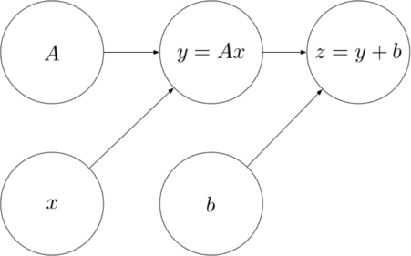
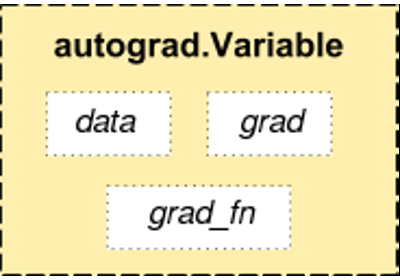

# Variaveis

Os algoritmos de deep learning são representados por um grafo computacional, podemos ver um exemplo de grafo computacional na figura abaixo.



Cada círculo no grafo representa uma variável, e na entrada e saída de cada operação existe uma variável, no PyTorch, as variáveis são wrappers para os tensores, isso é, ela armazena os tensores e mais 3 atributos. O dado em si (data), o gradiente (grad) e um apontador (creator) para construir o grafo da backpropagation.



O que faz o PyTorch ser um framework próprio para o uso em deep learning é sua capacidade de calcular o gradiente automaticamente de um grafo computacional definido, e isso no PyTorch é feito utilizando variáveis, ou seja, com as variáveis é possível criar expressões matemáticas e o PyTorch é capaz de calcular o gradiente dessa expressão.
O gradiente é uma operação matemática que é calculada através de derivadas parciais.

### Criação de variáveis


```python
import torch
from torch.autograd import Variable
```

As variáveis são criadas a partir de tensores


```python
y = Variable(torch.rand(2,4))
y
```


    tensor([[0.8807, 0.3669, 0.7776, 0.5670],
            [0.9787, 0.2027, 0.1333, 0.1424]])


```python
y_t = 5*torch.rand(2,4)
y = Variable(y_t)
y
```


    tensor([[4.4132, 0.7287, 0.0983, 4.2892],
            [2.0199, 4.2254, 3.5996, 3.4344]])


```python
x = Variable(torch.ones(2, 2), requires_grad=True)
x
```


    tensor([[1., 1.],
            [1., 1.]], requires_grad=True)


**requires_grad** indica se o PyTorch deve ou não calcular o gradiente da variável, ou seja, se essa variável irá ser utilizada durante o treinamento no cálculo do gradiente. Por padrão *requires_grad* é falso quando a variável é criada, Se uma de suas entrada para um operação requer o cálculo do gradiente, sua saída e seus subgrafos também irão requerer o caclulo do gradiente.

### Cálculo do gradiente


```python
y = x + 2
z = y * y * 2
out = z.mean()
out.backward()

# acessa o gradiente da variável x individualmente
x.grad
```


    tensor([[24., 24.],
            [24., 24.]])


Autograd é o pacote do PyTorch utilizado para calcular a derivada do grafo computacional, calculando o backpropagation começando pela variável que chamou a função *backward*. Nos modelos de deep learning, essa variável geralmente contém a função de perda.
Para acessar o gradiente individual para cada variável é utilizado o atributo *grad*.

O `backward()` destrói o grafo após sua execução. Isso é intrínseco ao PyTorch pelo fato dele trabalhar com grafos computacionais dinâmico.
